# Qt事件系统

## 一、事件的描述与分类

### 1、基本概念

<span style=color:red;background:yellow;font-size:15px>**事件是由程序内部或外部产生的事情或者动作的总称**</span>。事件通常来自底层窗口系统，当然也可以手动发送自定义的事件。事件可以同步也可以异步，还可以被过滤掉(过滤器)。

在Qt中，使用QEvent类及其子类来描述事件。

注意：在Qt中信号是对象产生的，但是事件不一定是由对象产生的，比如鼠标点击产生的事件。

### 2、事件分类

事件分类方式多种多样，比如同步事件或者异步事件，系统事件或者自定义事件，这里<span style=color:red;background:yellow;font-size:15px>根据事件的来源和传递方式</span>，事件可分为以下三大类。

- 自发事件：这是由<span style=color:red;background:yellow;font-size:15px>窗口系统</span>生成的，这些事件置于<span style=color:red;background:yellow;font-size:15px>**系统队列**</span>中，并由<span style=color:red;background:yellow;font-size:15px>事件循环</span>处理完发布事件后, 一个接一个地处理;
- 发布的事件(Posted events)：该类事件由<span style=color:red;background:yellow;font-size:15px>Qt或应用程序生成</span>，这些事件由Qt排队，并由事件循环处理;
- 发送的事件(Sent events)：该类事件由<span style=color:red;background:yellow;font-size:15px>Qt或应用程序生成</span>，这些事件直接发送到目标对象，**不经过事件循环处理。**

当然事件被细分为很多种类型(有一百多种)，每一种类型使用<span style=color:red;background:yellow;font-size:15px>**QEvent类中的枚举常量进行表示**</span>，比如QMouseEvent管理的鼠标事件有鼠标双击、移动、按下等类型，这些类型分别使用 QEvent::Type枚举类型中的枚举常量MouseButtonDblClick、MouseMove、 MouseButtonPress表示。


要想获取事件的类型，可以使用`Type QEvent::type() const`函数。下面是Qt下的事件的继承图：

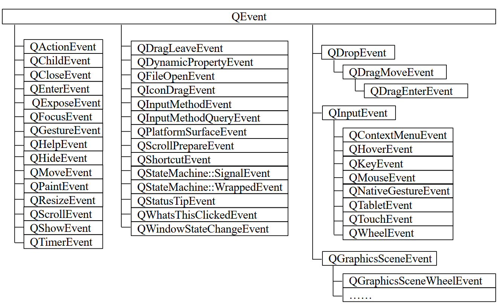

## 二、事件的传递

根据事件的概念所知，事件是程序内部或外部产生的事情或动作的总称，那么事件当然是可以传递的，比如：事件从A对象传递到B对象，再传递到C对象，那么事件在传递的时候需要遵循什么规则呢？

### 1、事件传递的规则

如果事件未被目标对象处理，则把事件传递给其父对象处理，若父对象仍未处理，则再传递给父对象的父对象处理，重复这个过程，直至这个事件被处理或到达顶级对象为止。 

> 例如:  QEvent <- QInputEvent <- QMouseEvent

注意：事件是在对象间传递的，这里是指<span style=color:red>**对象的父子关系，而不是指类的父子关系**</span>，这个概念在对象树章节重点讲过。  

### 2、事件的传递步骤

在Qt中有一个<span style=color:red;background:yellow;font-size:15px>**事件循环**</span>，该循环负责从可能产生事件的地方捕获各种事件，并把这些事件转换为带有事件信息的对象，然后由Qt的<span style=color:red;background:yellow;font-size:15px>**事件处理流程**</span>分发给需要处理事件的对象来处理事件。

1. 在Qt中通过调用`QCoreApplication::exec()`函数<span style=color:red;background:yellow;font-size:15px>**启动事件主循环**</span>, 主循环从事件队列中获取事件，然后创建一个合适的QEvent对象或其子类类型的对象来表示该事件，在此步骤中，事件循环<span style=color:red;background:yellow;font-size:15px>**首先处理所有发布的事件**</span>，直到队列为空，<span style=color:red;background:yellow;font-size:15px>**然后处理自发的事件，最后处理在自发事件期间产生的已发布事件**</span>。注意：**发送的事件**不由事件循环处理，该类事件会被直接传递给对象。
2. 接着，Qt会调用`QCoreApplication::notify()`函数对事件进行传递(或分发)。
4. 最后，QObject对象调用`QObject::event()`函数接收事件。

所以整个过程可以总结为启动事件主循环、传递或者分发事件、接收事件，如下图所示：

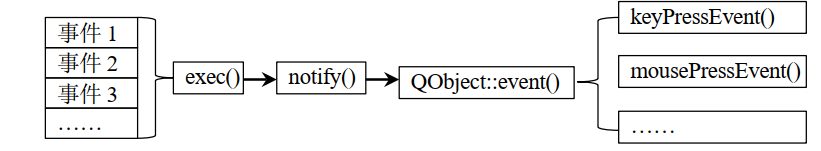

> 1. 调用QCoreApplication::exec()启动事件主循环. 事件主循环会先处理已发布的事件, 直到事件队列为空, 再处理自发的事件, 最后处理在"处理自发事件"的时候发布的事件
> 2. 调用QCoreAplication::notify()对事件进行分发
> 3. 调用QObject::event()函数接收事件

#### 2.1、QCoreApplication的说明

应用程序类之间的继承关系

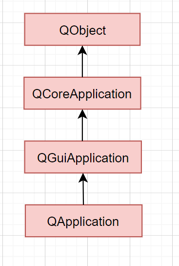

一个程序中只能有一个QCoreApplication及其子类的对象。

其中QCoreApplication类主要提供无GUI程序的事件循环；QGuiApplication类用于管理GUI程序的控制流和主要设置；QApplication类专门为QGuiApplication提供基于QWidget 的程序所需的一些功能，主要用于处理部件的初始化、最终化。主要职责如下 ：

- 使用用户的桌面设置初始化应用程序。 
- 执行事件处理，也就是说该类能从底层系统接收并分发事件。比如，使用QCoreApplication::sendEvent()或 QCoreApplication::postEvent()函数分发自定义事件；
- 解析常用命令行参数并设置其内部状态。
- 定义了应用程序的<span style=color:red>界面外观</span>，可使用 QApplication::setStyle()进行更改；
- 指定应程程序如何分配<span style=color:red>颜色</span>；
- 使用 QCoreApplication::translate()函数对<span style=color:red>字符串</span>进行转换；
- 通过 QApplication::desktop()函数处理<span style=color:red>桌面</span>，通过 QCoreApplication::clipboard()函数处理剪贴板；
- 管理应用程序的<span style=color:red>鼠标光标</span>。比如使用 QGuiApplication::setOverrideCuresor()函数设置光标等。

### 3、event函数说明

对于QObject::event()函数而言，需要注意其特点：

- 该函数是一个虚函数，是QObject对象处理事件的入口，在QObject的子类中通常会<span style=color:red;background:yellow;font-size:20px>**重写event()函数**</span>，比如QWidget类就重写了event()函数；函数重写后不需要调用, 事件系统会自动调用
- 与事件处理函数的关系： <span style=color:red;background:yellow;font-size:20px>**event()函数负责把事件传递给目标对象并调用对应的事件处理函数处理事件**</span>，比如调用 QWidget::keyPressEvent()函数处理键盘按下事件等，注意，QObject中的event()函数并不能实现该功能，这是通过QObject 的子类中重写的 event()函数实现的，比如调用QWidget::keyPressEvent()函数，就是由在QWidget 类中重写的 event()函数来完成的；
- <span style=color:red;background:yellow;font-size:20px>**该函数对大多数事件都调用了默认的处理函数**</span>，但并不能包括全部的事件，因此，有时我们需要重写该函数，这也是我们处理Qt事件的方式之一；
- <span style=color:red;background:yellow;font-size:20px>**该函数不会处理事件**</span>，它只是根据事件的类型进行事件的传递(或分发)，若返回true则表示这个事件被接受并进行了处理，否则事件未被处理，需进行进一步传递或丢弃。

### 4. QEvent::type类型

 这是一个枚举类型, 定义了 Qt 中有效的事件类型。每个类型的事件类型及其对应的专门类均已定义好

`QEvent::Type QEvent::type() const`函数, 返回值就是一个QEvent::type类型


## 三、事件的处理

在Qt中，任何QObject的子类都可以处理事件，QEvent及其子类虽然可以描述一个事件，但并不对事件进行处理，事件的处理是由对应的函数进行的。

### 1、事件处理函数

<span style=color:red;background:yellow;font-size:20px>事件是由类的成员函数(通常为虚函数)处理的，通常把处理事件的成员函数称为事件处理函数</span>。由此可见，处理事件需要两个要求：<span style=color:red;background:yellow;font-size:20px>处理该事件的对象和该对象中用于处理该事件的事件处理函数</span>。

在Qt中对绝大多数常用类型的事件提供了默认的事件处理函数，并作了默认处理，这些事件处理函数位于QObject的子类中，如QWidget::mousePressEvent()函数用于处理鼠标按下事件，QWidget::keyPressEvent()用于处理键盘按下事件等。对这些默认事件处理函数的调用是通过QObject::event()虚函数进行的，因此若默认的事件处理函数不能满足用户要求(比如对 Tab 键的处理)，则可以通过重新实现event()函数来达到目的。 

### 2、事件的五种处理方式 ( ☆ )

==由事件传递过程可见==， Qt可以使用以下5 种方式来处理事件  

#### 1: 重写事件处理函数

<span style=color:red;background:yellow;font-size:20px>重新实现各部件内部默认的事件处理函数</span>，比如重新实现 paintEvent()、mousePressEvent()等事件处理函数，这是最常用、最简单的方式；

#### 2: 重写QObject::event( )函数

<span style=color:red;background:yellow;font-size:20px>重新实现QObject::event()函数(需继承 QObject 类)</span>，使用该方式，<span style=color:red>可以在事件到达默认的事件处理函数之前捕获到该事件</span>。( 相当于截胡 )在重新实现 event()函数时，必须对未明确处理的事件调用基类的event()函数，比如，若子类化QWidget，并重写了event()函数，但未调用父类的 event()函数，则程序可能会不能正常显示界面；

#### 3: 重写QCoreApplication::notify( )函数

<span style=color:red;background:yellow;font-size:20px>子类化QApplication，并重新实现QCoreApplication::notify()函数</span>，由事件传递过程可知，该函数提供了对事件的完全控制，因此功能非常强大，所以重写该函数会很复杂，也因此此方法很少被使用。这是唯一能在事件过滤器之前捕获到事件的方式。

#### 4:在QObject上安装事件过滤器

 <span style=color:red;background:yellow;font-size:20px>在QObject对象上安装(或称为注册)事件过滤器</span>。对象一旦使用installEventFilter()注册，传递给目标对象的所有事件都会先传递给这个监视对象的eventFilter()函数。或同一对象上安装了多个事件处理器，则按照安装的逆序依次激活这些事件处理器；

#### 5: 在QApplication上安装事件过滤器

<span style=color:red;background:yellow;font-size:20px>在QApplication上安装(或称为注册)事件过滤器</span>。该方式与重新实现notify函数一样强大。一旦在QApplication 对象(程序中只有一个这种类型的对象)上注册了事件过滤器，则程序中每个对象的每个事件都会在发送到其他事件过滤器之前，发送到这个eventFilter()函数。该方式对于调试非常有用；

注意：exec()、notify()和 event()函数都不会处理事件，他们只是根据事件的类型进行事件的传递(或分发)。处理事件是由事件处理函数进行。

### 3、代码演示

#### 3.1、事件处理的方式演示  

```C++
//widget.h
#ifndef WIDGET_H
#define WIDGET_H

#include <QWidget>
#include <QEvent>
#include <QObject>
#include <QMouseEvent>

class Widget : public QWidget
{
    Q_OBJECT

public:
    Widget(QWidget *parent = nullptr);
    ~Widget();

    //重写event事件
    bool event(QEvent *event) override;

    //重写鼠标按压事件
    void mousePressEvent(QMouseEvent *event) override;
};
#endif // WIDGET_H


//widget.cc
#include "widget.h"

#include <QDebug>

Widget::Widget(QWidget *parent)
    : QWidget(parent)
{
}

Widget::~Widget()
{
}


bool Widget::event(QEvent *event)
{
    static int i = 0;
    qDebug() << "E" << i++;

    if(event->type() == QEvent::KeyPress)
    {
        qDebug() << "KeyDown";
    }
    //此处直接返回0或者1，鼠标按下就不起作用了
    return QWidget::event(event);
}

void Widget::mousePressEvent(QMouseEvent *event)
{
    qDebug() << "mousePress" ;
}
```

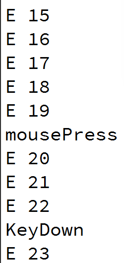

#### 3.2、重写notify函数    

Widget的实现

```C++
//widget.h
#ifndef WIDGET_H
#define WIDGET_H

#include <QWidget>
#include <QEvent>
#include <QObject>
#include <QMouseEvent>

class Widget : public QWidget
{
    Q_OBJECT

public:
    Widget(QWidget *parent = nullptr);
    ~Widget();

    bool event(QEvent *event) override;
};
#endif // WIDGET_H

//widget.cpp
#include "widget.h"
#include <QDebug>

Widget::Widget(QWidget *parent)
    : QWidget(parent)
{
}

Widget::~Widget()
{
}

bool Widget::event(QEvent *event)
{
    qDebug() << "E" ;

    //此处直接返回0或者1，鼠标按下就不起作用了
    return QWidget::event(event);
}
```

MyApplication的实现

```C++
//myapplication.h
#ifndef MYAPPLICATION_H
#define MYAPPLICATION_H

#include <QApplication>

class MyApplication : public QApplication
{
    Q_OBJECT
public:
    explicit MyApplication(int argc, char *argv[]);
    ~MyApplication();

    bool notify(QObject *obj, QEvent *ev) override;

signals:

};

#endif // MYAPPLICATION_H

//myapplication.cpp
#include "myapplication.h"
#include <QDebug>

MyApplication::MyApplication(int argc, char *argv[])
: QApplication(argc, argv)
{
}

MyApplication::~MyApplication()
{
}

bool MyApplication::notify(QObject *obj, QEvent *ev)
{
    static int i=0;
    qDebug() << "N" << i++;
    //若对象为w且事件为键盘按下事件
    if(obj->objectName()== "w" && ev->type()== QEvent::KeyPress)
    {
        qDebug() << "keyDwon";
    }
    return QApplication::notify(obj, ev);
}
```

测试代码

```C++
#include "widget.h"
#include "myapplication.h"

#include <QApplication>

int main(int argc, char *argv[])
{
    MyApplication a(argc, argv);
    Widget w;
    w.setObjectName("w");
    w.show();
    return a.exec();
}
```

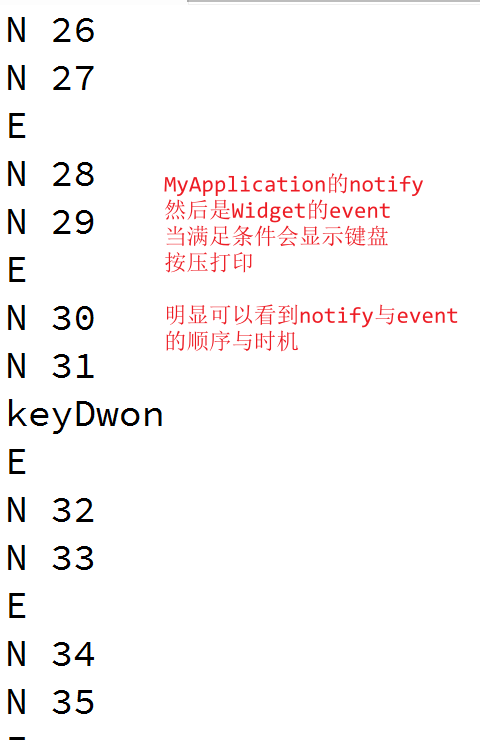


#### 3.3、事件传递  

Widget的实现

```C++
//widget.h
#ifndef WIDGET_H
#define WIDGET_H

#include <QWidget>
#include <QEvent>

class Widget : public QWidget
{
    Q_OBJECT

public:
    Widget(QWidget *parent = nullptr);
    ~Widget();

    //重写event函数
    bool event(QEvent *event) override;
};
#endif // WIDGET_H

//widget.cpp
#include "widget.h"

#include <QDebug>

Widget::Widget(QWidget *parent)
    : QWidget(parent)
{
}

Widget::~Widget()
{
}


bool Widget::event(QEvent *event)
{
    //判断是否是键盘按下事件
    if(event->type()==QEvent::KeyPress)
    {
        qDebug() << objectName().toUtf8().data() << "=keyDwon";
    }
    //判断是否是鼠标按下事件
    if(event->type()==QEvent::MouseButtonPress)
    {
        qDebug() << objectName().toUtf8().data() <<"=mouseDwon";
    }
    //判断是否是鼠标释放事件
    if(event->type()==QEvent::MouseButtonRelease)
    {
        qDebug() << objectName().toUtf8().data() <<"=mouseRelease";
    }
    //交给父对象处理
    return QWidget::event(event);
}
```

MyPushButton的实现

```C++
//mypushbutton.h
#ifndef MYPUSHBUTTON_H
#define MYPUSHBUTTON_H

#include <QPushButton>
#include <QEvent>

class MyPushButton : public QPushButton
{
    Q_OBJECT
public:
    explicit MyPushButton(QPushButton *parent = nullptr);
    ~MyPushButton();

    bool event(QEvent *e) override;

signals:

};

#endif // MYPUSHBUTTON_H

//mypushbutton.cpp
#include "mypushbutton.h"
#include <QDebug>

MyPushButton::MyPushButton(QPushButton *parent)
: QPushButton(parent)
{
}

bool MyPushButton::event(QEvent *e)
{
    //判断是否是键盘按下事件
    if(e->type() == QEvent::KeyPress)
    {
        qDebug()<<objectName().toUtf8().data() << "=keyDwon";
        //将事件传递给父对象处理
        return 0;
    }
    //判断是否是鼠标按下事件
    if(e->type()==QEvent::MouseButtonPress)
    {
        qDebug() << objectName().toUtf8().data() << "=mouseDwon";
        //事件不传递
        return 1;
    }
    return QWidget::event(e);
}

MyPushButton::~MyPushButton()
{
}
```

测试代码

```C++
#include "widget.h"
#include "mypushbutton.h"

#include <QApplication>

int main(int argc, char *argv[])
{
    QApplication a(argc, argv);
    Widget w;

    MyPushButton *myBtn = new MyPushButton;
    //设置父对象为w，若myBtn未处理的对象会传递给此处设置的父对象w处理，
    //注意事件传递是在对象之间的父子关系，而不是类之间的父子关系。
    myBtn->setParent(&w);
    myBtn->setText("AAA");

    //设置myBtn相对于w的位置
    myBtn->move(22, 22);
    //设置对象名
    w.setObjectName("w");
    myBtn->setObjectName("myBtn");
    //设置部件的大小
    w.resize(333,222);
    w.show();

    return a.exec();
}
```

代码分析：

MyPushButton类的对象myBtn，也就是按钮类对象，按钮的文本是"AAA"，但是对象名字就是myBtn；同样Widget类的对象是w，对象名字也是w，同时注意这里设置了父子关系，w是myBtn的父亲，那么当myBtn上的事件被传到到父对象的时候，就会传给w，这是主函数给与的信息。

- Widget中的三个事件，键盘按压、鼠标按压、鼠标释放都可以处理，但是都会处理完后交给父对象处理。
- MyPushButton中的两个事件，键盘按压、鼠标按压，但是前置会交给父对象处理，后置直接拦截，这就是区别

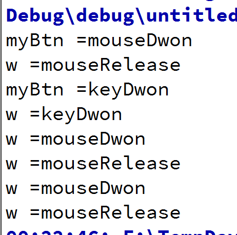


## 四、事件的接受和忽略

事件可以被接受或忽略，<span style=color:red;background:yellow;font-size:20px>**被接受的事件不会再传递给其它对象，被忽略的事件会被传递给其它对象处理，或者该事件被丢弃(即没有对象处理该事件)**</span>。要接收一个事件使用 QEvent::accept()函数，要忽略一个事件使用 QEvent::ignore()函数。<span style=color:red;>也就是说若调用 accept()，则事件不会传递给父对象，若调用 ignore()则事件会向父对象传递</span>。Qt默认值是 accept (接受事件)，但在QWidget的默认事件处理函数(比如 keyPressEvent())中，默认值是ignore，因为这样可实现事件的传递(即子对象未处理就传递给父对象处理)。对事件的接受和忽略，最好是明确的调用 accept和 ignore函数。在event函数中调用accept或 ignore是没有意义的，event函数通过返回一个bool值来告诉调用者是否接受了事件(true 表示接受事件)。 是否调用accept是用于事件处理函数与event函数之间通信的，而 event函数返回的bool值是用于与 QApplication::notify()函数之间通信的。

但是注意：QCloseEvent有一些不同，QCloseEvent::ignore()表示取消关闭操作，而QCloseEvent::accept()则表示让Qt继续关闭操作。为避免产生混淆，最好在closeEvent()处理函数的重新实现中显示地调用 accept()和 ignore()。


## 五、事件过滤器

是一种比重写event函数更高一层的拦截操作, 事件过滤器直接安装在QObject上

### 1、实现事件过滤器的步骤

<span style=color:red;background:yellow;font-size:16px>事件过滤器用于拦截传递到目标对象的事件</span>，这样可以实现监视目标对象事件的作用。在Qt中，实现事件过滤器的步骤如下：

- 一: 安装事件过滤器	调用`void QObject::installEventFilter(QObject* filterObj)`函数，把filterObj对象设置安装(或注册)为事件过滤器，filterObj也称为过滤器对象。 事件过滤器通常在构造函数中进行注册。

- 二: 重写过滤器函数         在上一步注册的filterObj对象，通过调用`bool QObject::eventFilter(QObject* obj, QEvent* e)`函数来接收拦截到的事件。也就是说拦截到的事件在filterObj对象中的eventFilter函数中处理。eventFilter 的第一个参数 obj 指向的是事件本应传递到的目标对象。

使用`QObject::removeEventFilter(QObject *obj)`函数可以删除事件过滤器。

### 2、事件过滤器处理事件的规则

- 过滤器对象的eventFilter()函数可以<span style=color:red;background:yellow;font-size:15px>接受或拒绝拦截到的事件</span>，若函数返回false，则表示事件需要作进一步处理，此时事件会被发送到目标对象本身进行处理(注意：这里并未向父对象进行传递)，若evetnFilter()返回true，则表示停止处理该事件，此时目标对象和后面安装的事件过滤器就无法获得该事件。
- 若同一对象安装了多个事件过滤器，则最后安装的过滤器首先被激活。


## 六、自定义事件与事件的发送

事件除了是Qt系统中定义好的事件之外，还可以是程序员自己定义的事件。

### 1、发送事件的两个函数

```C++
static void QCoreApplication::postEvent (
    QObject* receiver
    , QEvent* event
    , int priority=Qt::NormalEventPriority);

static bool QCoreApplication::sendEvent(QObject* receiver
                                        , QEvent* event)
```

> receiver：指向接收事件的对象
> event：表示需要发送的事件
> priority：表示事件的优先级， 事件会按优先级排序，高优先级的事件排在队列的前面。其取值为枚举类型 Qt::EventPriority 中的枚举值，如下
>
> - Qt::HighEventPriority：值为 1。
> - Qt::NormalEventPriority：值为 0。
> - Qt::LowEventPriority：值为-1。
>
> 优先级只是一个相对值，其值可取介于规定的最大值和最小值之间的任何值，比如可使 priority 参数的值为 Qt::HighEventPriority +10。

### 2、发送事件(sendEvent)与发布事件(postEvent)

发布(post)事件：

- 把事件添加到事件队列中，并立即返回。
- 发布事件必须在<span style=color:red;font-size:20px>堆</span>(比如使用 new)上创建事件，因为事件被发布后，事件队列将获得事件的所有权并自动将其删除。 发布事件后再访问该事件是不安全的。
- 发布事件还可以对事件进行合并(或称为压缩)，比如在返回事件循环之前连续发布了多个相同的事件，则这多个相同的事件会自动合并为一个单一的事件。 可合并的事件有鼠标移动事件、调整大小事件等。

发送(send)事件：把事件直接发送给接收事件的目标对象。 事件发送之后不会被删除，发送的事件通常创建在<span style=color:red;font-size:20px>堆栈上</span>。

### 3、自定义事件原理

事件其实就是使用的一个整数值表示的，因此在创建自定义事件时，只须给事件指定一个整数值即可，在Qt中，这个整数值是通过枚举类型 QEvent::Type定义的，事件的其它信息可以封装在一个自定义的类之中。自定义的事件即可以是预定义类型，也可以是自定义类型的。自定义类型的事件，需要定义一个事件编号，该编号必须大于 QEvent :: User(其值为1000)，小于 QEvent::MaxUser(其值为 65535)。各种事件不能重叠(即 QEvent::Type 类型的值不能相同)，小于 QEvent::User 的事件是Qt 内部定义的事件，他们不会重叠，对于自定义的事件可以使用 registerEventType()函数来保证事件不重叠，该函数原型如下：static int QEvent::registerEventType ( int hint = -1 );如果 hint 的值不会产生重叠，则会返回这个值；如果 hint 不合法，系统会自动分配一个合法值并返回。因此，可使用该函数的返回值创建 Type 类型的值。

### 4、 创建自定义事件的方法和步骤

可以使用以下方式创建自定义事件 ： 
- 使用 QEvent 的构造函数创建事件，其原型为：QEvent(Type type);

```C++
QEvent::Type t1=(QEvent::Type)1333; //定义事件编号
QEvent e(t); //创建事件 e
```

- 使用Qt已创建好的事件类型创建事件，比如使用 QKeyEvent 类创建键盘事件。
- 继承QEvent类，创建自定义事件。

- 使用QCoreApplication::postEvent()或 QCoreApplication::sendEvent()函数发送事件。
- 可使用以下方法处理自定义事件

> - 重写 QObject::event()函数，在该函数内直接处理自定义事件或调用自定义的事件处理函数处理事件。
> - 安装事件过滤器，然后在过滤器对象的 eventFilter()函数中处理自定义事件。
> - 当然，还可以重写 QCoreApplication::notify()函数。

### 5、自定义事件的使用

```C++
//widget.h
#ifndef WIDGET_H
#define WIDGET_H

#include <QWidget>
#include <QEvent>

class Widget : public QWidget
{
    Q_OBJECT

public:
    Widget(QWidget *parent = nullptr);
    ~Widget();

    //重写event函数
    bool event(QEvent *ev) override;

    //声明静态数据类型t1
    static QEvent::Type type1;
};
#endif // WIDGET_H

//widget.cpp
#include "widget.h"
#include "myevent.h"
#include <QDebug>

QEvent::Type Widget::type1 = (QEvent::Type)1333;

Widget::Widget(QWidget *parent)
    : QWidget(parent)
{
}

Widget::~Widget()
{
}

bool Widget::event(QEvent *ev)
{
    if(ev->type()== type1) //判断事件类型是否为type1
    {
        qDebug() << "AE" << ev->type()<< "," << "F1";
        return 1;
    }

    if(ev->type()== MyEvent::type2)
    {
        qDebug() << "BE" << ev->type() << "," << "F2";
        return 1;
    }

    if(ev->type() == ((MyEvent *)ev)->type3)
    {
        qDebug() << "CE" << ev->type() <<"," << "F3";
        return 1;
    }

    return QWidget::event(ev);
}
```

```C++
//myevent.h
#ifndef MYEVENT_H
#define MYEVENT_H

#include <QEvent>

class MyEvent : public QEvent
{
public:
    MyEvent();
    explicit MyEvent(QEvent::Type type4);

    //静态数据成员
    static QEvent::Type type2;
    //普通数据成员
    QEvent::Type type3;
};

#endif // MYEVENT_H


//myevent.cpp
#include "myevent.h"

QEvent::Type MyEvent::type2 = (QEvent::Type)1334;

MyEvent::MyEvent()
:QEvent(type2)
{}

MyEvent::MyEvent(QEvent::Type type4)
: QEvent(type4)
, type3(type4)
{
}
```

```C++
#include "widget.h"
#include "myevent.h"

#include <QApplication>

int main(int argc, char *argv[])
{
    QApplication a(argc, argv);
    QEvent e(Widget::type1);

    Widget ma;
    MyEvent me;

    MyEvent *pe = new MyEvent((QEvent::Type)1335);

    //发布或发送事件
    a.sendEvent(&ma, &e);
    a.sendEvent(&ma, &me);
    a.postEvent(&ma,pe);
    //a.postEvent(&ma,&me); //错误，发布的事件me必须是在堆上创建的。

    ma.show();
    return a.exec();
}
```

#### 5.1、显示结果

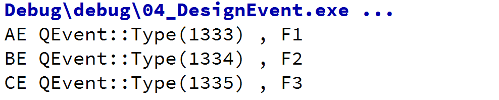


## 七、事件的传递顺序总结

event()函数、事件过滤器、和事件处理函数的调用顺序如下：

- 首先按逆序调用事件过滤器;
- 然后调用 event()函数;

- 最后调用事件处理函数(注意：事件处理函数需在 event()函数中明确或间接调用，否则不会调用事件处理函数)。


## 八、Qt鼠标事件

### 1、鼠标事件介绍

在Qt中，鼠标事件是指由用户通过鼠标操作（如点击、移动、释放等）触发的底层输入事件。这些事件继承自QEvent，并由Qt的事件处理系统管理。常见的鼠标事件如下：

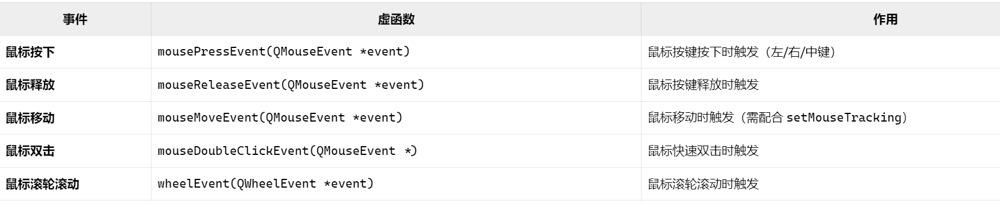

**Qt::MouseButton**

这个枚举类型中描述了所有的鼠标按键。

### 2、代码示例

下面通过一个例子来展示鼠标事件的特点。

```C++
#ifndef MYLABEL_H
#define MYLABEL_H

#include <QLabel>

class MyLabel : public QLabel
{
    Q_OBJECT

public:
    MyLabel(QLabel *parent = nullptr);
    ~MyLabel();

    //重写鼠标进入事件
    void enterEvent(QEvent *ev) override;
    //重写鼠标进入事件
    void leaveEvent(QEvent *ev) override;
    //鼠标移动事件
    void mouseMoveEvent(QMouseEvent *ev) override;
    //鼠标按压事件
    void mousePressEvent(QMouseEvent *ev) override;
    //鼠标释放事件
    void mouseReleaseEvent(QMouseEvent *ev) override;
};

#endif // MYLABEL_H
```

```C++
#include "mylabel.h"

#include <QMouseEvent>
#include <QDebug>

MyLabel::MyLabel(QLabel *parent)
    : QLabel(parent)
{
    setWindowTitle("测试鼠标事件");
    resize(400, 300);
}

MyLabel::~MyLabel()
{
}

//重写鼠标进入事件
void MyLabel::enterEvent(QEvent *ev)
{
    Q_UNUSED(ev);
    qDebug() << "鼠标进入了";
}
//重写鼠标进入事件
void MyLabel::leaveEvent(QEvent *ev)
{
    Q_UNUSED(ev);
    qDebug() << "鼠标离开了";
}

//鼠标移动事件
void MyLabel::mouseMoveEvent(QMouseEvent *ev)
{
    if(ev->buttons() & Qt::LeftButton)//按照位与
    {
        QString str = QString("鼠标移动 x = %1 y = %2 "
                              "global x = %3 global y = %4")
                .arg(ev->x()).arg(ev->y())
                .arg(ev->globalX()).arg(ev->globalY());
        qDebug() << str;
    }
}

//鼠标按压事件
void MyLabel::mousePressEvent(QMouseEvent *ev)
{
    if(ev->button() == Qt::LeftButton)
    {
        QString str = QString("鼠标按下 x = %1 y = %2 "
                              "global x = %3 global y = %4")
                .arg(ev->x()).arg(ev->y())
                .arg(ev->globalX()).arg(ev->globalY());
        qDebug() << str;
    }
}

//鼠标释放事件
void MyLabel::mouseReleaseEvent(QMouseEvent *ev)
{
    if(ev->button() == Qt::LeftButton)
    {
        QString str = QString("鼠标释放 x = %1 y = %2 "
                              "global x = %3 global y = %4")
                .arg(ev->x()).arg(ev->y())
                .arg(ev->globalX()).arg(ev->globalY());
        qDebug() << str;
    }
}
```

```C++
#include "mylabel.h"

#include <QApplication>

int main(int argc, char *argv[])
{
    QApplication a(argc, argv);
    MyLabel w;
    w.show();
    return a.exec();
}
```

### 3、显示结果

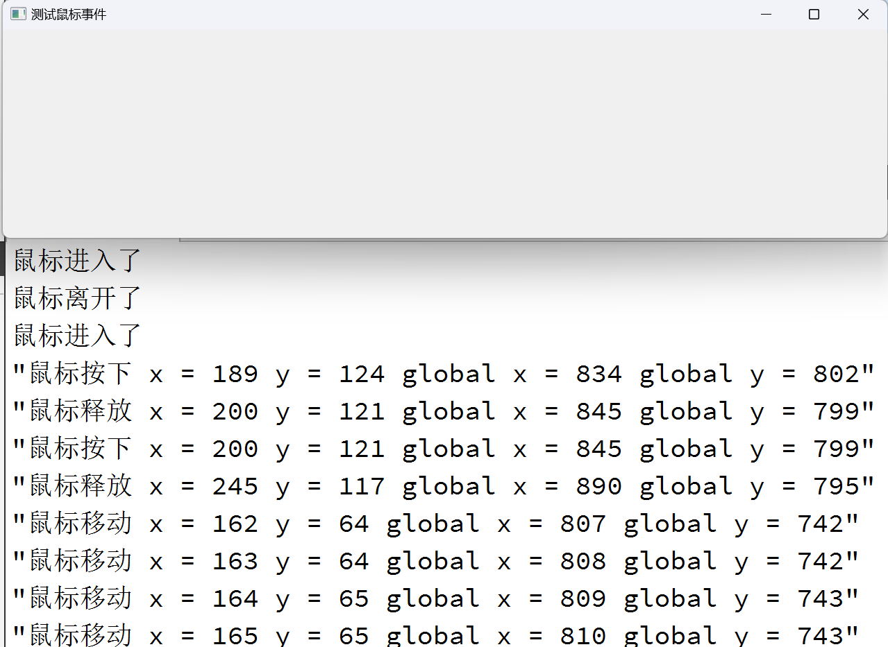

### 4、事件分发器

在Qt中，事件分发器是一个核心概念，用于处理GUI应用程序中的事件。<span style=color:red;background:yellow;font-size:20px>**事件分发器负责将事件从一个对象传递到另一个对象，直到事件被处理或被取消**</span>。每个继承自QObject类或QObject类本身都可以在本类中重写event函数，来实现相关事件的捕获和拦截。在Qt中，我们发送的事件都是传给了QObject对象，更具体点是传给了QObject对象的event函数。所有的事件都会进入到这个函数里面，那么我们处理事件就要重写这个event函数。event函数本身不会去处理事件，是而根据事件类型（type值）调用不同的事件处理函数。事件分发器就是工作在应用程序向下分发事件的过程中，事件分发器用于分发事件，在此过程中，事件分发器也可以做拦截操作。事件分发器主要是通过`bool event(QEvent *e)`函数来实现。其返回值为布尔类型，若为ture，代表拦截不向下分发，否则交给父类。

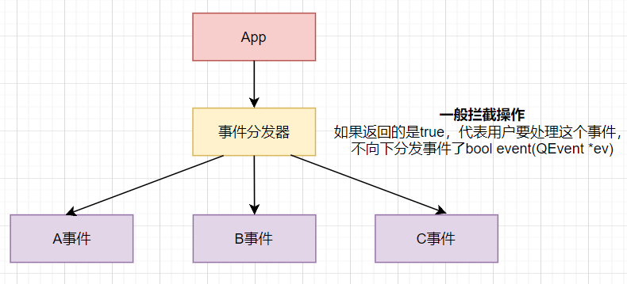

App需要将对应的事件交给事件分发器，如果事件分发器的返回结果是true，就代表用户要处理这个事件，不向下分发事件了；但是事件分发器可以做一层拦截。在QObject类中的event函数中，有解释与示例展示。所以对于上述的鼠标事件中的事件，比如按压事件，我们可以进行拦截，让其按照我们的要求实现功能。

```C++
//在上述代码基础上重写event函数
bool MyLabel::event(QEvent *e)
{
    if(e->type() == QEvent::MouseButtonPress)
    {
        QMouseEvent *ev = static_cast<QMouseEvent *>(e);
        QString str = QString("在event函数中：鼠标按下 x = %1 y = %2 "
                              "global x = %3 global y = %4")
                .arg(ev->x()).arg(ev->y())
                .arg(ev->globalX()).arg(ev->globalY());
        qDebug() << str;

        return true;
    }

    return QLabel::event(e);
}
```

### 5、事件过滤器

在Qt中，一个对象可能经常要查看或拦截另外一个对象的事件，如对话框想要拦截按键事件，不让别的组件接收到，或者修改按键的默认值等。通过上面的学习，我们已经知道，Qt创建了QEvent事件对象之后，会调用QObject的event()函数处理事件的分发。显然，我们可以在event函数中实现拦截的操作。由于event函数是protected的，因此，需要继承已有类。如果组件很多，就需要重写很多个event函数。这当然相当麻烦，更不用说重写event函数还得小心一堆问题。好在Qt提供了另外一种机制来达到这一目的：事件过滤器。<span style=color:red;background:yellow;font-size:20px>事件过滤器是在应用程序分发到event事件分发器之前，再做一次更高级的拦截</span>。事件过滤器的一般使用如下两个步骤：

- 安装事件过滤器；
- 重写事件过滤器函数eventfilter.

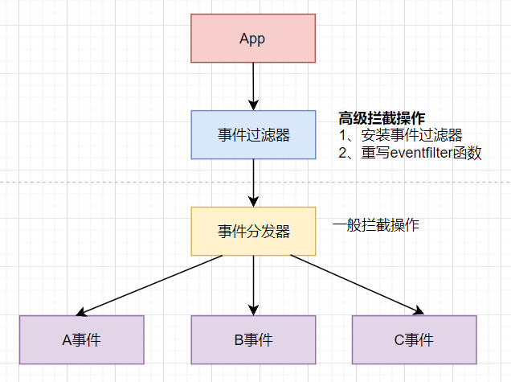

```C++
MyLabel::MyLabel(QLabel *parent)
    : QLabel(parent)
{
    setWindowTitle("测试鼠标事件");
    resize(400, 300);

    //1、安装事件过滤器
    installEventFilter(this);
}

//步骤2：重写eventFilter函数
bool MyLabel::eventFilter(QObject *obj, QEvent *e)
{
    if(obj == this)
    {
        if(e->type() == QEvent::MouseButtonPress)
        {
            QMouseEvent *ev = static_cast<QMouseEvent *>(e);
            QString str = QString("eventFilter函数中：鼠标按下 x = %1 y = %2 "
                                  "global x = %3 global y = %4")
                    .arg(ev->x()).arg(ev->y())
                    .arg(ev->globalX()).arg(ev->globalY());
            qDebug() << str;

            //这样会拦截事件分发器，以及后续对应的事件
            return true;
        }
    }
    //其他默认处理
    return QLabel::eventFilter(obj, e);
}
```

当然按照事件的处理方式，还可以在QApplication上安装事件过滤器或者子类化QApplication，并重写notify函数，但是该方法与鼠标事件没有关系，所以我们使用了上述的步骤进行事件的拦截操作。

## 九、定时器事件

### 1、定时器介绍

在Qt中，定时器事件(Timer Events)是一种<span style=color:red;background:yellow;font-size:20px>**基于系统时钟的周期性事件触发机制**</span>，用于执行定时任务、动画更新、轮询操作等。在Qt5下的定时器很多，包括：QTimer(最常用)、QBasicTimer(轻量级定时器)、QDeadlineTimer(截止时间计算器，Qt5.8+)、QElapsedTimer(性能计时器)、QVariantAnimation(动画定时器)、QTimeLine(时间线定时器)等等很多定时器。

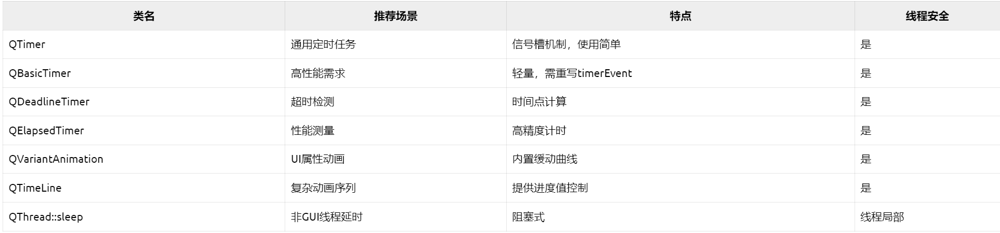

经常使用的方式有两种：QTimer 类（推荐使用）或者重写 QObject::timerEvent()（事件处理机制的方式）。

### 2、定时器常用函数

```C++
//常用方法1：定时器类：QTimer的成员函数
//启动定时器，设置时间间隔毫秒
[slot] void start();
[slot] void start(int msec);
void start(std::chrono::milliseconds msec);

//停止定时器
[slot] void stop();

//设置触发时间间隔
void setInterval(std::chrono::milliseconds value);

//返回底层定时器的id
int timerId() const;

//设置定时器是否为单次触发模式,如果singleShot为true说明触发一次后定时器停止，为false定时器会持续重复触发（默认）
void setSingleShot(bool singleShot);

//设置定时器精度
void setTimerType(Qt::TimerType atype);
//Qt::TimerType枚举类型
//Qt::PreciseTimer	    高精度定时器（毫秒级）
//Qt::CoarseTimer	    粗粒度定时器（默认，5%精度）
//Qt::VeryCoarseTimer	非常粗粒度（秒级）

//信号
//超时就会触发信号
[signal] void QTimer::timeout();


//常用方法2：重写timerEvent函数
//这个事件处理器可以在子类中重新实现，用于接收对象的定时器事件
[virtual protected] void QObject::timerEvent(QTimerEvent *event)

//启动定时器
int QObject::startTimer(int interval, Qt::TimerType timerType = Qt::CoarseTimer);
//参数interval：设置时间间隔，单位是毫秒
//参数timerType，类型是Qt::TimerType枚举类型
//Qt::PreciseTimer	    高精度定时器（毫秒级）
//Qt::CoarseTimer	    粗粒度定时器（默认，5%精度）
//Qt::VeryCoarseTimer	非常粗粒度（秒级）

//停止指定id的定时器
void QObject::killTimer(int id);

//获取定时器对应的id
int QTimerEvent::timerId() const
```

### 3、代码示例

使用设计师界面创建标签，并进行简单布局。

```C++
#ifndef WIDGET_H
#define WIDGET_H

#include <QWidget>

QT_BEGIN_NAMESPACE
namespace Ui { class Widget; }
QT_END_NAMESPACE

class Widget : public QWidget
{
    Q_OBJECT

public:
    Widget(QWidget *parent = nullptr);
    ~Widget();

    //重写timerEvent
    void timerEvent(QTimerEvent *ev) override;

private:
    Ui::Widget *ui;
    
    int m_tid1;//设置定时器1的id
    int m_tid2;//设置定时器2的id
};
#endif // WIDGET_H
```

```C++
#include "widget.h"
#include "ui_widget.h"

#include <QTimer>

Widget::Widget(QWidget *parent)
    : QWidget(parent)
    , ui(new Ui::Widget)
{
    ui->setupUi(this);

    //启动两个定时器，并且分别设置间隔时间
    m_tid1 = startTimer(1000);
    m_tid2 = startTimer(2000);

    //创建定时器类对象
    QTimer *tm = new QTimer;
    //启动定时器，并且设置时间间隔为500ms
    tm->start(500);

    //每间隔500ms就触发一次
    connect(tm, &QTimer::timeout, [=]{
        static int num3 = 1;
        ui->label_3->setText(QString::number(num3++));
    });
}

Widget::~Widget()
{
    delete ui;
}

void Widget::timerEvent(QTimerEvent *ev)
{
    if(m_tid1 == ev->timerId())
    {
        static int num = 1;
        ui->label->setText(QString::number(num++));
    }

    if(m_tid2 == ev->timerId())
    {
        static int num2 = 1;
        ui->label_2->setText(QString::number(num2++));
    }
}
```


### 4、显示结果

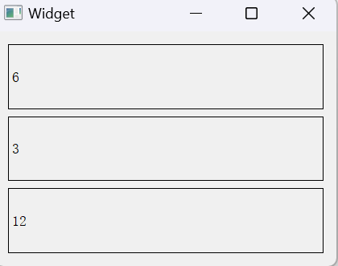

## 十、绘图事件

### 1、绘图系统概念

Qt的绘图系统(Painting System)是一个功能强大且灵活的2D图形渲染框架，它使得开发者能够高效地在屏幕、内存或设备上绘制图形、文本和图像。其核心设计目的是跨平台一致性，确保相同的绘图代码可以在Windows、Linux、macOS 等不同系统上呈现一致效果。整个绘图系统基于QPainter，QPainterDevice和QPaintEngine三个类。<span style=color:red;background:yellow;font-size:20px>**其中，QPainter用来执行绘制的操作，所以称为绘制器；QPaintDevice是一个二维空间的抽象，这个二维空间允许QPainter在其上面进行绘制，也就是QPainter工作的空间，所以将QPaintDevice称为绘图设备；QPaintEngine提供了画笔(QPainter)在不同的设备上进行绘制的统一的接口，所以称为绘图引擎** </span>。QPaintEngine类应用于QPainter和QPaintDevice之间，通常对开发人员是透明的。除非你需要自定义一个设备，否则你是不需要关心QPaintEngine这个类的。我们可以把QPainter理解成画笔；把QPaintDevice理解成使用画笔的地方，比如纸张、屏幕等；而对于纸张、屏幕而言，肯定要使用不同的画笔绘制，为了统一使用一种画笔，我们设计了QPaintEngine类，这个类让不同的纸张、屏幕都能使用一种画笔。这三者之间的关系如下图：

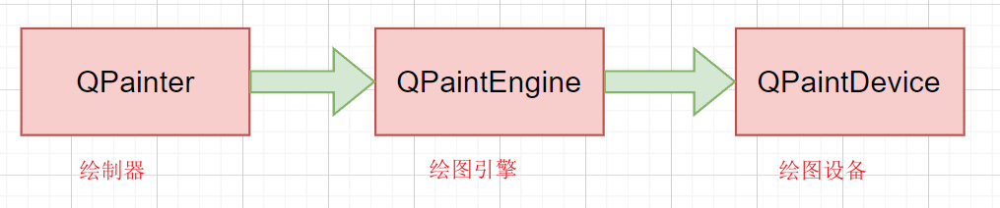  

从三者之间的关系可知，<span style=color:red;background:yellow;font-size:20px>**Qt的绘图系统其实就是使用QPainter(绘制器)在QPaintDevice(绘图设备)上进行绘制，它们之间使用透明的QPaintEngine(绘图引擎)进行通信(也就是将QPainter的指令传递给QPaintDevice)**。</span>

### 2、绘图系统关系图

绘图系统中涉及到三个大类，它们的关系图如下：

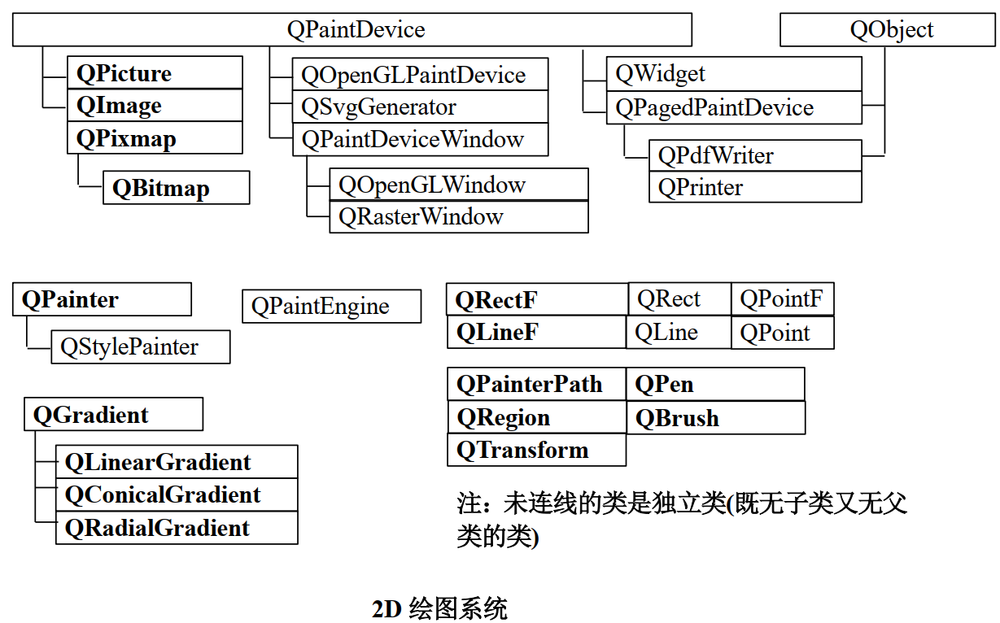

由上述继承图可见，最复杂的就是绘图设备，因为绘图设备类型更多，当然还有一些绘制图形的类，比如：绘制的是矩形、直线、点等。

### 3、QPainter的使用

QPainter的核心功能就是绘图，该类提供了非常多的函数来完成大多数图形的绘制，可以绘制线条、圆形、文本、图像等。QPainter可以在继承自QPaintDevices类的任何对象上绘制图形。QPainter类的函数提供的功能几乎包括了所有的2D绘图功能，后续在学习过程中用到在慢慢介绍。

#### 3.1、<span style=color:red;background:yellow;font-size:20px>**使用QPainter绘制图形的步骤**：</span>

1. 创建一个 QPainter对象；
2. 调用QPainter::begin(QPaintDevice *)；指定绘图设备并开始绘制，此步骤也可在QPainter的构造函数中完成。注意：每次调用begin()函数都会把QPainter的设置重置为默认值；
3. 调用QPainter的成员函数绘制图形，调用QPainter::end()结束绘制(该函数也可以在QPainter的析构函数中完成)。

简言之，创建绘图对象，然后开始绘制图形即可，因为绘图开始函数begin与结束函数end在绘图对象的构造函数与析构函数中被调用了。

注意： 若绘制设备是一个QWidget部件，则QPainter只能在paintEvent()处理函数中使用(需要子类化QWidget部件，并重新实现该函数，也就是重写绘图事件，这种方式类似鼠标事件)。

#### 3.2、使用示例

```C++
#ifndef WIDGET_H
#define WIDGET_H

#include <QWidget>
#include <QPainter>

class Widget : public QWidget
{
    Q_OBJECT

public:
    Widget(QWidget *parent = nullptr)
        : QWidget(parent)
    {}
    ~Widget()
    {}

    //重写绘图事件，该绘图事件无需调用，系统就可以自动调用
    void paintEvent(QPaintEvent *event)
    {
        Q_UNUSED(event);
        //创建绘图对象（begin函数）
        QPainter pat(this);

        //画直线
        pat.drawLine(0, 0, 100, 100);
    }
};
#endif // WIDGET_H
```

#### 3.3、显示结果

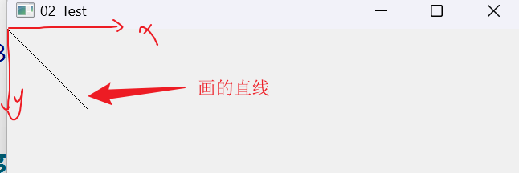

#### 3.4、绘制的图形名

只要记住绘制图形的名字，就可以查询接口绘制出对应的图形了。

> - drawLine绘制直线;
>
> - drawRect绘制矩形;
> - drawEllipse绘制椭圆;
> - drawArc绘制弧;
> - drawChord绘制弦;
> - drawPie绘制扇形(饼形);
> - drawRoundedRect绘制带圆角的矩形;
> - drawPoint绘制点;
> - drawConvexPolygon绘制凸多边形;
> - drawPolyline绘制折线;
> - drawPolygon绘制多边形;
> - drawText绘制文本、

#### 3.5、画笔

前面使用QPainter绘图时候，使用的都是默认的画笔，当然也可以指定使用哪种笔进行画画。Qt中使用QPen类来创建画笔对象。画笔定义了怎样绘制线条的形状和轮廓，还定义了文本的颜色。 画笔决定了线条的粗细、颜色、样式(即线条的虚实)等属性。默认画笔的宽度为1，颜色为黑色、端点样式为 Qt::SquareCap、联接样式为Qt::BevelJoin。

```C++
//画笔样式，Qt::PenStyle
//Qt::NoPen               无画笔
//Qt::SolidLine           实线
//Qt::DashLine            虚线
//Qt::DotLine             点线
//Qt::DashDotLine         点划线
//Qt::DashDotDotLine      双点划线
//Qt::CustomDashLine      自定义（使用setDashPattern函数设置）

```

 ```C++
 #ifndef WIDGET_H
 #define WIDGET_H
 
 #include <QWidget>
 #include <QPainter>
 
 class Widget : public QWidget
 {
     Q_OBJECT
 
 public:
     Widget(QWidget *parent = nullptr)
         : QWidget(parent)
     {}
     ~Widget()
     {}
 
     void paintEvent(QPaintEvent *event)
     {
         Q_UNUSED(event);
 
         QPainter pat(this);
 
         //创建画笔对象
         QPen pen(QColor(255, 0, 0));
         //设置画笔宽度
         pen.setWidth(3);
         //设置画笔风格
         pen.setStyle(Qt::DashLine);
         //让画家使用画笔
         pat.setPen(pen);
 
         //画线
         pat.drawLine(0, 0, 100, 100);
 
 
         pat.drawEllipse(100, 100, 300, 200);
     }
 };
 #endif // WIDGET_H
 ```

#### 3.6、画刷

QBrush类(画刷)用于描述QPainter绘制的形状的填充颜色或图案。这个使用类似QPen一样，查找对应的函数即可。

#### 3.7、综合使用的代码示例

使用画笔、画刷绘制简单的图形。

```C++
void Widget::paintEvent(QPaintEvent *event)
{
    //创建画家对象
    QPainter pat(this);

    //创建画笔对象
    QPen pen(QColor(255, 0, 0));
    //设置笔的宽度
    pen.setWidth(3);
    //设置笔的风格
    pen.setStyle(Qt::DotLine);
    //让画家使用这个画笔
    pat.setPen(pen);
    
    //创建画刷
    QBrush brush;
    //设置画刷颜色
    brush.setColor(Qt::green);
    //设置画刷风格
    brush.setStyle(Qt::BDiagPattern);
    //让画家使用画刷
    pat.setBrush(brush);

    //画直线
    pat.drawLine(0, 0, 100, 100);
    //画矩形
    pat.drawRect(20, 20, 100, 100);
    //画圆(椭圆)
    pat.drawEllipse(QPoint(200, 200), 50, 50);
    //写字
    pat.drawText(QRect(10, 320, 300, 300), "我爱你中国");
    
   
    //不挪动画家，那么三个一样的矩形就会重叠
    QPainter pat(this);
    //画矩形
    pat.drawRect(QRect(20, 20, 50, 50)); 
    //移动画家
    pat.translate(100, 0);
    //保存画家状态
    pat.save();

    pat.drawRect(QRect(20, 20, 50, 50));
    pat.translate(100, 0);
    
    //还原画家保存状态
    pat.restore();
    pat.drawRect(QRect(20, 20, 50, 50));
}
```

#### 3.8、重绘方式（重要）

如前面了解到的，如果绘制设备是一个QWidget部件，则需要重写paintEvent函数处理绘图逻辑，并且该函数是系统自动调用的，但是这只是绘制了一次，如果需要重复绘制操作，那么应该重复调用paintEvent函数，但是该函数是系统自定调用的，那么我们需要使用其他的方式来调用paintEvent函数，达到重复绘制的效果，<span style=color:red;background:yellow;font-size:20px>这种方式是repaint或者update，这两个函数的执行会调用paintEvent函数</span>，如下例：

```C++
#ifndef WIDGET_H
#define WIDGET_H

#include <QWidget>
#include <QPainter>
#include <QTimer>

class Widget : public QWidget
{
    Q_OBJECT

public:
    Widget(QWidget *parent = nullptr)
        : QWidget(parent)
    {
        //创建定时器对象
        QTimer *tm = new QTimer(this);
        tm->start(100);//启动定时器

        connect(tm, &QTimer::timeout, [=](){
            //repaint();
            update();//更新就可以触发绘图事件paintEvent函数
            //不是直接调用paintEvent，
        });
    }
    ~Widget()
    {}

    void paintEvent(QPaintEvent *event)
    {
        Q_UNUSED(event);

        //创建画家对象
        QPainter pat(this);
        //当位置超过屏幕宽度，就更新_pos的位置（_pos是数据成员）
        if(m_pos >= this->width())
        {
            m_pos = 0;
        }
        
        pat.drawPixmap(m_pos, 0, QPixmap(":/wangdao.png"));
        m_pos += 10;
    }

private:
    int m_pos = 0;
};
#endif // WIDGET_H
```

<span style=color:red;background:yellow;font-size:20px>**repaint与update的区别**</span>

> #### 1、执行时机
>
> update函数只是将一个paintEvent事件添加到**事件队列**中，等待稍后执行，它不会立即执行paintEvent。
>
> repaint函数会立即执行paintEvent，而不会等待事件队列的处理。
>
> #### 2、重绘区域
>
> update函数会合并多个重绘请求，只在最后执行一次paintEvent，可以减少不必要的重绘操作，提高性能。
>
> repaint函数会立即执行paintEvent，不会进行任何合并操作，这意味着每次调用都会触发一次paintEvent。
>
> #### 3、同步性
>
> update是异步的，它只是将重绘事件添加到事件队列，不会立即执行。
>
> repaint是同步的，它会立即执行paintEvent，阻塞直到重绘完成。
>
> #### 4、场景
>
> update通常用于在不重要的时候触发重绘，比如用户交互、动画等。
>
> repaint更适用于需要立即反馈的场景，比如需要在 paintEvent中计算和显示一些重要的信息。
>
> #### 总的来说
>
> update函数是一种异步、高性能的重绘方式，适用于大多数场景；
> repaint函数是一种同步、低性能的重绘方式，适用于需要立即反馈的场景。
> 所以在实际开发中，我们通常会优先使用 update，只有在特殊情况下，比如需要立即反馈的场景，我们才会选择使用repaint函数。


### 4、QPaintDevice的使用

#### 4.1、四种绘图设备介绍

Qt提供了4个类来处理图像：QImage、QPixmap、QBitmap、QPicture，为了对这几个类加以区分，分别称QImage为图像、QPixmap为像素图、QBitmap为位图、QPicture为图片，由于它们都是QPaintDevice类的子类(直接或间接)，因此他们都是绘制设备，可以直接在其上进行图形绘制。   

Qt各个处理图像类的区别及作用 ：

- QImage类提供了一个与硬件无关的图像表示方法，可以直接访问和操控像素，也就是说该类可修改或编辑图像的像素。该类还可以用于进行I/O处理，并对I/O处理操作进行了优化 ；
- QPixmap类主要用于在屏幕上显示图像，QPixmap中的像素数据是由底层窗口系统进行管理的，该类不能直接访问和操控像素，只能通过QPainter的相应函数或把QPixmap转换为QImage来访问和操控像素。QPixmap可通过标签(QLabel 类)或QAbstractButton 的子类(icon 属性)显示在屏幕上 ；
- QBitmap是QPixmap的子类，用于处理颜色深度为1的图像，即只能显示黑白两种颜色；  
- QPicture用来记录并重演QPainter命令，QPicture与分辨率无关，可在不同设备上显示。该类使用一个与平台无关的格式(.pic 格式)把绘图命令序列化到 I/O 设备，所有可绘制在QWidget部件或QPixmap上的内容都可以保存在QPicture中，该类的主要作用是把一个绘制图备上使用QPainter绘制的所有图形保存在QPicture之中，然后再把这些图形重新绘制在其他绘图设备上 。

#### 4.2、绘图设备之QPixmap

```C++
#include "widget.h"

#include <QPainter>
#include <QPen>
#include <QPixmap>

Widget::Widget(QWidget *parent)
    : QWidget(parent)
{
    QPixmap pix(400, 400);
    //填充背景是白色
    pix.fill(Qt::white);

    //创建画家对象，并指定绘图设备为QPixmap对象
    QPainter pat(&pix);
    //设置画笔，并且指定画笔的颜色
    pat.setPen(QPen(QColor(255, 0, 0)));
    //画矩形
    pat.drawEllipse(100, 100, 150, 100);
    //保存画出的图片到磁盘上
    pix.save("F:/pix.png");
}
```

#### 4.3、绘图设备之QImage

```C++
Widget::Widget(QWidget *parent)
    : QWidget(parent)
{
    //创建绘图设备QImage对象，可以对像素进行访问
    QImage img(400, 400, QImage::Format_RGB32);
    //填充背景是白色
    img.fill(Qt::white);
    //创建画家对象，并指定绘图设备为QImage对象
    QPainter pat(&img);
    //设置画笔，并且指定画笔的颜色
    pat.setPen(QPen(QColor(0, 0, 255)));
    //画矩形
    pat.drawEllipse(100, 100, 100, 100);
    //保存画出的图片到磁盘上
    img.save("F:/img.png");
}
```

也可以对资源文件进行像素级别的操作

```C++
void Widget::paintEvent(QPaintEvent *event)
{
    QPainter pat(this);

    //利用QImage对像素进行修改
    QImage img;
    img.load(":/wangdao.png");

    //修改像素点
    for(int i = 100; i < 300; ++i)
    {
        for(int j = 100; j < 300; ++j)
        {
            //QRgb就是个unsigned int的别名
            //qRgb函数的返回类型是QRgb
            QRgb value = qRgb(255, 0, 0);
            img.setPixel(i, j, value);
        }
    }
    pat.drawImage(0, 0, img);
}
```

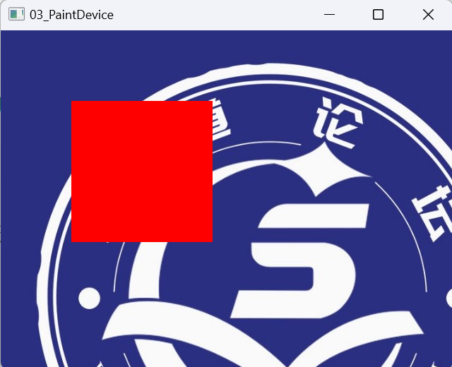


#### 4.4、绘图设备之QPicture

```C++
#include "widget.h"

#include <QPainter>
#include <QPen>
#include <QPicture>
#include <QBrush>

Widget::Widget(QWidget *parent)
    : QWidget(parent)
{
    //QPicture绘图设备，可以记录和重现绘图指令
    QPicture pic;
    QPainter pat(&pic);

    //设置画笔以及颜色
    pat.setPen(QPen(Qt::red));
    QBrush brush(Qt::DashDotLine);
    brush.setColor(QColor(Qt::green));
    pat.setBrush(brush);
    //画原型
    pat.drawEllipse(150, 150, 150, 150);

    pat.end();//要结束画图，不然就绘图不成功

    //保存到磁盘中
    pic.save("F:/pic.ll");
}

Widget::~Widget()
{
}

void Widget::paintEvent(QPaintEvent *event)
{
    QPainter pat(this);
    //重现QPicture的绘图指令
    QPicture pic;
    pic.load("F:/pic.ll");//加载文件
    pat.drawPicture(0, 0, pic);
}
```


### 5、<span style=color:red;background:yellow;font-size:40px>绘图原理(重要)</span>

<span style=color:red;background:yellow;font-size:20px>Qt中所有的绘图操作先在后台缓冲区完成，然后一次性将后台缓冲区的内容复制到前台缓冲区，显示到屏幕上，避免直接在前台缓冲区绘图，从而减少闪烁和绘制延迟，也就Qt的绘图使用的是双缓冲技术</span>。双缓冲是一种图形绘制技术，它使用两个缓冲区：

> - 前台缓冲区（Front Buffer）：当前显示在屏幕上的图像。
> - 后台缓冲区（Back Buffer）：用于绘制新图像的临时区域。

注意：当控件需要绘制时，Qt会自动创建一个与控件大小相同的后台缓冲区（通常是QPixmap或QImage）。

#### 1、手动实现双缓冲

```C++
void MyWidget::paintEvent(QPaintEvent *event)
{
    Q_UNUSED(event);
    //1、创建后台缓冲区
    QPixmap buffer(size());
    buffer.fill(Qt::white);
    
    //2、在后台缓冲区绘制
    QPainter painter(&buffer);
    painter.setPen(Qt::red);
    painter.drawRect(10, 10, 100, 100);
    
    //3、将后台缓冲区的内容复制到前台缓冲区
    QPainter widgetPainter(this);
    widgetPainter.drawPixmap(0, 0, buffer);
}
```

#### 2、如何禁用双缓冲

禁用双缓冲的方式很简单，使用setAttribute(Qt::WA_PaintOnScreen, true); 这样就可以禁用双缓冲了。

```C++
//如果Qt::WA_PaintOnScreen为false（默认值），则表示启用了双缓冲;如果为true，则禁用了双缓冲;
bool isDoubleBuffered = widget->testAttribute(Qt::WA_PaintOnScreen);

//设置禁用或者启动双缓冲
widget->setAttribute(Qt::WA_PaintOnScreen, false); //启用双缓冲
widget->setAttribute(Qt::WA_PaintOnScreen, true); // 禁用双缓冲

//禁用双缓冲，同时还要禁用Qt的默认绘制引擎，并返回nullptr，也就是重写paintEngine，否则会发生冲突
QPaintEngine *Widget::paintEngine() const override
{
    // 返回空指针，表示禁用 Qt 的绘制系统
    return nullptr;
}
```

#### 3、代码示例

```C++
#ifndef WIDGET_H
#define WIDGET_H

#include <QtMath>
#include <QWidget>
#include <QPainter>
#include <QTimer>
#include <QTime>

class Widget : public QWidget
{
    Q_OBJECT

public:
    Widget(QWidget *parent = nullptr)
        : QWidget(parent)
    {
        setWindowTitle("启用双缓冲");

        //setAttribute(Qt::WA_PaintOnScreen, true); // 强制禁用双缓冲
        QTimer *timer = new QTimer(this);
        connect(timer, &QTimer::timeout, [=]() {
            m_angle = (m_angle + 5) % 360;
            update();
        });
        timer->start(60); // 约60FPS
    }

    ~Widget()
    {}

    void paintEvent(QPaintEvent *event)
    {
        QPainter painter(this);
        painter.fillRect(rect(), Qt::black); // 清屏（黑色背景）
        painter.setRenderHint(QPainter::Antialiasing);
        // 绘制500个旋转矩形（复杂度大幅提升）
        for (int i = 0; i < 500; ++i)
        {
            painter.save(); // 保存状态
            painter.translate(width() * qSin(m_angle * 0.017 + i * 0.1),
                              height() * qCos(m_angle * 0.017 + i * 0.2));
            painter.rotate(m_angle + i);
            painter.setPen(QPen(QColor::fromHsv((m_angle + i) % 360, 255, 255), 2));
            painter.drawRect(-20, -20, 40, 40);
            painter.restore(); // 恢复状态
        }
        m_angle = (m_angle + 1) % 360; //缓慢旋转
    }
 private:
     int m_angle = 0;
};
#endif // WIDGET_H
```

由于现代硬件性能提升以及显示器频率比较高，而且Qt底层做了优化，所以双缓冲开启与否的效果不是很明显，所以我们主要懂其原理即可。

