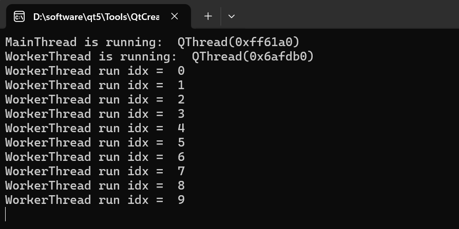
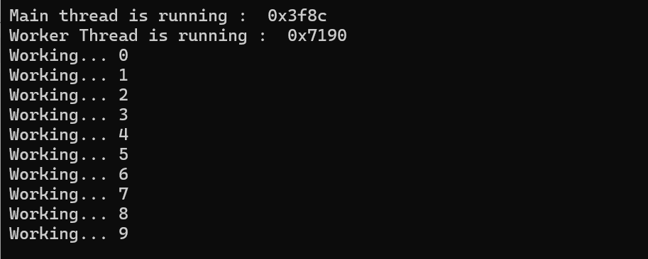

# Qt线程

## 一、Qt线程介绍

### 1、Qt线程概述

C/C++程序都是从main函数入手的，Qt程序也不例外，在Qt中每个程序启动后拥有的第一个线程是GUI线程，也称<span style=color:red>主线程或者main线程，主线程负责几乎所有GUI操作</span>，Qt中所有的组件类只能工作在GUI线程。而对于非GUI的耗时操作，都由QThread及其子类来完成，可以称为<span style=color:red>工作线程或者子线程</span>。

<span style=color:red;background:yellow;>**Qt中使用QThread类提供不依赖平台的管理线程的方法**</span>，如果要设计多线程程序，一般是从QThread继承定义一个线程类，在自定义线程类里进行任务处理。<span style=color:red;background:yellow>注意：只有GUI线程可以访问和操作窗体上的部件（控件），如果其他线程尝试直接访问这些控件，会导致程序崩溃。为了在线程中更新UI，可以使用信号和槽机制。</span>

在Qt框架中，多线程编程是通过QThread类来实现的。QThread类提供了一种高级的、面向对象的方式来处理线程，它允许开发者将耗时的任务从主线程（GUI线程）中分离出来，以避免界面冻结和提高应用程序的响应性。

### 2、Qt线程的使用条件

在Qt中，<span style=color:red;background:yellow>线程的使用通常是为了处理耗时的操作</span>，以避免阻塞主界面（GUI）线程，从而保持应用程序的响应性。

- 耗时操作：当需要执行耗时的操作，如文件读写、网络请求、复杂计算等，这些操作可能会占用大量CPU时间或等待外部资源，这时应考虑使用线程；
- 保持界面响应：如果耗时操作在主线程中执行，可能会导致界面冻结或无响应，使用线程可以避免这种情况，让界面保持流畅；
- 并发任务：当需要同时执行多个任务时，可以使用线程来实现并发处理，提高程序的效率。


## 二、线程相关函数介绍

#### 1、线程启动

```C++
[slot] void QThread::start(QThread::Priority priority = InheritPriority);
//QThread::Priority枚举类型: 优先级参数
//QThread::IdlePriority          没有其它线程运行时才调度
//QThread::LowestPriority        比LowPriority调度频率低
//QThread::LowPriority           比NormalPriority调度频率低
//QThread::NormalPriority        操作系统的默认优先级
//QThread::HighPriority          比NormalPriority调度频繁
//QThread::HighestPriority       比HighPriority调度频繁
//QThread::TimeCriticalPriority  尽可能频繁的调度
//QThread::InheritPriority       使用和创建线程同样的优先级. 这是默认值
```

<span style=color:red;background:yellow;>线程的启动函数，调用该函数后会执行run方法，但在run函数执行前会触发started信号</span>，操作系统将根据优先级参数调度线程。如果线程已经在运行，那么这个函数什么也不做。优先级参数的效果取决于操作系统的调度策略。特别是那些不支持线程优先级的系统优先级将会被忽略。

#### 2、线程优先级

```C++
void QThread::setPriority(QThread::Priority priority);
//QThread::Priority枚举类型:
//QThread::IdlePriority          没有其它线程运行时才调度
//QThread::LowestPriority        比LowPriority调度频率低
//QThread::LowPriority           比NormalPriority调度频率低
//QThread::NormalPriority        操作系统的默认优先级
//QThread::HighPriority          比NormalPriority调度频繁
//QThread::HighestPriority       比HighPriority调度频繁
//QThread::TimeCriticalPriority  尽可能频繁的调度
//QThread::InheritPriority       使用和创建线程同样的优先级. 这是默认值
```

设置正在运行线程的优先级。如果线程没有运行，此函数不执行任何操作并立即返回。使用start函数来启动一个线程具有特定的优先级。优先级参数可以是QThread::Priority枚举除InheritPriortyd的任何值。

#### 3、线程执行

```C++
[protected] int QThread::exec();
```

该函数的作用是进入<span style=color:red;background:yellow;>事件循环并等待直到调用exit函数</span>，返回值是通过调用exit函数来获得，如果调用成功则返回0。

```C++
[virtual protected] void QThread::run();
```

<span style=color:red;background:yellow;>线程的运行起点，在调用start函数之后，新创建的线程就会调用这个函数，底层默认调用exec函数，大多数需要重写这个函数，便于管理自己的线程</span>。该方法返回时，该线程的执行将结束。

#### 4、线程退出

```C++
[slot] void QThread::quit();
```

<span style=color:red;background:yellow;>告诉线程事件循环退出</span>，返回0表示成功，底层也是调用了QThread::exit(0)。

```C++
void QThread::exit(int returnCode = 0);
```

<span style=color:red;background:yellow;>告诉线程事件循环退出</span>。调用这个函数后，线程离开事件循环后返回，QEventLoop::exec()返回returnCode，0表示成功，非0表示失败。


>```C++
>[slot] void QThread::terminate();
>```
>
><span style=color:red;background:yellow;>终止线程，线程可能会立即被终止也可能不会，这取决于操作系统的调度策略，使用terminate之后再使用QThread::wait()，以确保万无一失</span>。当线程被终止后，所有等待中的线程将会被唤醒。 
>
>警告：此函数比较危险，不鼓励使用。线程可以在代码执行的任何点被终止。线程可能在更新数据时被终止，从而没有机会来清理自己，解锁等等。总之，只有在绝对必要时使用此函数。
>
>

```C++
void QThread::requestInterruption();
```

请求线程停止执行，但它不会强制终止线程，而是设置线程的中断标志。此函数不停止线程上运行的任何事件循环，并且在任何情况下都不会终止它。

#### 5、线程等待

```C++
//线程将会被阻塞等待time毫秒。如果线程退出，则wait会返回。Wait函数解决多线程在执行时序上的依赖。
bool wait(unsigned long time = ULONG_MAX);

//线程睡眠msecs毫秒
[static] void QThread::msleep(unsigned long msecs);
//线程睡眠secs秒
[static] void QThread::sleep(unsigned long secs); 
//线程睡眠usecs微秒
[static] void QThread::usleep(unsigned long usecs); 
```

注意：一般情况下，wait和sleep函数应该不需要，因为Qt是一个事件驱动型框架。考虑监听finished信号来取代wait，使用QTimer来取代sleep。

#### 6、线程状态

```C++
//判断线程是否结束
bool isFinished() const;   

//判断线程是否正在运行
bool isRunning() const;  

//如果线程上的任务运行应该停止，返回true。注意：此函数可用于使长时间运行的任务干净地中断。从不检查或作用于该函数返回值是安全的，但是建议在长时间运行的函数中经常这样做。注意：不要过于频繁调用，以保持较低的开销。
bool isInterruptionRequested() const;
```

#### 7、线程标识                                                                         

```C++
//返回一个线程指针
[static] QThread *QThread::currentThread();

//返回当前正在执行的线程的id
[static] Qt::HANDLE QThread::currentThreadId();
```

#### 8、线程属性

```C++
//设置或者获取优先级
void QThread::setPriority(QThread::Priority priority);
QThread::Priority priority() const;

//设置或者获取线程堆栈大小
void QThread::setStackSize(uint stackSize);
uint QThread::stackSize() const;

//根据启用的参数启用或禁用当前线程的终止。该线程必须由QThread启动。
void setTerminationEnabled ( bool enabled = true );                           
```

#### 9、常用信号

```C++
//启动线程运行会触发该信号
[signal] void QThread::started(); 

//终止线程运行会触发该信号   exit quit ----> finished
[signal] void QThread::finished();
```


## 三、线程使用方式

在Qt中，常用的使用线程的方法有如下两种：

- 继承QThread类，重写run()函数；
- 继承QObject类，通过moveToThread(thread)，交给thread执行。

### 3.1、重写run函数

在Qt中，因为QThread类本身并不执行任何的任务，主要就是提供线程管理的功能，比如：启动、停止、暂停和恢复线程，而run函数是虚函数，所以自己写的线程类需要重写该虚函数，并且在该虚函数中定义自己将要执行的具体任务。

<span style=color:red;background:yellow;font-size:20px>常规步骤如下</span>：

- 自定义⼀个类，继承自QThread；
- 重写run方法（也称线程处理函数，和主线程不是同⼀个线程），并在其中实现需要执行的复杂逻辑；
- 调用start函数实现线程启动，注意：线程启动不能直接调用run函数；

```C++
//widget.h
#ifndef WORKERTHREAD_H
#define WORKERTHREAD_H

#include <QThread>
#include <QObject>

//1、自定义类继承QThread
class WorkerThread : public QThread
{
public:
     WorkerThread(QObject* parent = nullptr);
     ~WorkerThread();

    //2、重写run方法
     void run() override;
};

#endif // WORKERTHREAD_H


//widget.cpp
#include "workthread.h"
#include <QDebug>

WorkerThread::WorkerThread(QObject *parent)
{
}

WorkerThread::~WorkerThread()
{
}

void WorkerThread::run()
{
    // 耗时任务
    qDebug() << "WorkerThread is running: "
             << QThread::currentThread();
    for (int idx = 0; idx < 10; ++idx)
    {
        QThread::msleep(1000);
        qDebug() << "WorkerThread run idx = " << idx;
    }
}

//main.cpp
#include "workthread.h"
#include <QCoreApplication>
#include <QDebug>


int main(int argc, char *argv[]) 
{
    QCoreApplication a(argc, argv);

    qDebug() << "MainThread is running: " << QThread::currentThread();

    //3、创建工作线程并执行start函数启动run方法
    WorkerThread thread;
    thread.start();  //启动线程,线程运行run方法
    thread.wait();   //可写可不写，等待线程完成

    return a.exec();
}
```



### 3.2、使用moveToThread迁移


`myobject.h`

```c++
#ifndef MYTHREAD_H
#define MYTHREAD_H

#include <QObject>

class MyObject : public QObject
{
    Q_OBJECT
public:
    MyObject(QObject *parent = nullptr); // MyObject 在创建时没有父对象，因为它将在一个独立的线程中管理自己的生命周期
    ~MyObject();

    void doTask();

signals:
    void signalQuit();
};

#endif // MYTHREAD_H
```

`widget.h`

```c++
#ifndef WIDGET_H
#define WIDGET_H

#include <QWidget>

class Widget : public QWidget
{
    Q_OBJECT

public:
    Widget(QWidget *parent = nullptr); // 表示Widget是一个顶层窗口
    ~Widget();
};
#endif // WIDGET_H
```


<span style=color:red;background:yellow;font-size:20px>常规步骤如下</span>：

- 自定义类并继承自QObject类；
- 创建自定义类的对象，<span style=color:red;background:yellow>注意不能指定父对象</span>；
- 创建QThread类的对象，可以指定其父对象；
- 调用moveToThread函数，将自定义对象加入到QThread的对象中；
- 使用信号与槽触发任务（通过信号与槽机制跨线程通信）；
- 使用deleteLater函数自动清理资源（或者其他方式清理资源）；
- 调用start函数启动线程；

注意：调用start函数只是启动了线程，但是并没有开启线程处理函数，线程处理函数的开启需要用到信号槽机制。还有就是moveToThread要在start之前。

```C++
//Worker.h
#ifndef WORKER_H
#define WORKER_H

#include <QObject>

//1、自定义类继承自QObject
class Worker : public QObject
{
    Q_OBJECT
public:
    explicit Worker(QObject *parent = nullptr);
    ~Worker();
signals:
    void finishedWorker();

public slots:
    //模拟耗时任务
    void doWork();
};

#endif // WORKER_H

//Worker.cpp
#include "worker.h"
#include <QDebug>
#include <QThread>

Worker::Worker(QObject *parent) : QObject(parent)
{
}

Worker::~Worker()
{
}

void Worker::doWork()
{
    qDebug() << "Worker Thread is running : " << QThread::currentThreadId();

    for (int idx = 0; idx < 10; ++idx)
    {
        QThread::msleep(1000);  // 模拟耗时操作
        qDebug() << "Working..." << idx;
    }

    //通知任务完成
    emit finishedWorker();
}

//main.cpp
#include "worker.h"
#include <QCoreApplication>
#include <QThread>
#include <QDebug>

int main(int argc, char *argv[]) {
    QCoreApplication a(argc, argv);

    //打印主线程id
    qDebug() << "Main thread is running : " << QThread::currentThreadId();

    //2、创建Worker
    Worker *worker = new Worker;
    //3、创建QThread对象
    QThread *th = new QThread;

    //4、迁移Worker到QThread线程
    worker->moveToThread(th);

    // 5、连接信号槽，自动跨线程通信
    //启动线程时开始工作
    QObject::connect(th, &QThread::started, worker, &Worker::doWork);
    QObject::connect(worker, &Worker::finishedWorker, th, &QThread::quit);
    //6、使用deleteLater清理资源，线程结束时自动删除Worker和QThread对象(延迟删除)
    QObject::connect(th, &QThread::finished, worker, &Worker::deleteLater);
    QObject::connect(th, &QThread::finished, th, &QThread::deleteLater);

    //7、启动线程
    th->start();

    return a.exec();
}
```



### 3.3、二者对比

重写run方法优势是：简单直接。

 缺点是：

- 容易误用

> - 默认情况下，QThread派生类的信号槽在子线程执行（而非主线程），可能导致意外行为；
> - 若在 run()中操作GUI程序崩溃；

- 线程生命周期管理复杂

> - run函数执行完毕后，线程不会自动退出，需手动调用quit函数；
> - 暴力 terminate() 可能导致资源泄漏；

- 灵活性差

> 一个 QThread 子类只能执行固定的run函数逻辑，无法动态切换任务。

moveToThread迁移方法，优点：

- 清晰的线程-任务分离

> - 自定义工作类（继承QObject）类专门负责业务逻辑，QThread仅管理线程生命周期；
> - 符合 单一职责原则，维护性好。

- 自动信号槽跨线程通信

> - 默认使用 QueuedConnection，线程安全（无需手动锁）;
> - 适合 任务进度反馈（如更新 UI）;

- 更灵活的任务管理

> 同一个 QThread可以运行不同的自定义工作类（动态切换任务）。

缺点是

- 需要额外类：相比直接继承 QThread，代码量稍多;
- 注意 moveToThread 的父对象问题：自定义工作类，不能有父对象，否则无法转移到新线程；

<span style=color:red;background:yellow;font-size:20px>优先选择 moveToThread方法，特别是通用多任务、需与 GUI 交互场景；避免重写run函数，除非处理简单、独立、无交互的后台任务</span>

## 四、锁机制

### 1、互斥锁

QMutex提供相互排斥的锁，或互斥量。在一个时刻至多一个线程拥有mutex，假如一个线程试图访问已经被锁定的mutex，那么线程将休眠，直到拥有mutex的线程对此mutex解锁。QMutex常用来保护共享数据访问。QMutex类所以成员函数是线程安全的。

```C++
//头文件
#include <QMutex>

//构造函数
QMutex(QMutex::RecursionMode mode);
//QMutex::RecursionMode枚举：
//QMutex::Recursive      递归，允许多次加锁，但要有对应的多次解锁
//QMutex::NonRecursive   非递归，只能加锁一次

//无参构造
QMutex();

//上锁
void lock();

//解锁
void unlock();

//尝试上锁
bool tryLock(int timeout = 0);
bool try_lock();
bool try_lock_for(std::chrono::duration<Rep, Period> duration);
bool try_lock_until(std::chrono::time_point<Clock, Duration> timePoint);
```

QMutex类似C++11中的std::mutex，为了避免上锁后忘记解锁，Qt提供了类似C++11中的std::lock_guard与std::unique_lock的QMutexLocker类，构造函数中上锁，析构函数中解锁，使用RAII技术。

### 2、读写锁

#### 2.1、QReadWriterLock读写锁

QReadWriterLock与QMutex相似，但对读写操作访问进行区别对待，<span style=color:red;background:yellow;font-size:20px>可以允许多个读者同时读数据，但只能有一个写，并且写读操作不同同时进行</span>。使用QReadWriteLock而不是QMutex，可以使得多线程程序更具有并发性。 QReadWriterLock默认模式是NonRecursive，非递归。

```C++
QReadWriteLock(QReadWriteLock::RecursionMode recursionMode = NonRecursive);

void lockForRead();
void lockForWrite();
bool tryLockForRead();
bool tryLockForRead(int timeout);
bool tryLockForWrite();
bool tryLockForWrite(int timeout);
void unlock();
```

官网给出的例子示意：

```C++
QReadWriteLock lock;
void ReaderThread::run()
{
    lock.lockForRead();
    read_file();//读文件
    lock.unlock();
}
 
void WriterThread::run()
{
    lock.lockForWrite();
    write_file();//写文件
    lock.unlock();
}
```

#### 2.2、QReadLocker读锁与QWriteLocker写锁

Qt引进了QReadLocker和QWriteLocker类来简化解锁操作，在函数需要的地方建立QReadLocker或QWriteLocker对象，并把lock指针传给QReadLocker或QWriteLocker对象，此时lock已经加锁，等到退出函数后，QReadLocker或QWriteLocker对象局部变量会自己销毁，此时解锁。

```C++
QReadWriteLock lock;

QByteArray readData()
{
    QReadLocker locker(&lock);
    //...
    return data;
}

//等价于下面代码
QReadWriteLock lock;

QByteArray readData()
{
    lock.lockForRead();
    //...
    lock.unlock();
    
    return data;
 }
```

```C++
QReadWriteLock lock;

void writeData(const QByteArray &data)
{
    QWriteLocker locker(&lock);
    //...
}

//等价于下面代码
QReadWriteLock lock;

void writeData(const QByteArray &data)
{
    lock.lockForWrite();
    //...
    lock.unlock();
}
```

## 五、信号量

在多线程环境中，多个线程可能需要访问有限的共享资源。如果没有适当的同步机制，就可能出现多个线程同时访问同一资源的情况，导致数据损坏或不一致。Qt提供了QSemaphore类来实现信号量。QSemaphore类提供了以下基本操作：

- acquire(int n)：尝试获取n个信号量。如果信号量的值小于n，则调用线程将被阻塞，直到信号量的值足够大。
- release(int n)：释放n个信号量，增加信号量的计数器。
- available()：返回当前可用的信号量数量。

```C++
QSemaphore(int n = 0)

void acquire(int n = 1);
int available() const;
void release(int n = 1);
bool tryAcquire(int n = 1);
bool tryAcquire(int n, int timeout);
```

代码示例

```C++
void test()
{
    QSemaphore sem(5);      // sem.available() == 5
    sem.acquire(3);         // sem.available() == 2
    sem.acquire(2);         // sem.available() == 0
    sem.release(5);         // sem.available() == 5
    sem.release(5);         // sem.available() == 10
    
    sem.tryAcquire(1);      // sem.available() == 9, returns true
    sem.tryAcquire(250);    // sem.available() == 9, returns false
}
```

<span style=color:red;background:yellow;font-size:20px>QSemaphore是Qt框架提供的计数信号量类，用于控制同时访问共享资源的线程数量。限制并发线程数量，用于解决⼀些资源有限的问题。</span>

## 六、条件变量

在多线程环境中，<span style=color:red;background:yellow;font-size:20px>线程可能需要等待某个条件成立才能继续执行</span>。例如，一个线程可能需要等待另一个线程完成特定的任务或更新共享数据。没有条件变量，线程可能需要不断轮询检查条件是否满足，这会导致资源浪费和效率低下。条件变量提供了一种机制，允许线程在条件不满足时挂起，直到其他线程通知条件已满足。

Qt提供了QWaitCondition类来实现条件变量。QWaitCondition类提供了以下基本操作：

- wait(QMutex *mutex)：使当前线程等待条件变量。线程在调用此方法时必须持有与条件变量关联的互斥锁。线程将释放互斥锁并进入等待状态，直到其他线程调用wakeOne()或wakeAll()方法唤醒
- wakeOne()：唤醒一个等待条件变量的线程。被唤醒的线程将尝试重新获取互斥锁，并继续执行。
- wakeAll()：唤醒所有等待条件变量的线程。所有被唤醒的线程将尝试重新获取互斥锁，并继续执行。

```C++
QWaitCondition();

void notify_all();
void notify_one();
void wakeAll();
void wakeOne();
bool wait(QMutex *lockedMutex, unsigned long time = ULONG_MAX);
bool wait(QReadWriteLock *lockedReadWriteLock, unsigned long time = ULONG_MAX);
```

QWaitCondition是Qt框架提供的条件变量类，用于线程之间的消息通信和同步。在某个条件满足时等待或唤醒线程，用于线程的同步和协调。