# Qt网络编程

Qt网络编程提供了用于编写TCP/IP客户端和服务器端程序的各种类，如用于TCP通信的QTcpSocket和QTcpServer，用于UDP通信的QUdpSocket，还有用于实现HTTP、FTP等普通网络协议的高级类如QNetworkRequest、QNetworkReply和QnetAccessManager。Qt网络模块还提供用于网络代理、网络承载管理的类，提供基于安全套接字层（Secure Sockets Layer，SLL）协议的安全网络通信的类。要在Qt程序中使用Qt网络模块，需要在项目配置文件中增加一条配置语句：`Qt += network`

## 一、TCP Socket

### 1、TCP通信概述

<span style=color:red;background:yellow;font-size:20px>TCP(Transmission Control Protocol)是一种被大多数Internet网路协议（如HTTP和FTP）用于数据传输的低级网络协议，它是可靠的、面向流、面向连接的传输协议，特别适合用于连续数据的传输</span>。

TCP通信必须先建立TCP协议，通信端分为客户端和服务端。如下图：

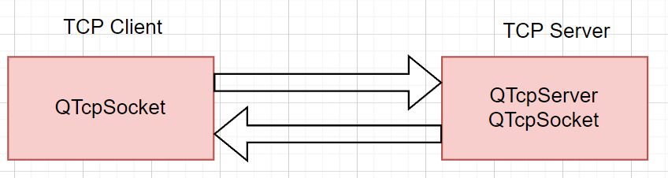

Qt提供QTcpSocket类和QTcpServer类用于建立TCP通信应用程序。服务器端程序必须使用QTcpServer用于端口监听，建立服务器；QTcpSocket用于建立连接后使用套接字进行通信。

QTcpServer是从QObject继承的类，它主要用于服务器端建立网络监听，创建网络Socket连接。QTcpServer类的主要接口函数入下：

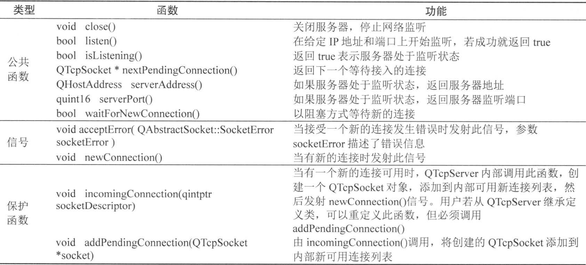

服务器端程序首先需要用QTcpServer::listen()开始服务器端监听，可以指定监听的IP地址和端口，一般一个服务程序只监听某个端口的网络连接。当有新的客户端接入时，QTcpServer内部的incommingConnection函数会创建一个与客户端连接的QTcpSocket对象，然后发射信号newConnection函数。在newConnection信号的槽函数中，可以用nextPengdingConnection接受客户端的连接，然后使用QTcpSocket与客户端通信。所以在客户端与服务器建立TCP连接后，具体的数据通信是通过QTcpSocket完成的。QTcpSocket类提供了TCP协议的接口，可以用QTcpSocket类实现标准的网络通信协议入POP3、SMTP和NNTP，也可以设计自定义协议。

QTcpSocket是从QIODevice间接继承的类，所以具有流读写的功能，继承关系如下：

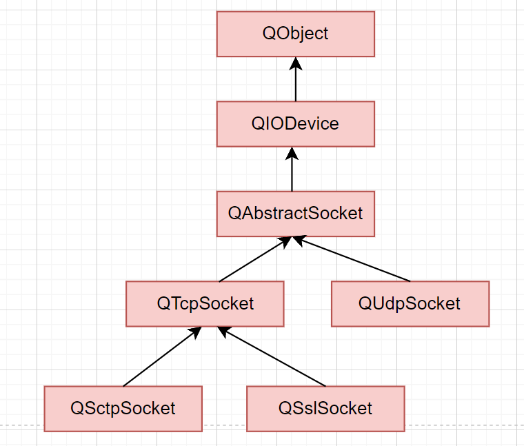

QTcpSocket类除了构造与析构外，其他函数都是从QAbstractSocket继承或者重定义的。QAbstractSocket用于TCP通信的主要接口函数如下：

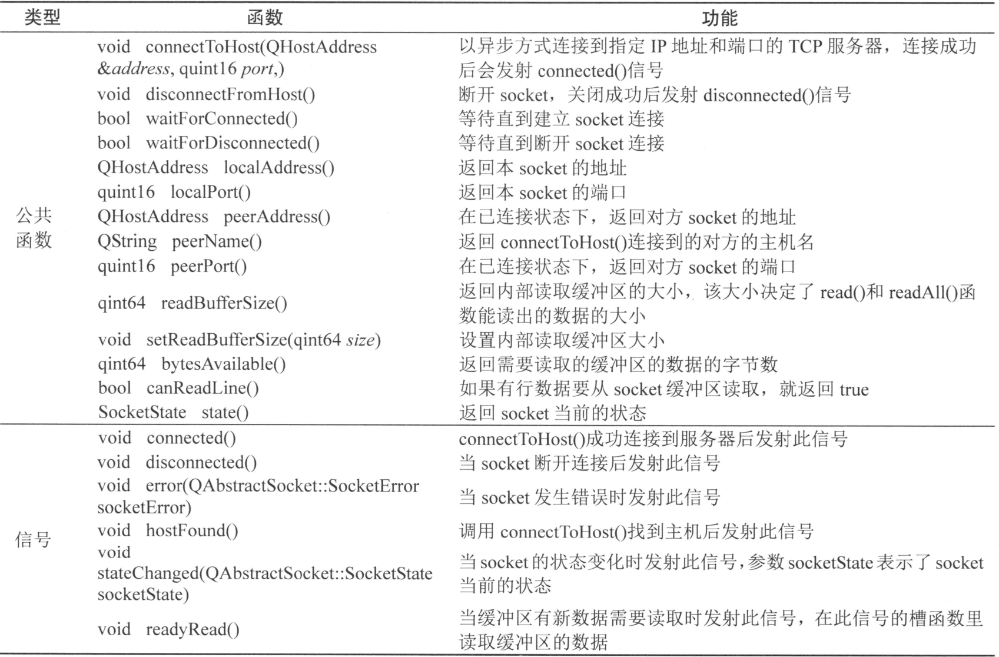

TCP客户端使用QTcpSocket与Tcp服务器建立连接并通信。客户端的QTcpSocket实例首先通过connectToHost函数尝试连接到服务器，需要指定服务器的IP地址和端口。connectToHost函数是异步方式连接到服务器，不会阻塞程序运行，连接后发射connected信号。如果需要使用阻塞式方式连接服务器，则使用waitForConnected函数阻塞程序运行，直到连接成功或失败，例如：

```C++
socket->connectToHost("192.168.100.100", 6666);
if(socket->waitForConnected(1000))
{
    qDebug("connected");
}
```

与服务器端建立socket连接后，就可以向缓冲区写数据或者从接收缓冲区读取数据，实现数据的通信。当缓冲区有新数据进入时，会触发readyRead信号，一般在此信号的槽函数里读取缓冲区数据。QTcpSocket是从QIODevice间接继承的，所以可以使用流数据读写功能。一个QTcpSocket实例既可以接收数据也可以发送数据，且接收与发射是异步工作的，有各自的缓冲区。

### 2、详细步骤

#### 2.1、服务器端

##### 2.1.1、创建QTcpServer对象

```C++
//创建QTcpServer对象
QTcpServer::QTcpServer(QObject *parent = nullptr);
//例如：
QTcpServer *tcpServer = new QTcpServer(this);
```

##### 2.1.2、监听

调用成员函数listen启动监听，该函数会绑定ip和端口号port，ip与端口号都可以自己指定或者系统指定。

```C++
//启动服务器监听
bool listen(
    const QHostAddress &address = QHostAddress::Any
    , quint16 port = 0);
//address：要监听的ip地址，如果写Any，表示监听该主机上的所有网络接口
//port：要监听的端口号，如果不指定，系统会默认给绑定一个随机端口号
//返回值：成功监听返回true，失败返回false

//例子
tcpServer->listen(QHostAddress::Any, port)
```

##### 2.1.3、信号检测

当有客户端发来请求后，服务器会自动触发newConnection信号，我们可以将信号绑定到自定义的槽函数中完成相关逻辑。

```C++
//此时，如果有客户端发来连接请求，那么该服务器就会自动触发一个newConnection的信号，我们可以将该信号连接到自定义的槽函数中，处理后续操作
[signal] void QTcpServer::newConnection();
//newConnectionSlot是自定义的槽函数
connect(tcpServer, &QTcpServer::newConnection, this, &Widget::newConnectionSlot);
```

##### 2.1.4、获取客户端套接字对象

使用newPendingConnection函数获取最新连接的客户端套接字

```C++
//获取最新连接的客户端套接字的地址,并返回最新的一个连接的套接字地址
[virtual] QTcpSocket *QTcpServer::nextPendingConnection();

//例如：
QTcpSocket *clientSocket = tcpServer->nextPendingConnection();
```

##### 2.1.5、发射readyRead信号

可以将该信号连接到对应的槽函数中，处理客户端发来的消息。

```C++
[signal] void QIODevice::readyRead();
//每次有新数据可供从设备读取时，此信号都会发出一次。只有当新数据可用时才会再次发出，例如当网络数据的新有效负载到达您的网络套接字时，或者当新的数据块已附加到您的设备时。
//readyRead不会递归发出；如果您重新进入事件循环或在连接到readyRead信号的插槽内调用waitForReadyRead，则不会重新发送信号（尽管waitForReadyRead（）可能仍然返回true）。

//例如：
//程序执行至此，一个服务器可以对应多个客户端，已经建立了连接；此时，如果有某个客户端发来数据，那么该客户端套接字就会自动发射一个readyRead的信号，我们可以将该信号连接到自定义的槽函数中处理相关逻辑
connect(clientSocket, &QTcpSocket::readyRead, this, &Widget::readyReadSlot);
```

##### 2.1.6、读取与写入数据

使用该客户端套接字进行读取数据以及发送数据

```C++
//返回当前套接字的状态
QAbstractSocket::SocketState QAbstractSocket::state() const
//返回结果为0时，表示该套接字是未连接状态
    
List<QTcpSocket *> socketList;
if(socketList[i]->state() == 0)
{
    //将该套接字移除出链表
    socketList.removeAt(i);
}

//判断当前客户端中是否有数据可读
[override virtual] qint64 QAbstractSocket::bytesAvailable() const
//返回值：返回当前客户端套接字中的待读数据，如果没有数据，则返回0
    
//读数据    
qint64 QIODevice::read(char *data, qint64 maxSize);
QByteArray QIODevice::read(qint64 maxSize);
QByteArray QIODevice::readAll();
qint64 QIODevice::readLine(char *data, qint64 maxSize);
QByteArray QIODevice::readLine(qint64 maxSize = 0);
//写数据
qint64 QIODevice::write(const char *data, qint64 maxSize);
qint64 QIODevice::write(const char *data);
qint64 QIODevice::write(const QByteArray &byteArray);
int QIODevice::writeChannelCount() const;

void Widget::readyReadSlot()
{
    int flag = socketList[i]->state;//返回套接字的状态
    
    if(socketList[i]->bytesAvailable() != 0)
    {
        QByteArray msg = socketList[i]->readAll();//读数据
        socketList[i]->write(msg);//写数据
    }
}
```

##### 2.1.7、关闭套接字

```C++
//关闭套接字
[override virtual] void QAbstractSocket::close()
tcpServer->close();
```

#### 2.2、客户端

##### 2.2.1、创建QTcpSocket对象.

```C++
//实例化客户端对象
//创建一个处于未连接状态下的QTcpSocket对象
QTcpSocket::QTcpSocket(QObject *parent = nullptr);

//例如：
QTcpSocket *clientTcpSocket = new QTcpSocket(this);
```

##### 2.2.2、向服务器发送请求

调用成员函数connectToHost向服务器发送连接请求，如果连接请求成功，那么客户端会自动触发connected的信号，将该信号连接到自定义的槽函数中进行逻辑处理

```C++
//调用套接字成员函数，连接服务器
void connectToHost(
    const QHostAddress &address
    , quint16 port, OpenMode mode = ReadWrite);
//address：要被连接的服务器ip地址
//port：服务器的端口号
//mode：默认为可读可写
//例如：
QString ip("127.0.0.1");
quint16 port(8888);
clientTcpSocket->connectToHost(ip, port);
clientTcpSocket->connectToHost("127.0.0.1", 8888);


//当客户端与服务器建立联系后，如果客户端接受到服务器发来的消息,客户端自身就会自动发射一个 readyRead的信号，我们可以将该信号连接到自定义的槽函数中执行相关逻辑
[signal] void QIODevice::readyRead();
connect(client, &QTcpSocket::readyRead, this, &Widget::readyReadSlot);
 
//如果当前客户端成功连接的服务器，那么该客户端就会自动发射一个connected的信号,可以将该信号连接到自定义的槽函数中处理相关逻辑
[signal] void QAbstractSocket::connected();
connect(client, &QTcpSocket::connected, this, &Widget::connectedSlot);

//当客户端断开了与服务器的连接后，该客户端就会自动发射一个disconnected的信号,可以将该信号连接到自定义的槽函数中处理相关逻辑
[signal] void QAbstractSocket::disconnected();
connect(client, &QTcpSocket::disconnected, this, &Widget::disconnectedSlot);
```

##### 2.2.3、读写数据

与服务器之间进行数据的传输

```C++
qint64 QIODevice::read(char *data, qint64 maxSize);
QByteArray QIODevice::read(qint64 maxSize);
QByteArray QIODevice::readAll();
qint64 QIODevice::readLine(char *data, qint64 maxSize);
QByteArray QIODevice::readLine(qint64 maxSize = 0);

qint64 QIODevice::write(const char *data, qint64 maxSize);
qint64 QIODevice::write(const char *data);
qint64 QIODevice::write(const QByteArray &byteArray);
int QIODevice::writeChannelCount() const;
```

##### 2.2.4、触发readyRead信号

如果客户端收到服务器发来的数据后，客户端会触发readyRead信号，将该信号连接到对应的槽函数中。

```C++
[signal] void QIODevice::readyRead();
```

##### 2.2.5、断开连接

调用成员函数disconnectFromHost断开跟服务器的连接。

```C++
[virtual] void QAbstractSocket::disconnectFromHost();
```

### 3、服务器端的设计

```C++
//widget.h
#ifndef WIDGET_H
#define WIDGET_H

#include <QWidget>
#include <QTcpServer>

QT_BEGIN_NAMESPACE
namespace Ui { class Widget; }
QT_END_NAMESPACE

class Widget : public QWidget
{
    Q_OBJECT

public:
    Widget(QWidget *parent = nullptr);
    ~Widget();

    void handle();
    QString process(const QString &request);

private:
    Ui::Widget *ui;
    QTcpServer *_tcpSever;
};
#endif // WIDGET_H

//widget.cpp
#include "widget.h"
#include "ui_widget.h"
#include <QMessageBox>
#include <QTcpSocket>

Widget::Widget(QWidget *parent)
    : QWidget(parent)
    , ui(new Ui::Widget)
{
    ui->setupUi(this);

    //设置窗口标题
    setWindowTitle("TCP服务器");
    //初始化
    _tcpSever = new QTcpServer(this);
    //通过槽函数进行连接
    connect(_tcpSever, &QTcpServer::newConnection, this, &Widget::handle);
    //监听端口
    bool ret = _tcpSever->listen(QHostAddress::Any, 8888);
    if(!ret)
    {
        QMessageBox::critical(this, "服务器启动失败", _tcpSever->errorString());
        return;
    }
}

void Widget::handle()
{
    //获取到新的连接对应的socket.
    QTcpSocket *clientSocket = _tcpSever->nextPendingConnection();
    QString log = QString('[') + clientSocket->peerAddress().toString() + ":"
            + QString::number(clientSocket->peerPort()) + "] 客⼾端上线!";
    ui->listWidget->addItem(log);

    //通过信号槽,处理收到请求的情况
    connect(clientSocket, &QTcpSocket::readyRead, this, [=](){
        //读取出请求数据
        QString request = clientSocket->readAll();
        //根据请求处理响应
        const QString &response = process(request);
        //写会客户端
        clientSocket->write(response.toUtf8());

        QString log = QString("[") + clientSocket->peerAddress().toString()
                + ":" + QString::number(clientSocket->peerPort()) + "] req: " +
                request + ", resp: " + response;
        ui->listWidget->addItem(log);
    });

    //通过信号槽,处理断开连接的情况
    connect(clientSocket, &QTcpSocket::disconnected, this, [=](){
        QString log = "[" + clientSocket->peerAddress().toString() + ":"
                + QString::number(clientSocket->peerPort()) + "] 客⼾端下线!";
        ui->listWidget->addItem(log);
        clientSocket->deleteLater();
    });
}

QString Widget::process(const QString &request)
{
    return request;
}

Widget::~Widget()
{
    delete ui;
}
```

### 4、客户端的设计

```C++
//widget.h
#ifndef WIDGET_H
#define WIDGET_H

#include <QWidget>
#include <QTcpSocket>

QT_BEGIN_NAMESPACE
namespace Ui { class Widget; }
QT_END_NAMESPACE

class Widget : public QWidget
{
    Q_OBJECT

public:
    Widget(QWidget *parent = nullptr);
    ~Widget();

private slots:
    void on_btnSend_clicked();

private:
    Ui::Widget *ui;
    QTcpSocket *_tcpClient;
};
#endif // WIDGET_H

//widget.cpp
#include "widget.h"
#include "ui_widget.h"
#include <QMessageBox>

Widget::Widget(QWidget *parent)
    : QWidget(parent)
    , ui(new Ui::Widget)
{
    ui->setupUi(this);

    //设置窗⼝标题
    setWindowTitle("TCP客户端");
    //实例化socket对象
    _tcpClient = new QTcpSocket(this);
    //与服务器建⽴连接
    _tcpClient->connectToHost("127.0.0.1", 8888);

    //处理服务器返回的响应.
    connect(_tcpClient, &QTcpSocket::readyRead, this, [=](){
        //读取当前接收缓冲区中的所有数据
        QString response = _tcpClient->readAll();
        qDebug() << response;
        ui->listWidget->addItem(QString("服务器说: ") + response);
    });

    //等待并确认连接是否出错
    if(!_tcpClient->waitForConnected()){
        QMessageBox::critical(this, "连接服务器出错!", _tcpClient->errorString());
        return;
    }
}

Widget::~Widget()
{
    delete ui;
}


void Widget::on_btnSend_clicked()
{
    //获取输⼊框的内容
    const QString &text = ui->lineEdit->text();
    //清空输⼊框内容
    ui->lineEdit->setText("");
    //把消息显⽰到界⾯上
    ui->listWidget->addItem(QString("客⼾端说: ") + text);
    //发送消息给服务器
    _tcpClient->write(text.toUtf8());
}
```

### 5、测试结果

先启动服务器，然后再启动客户端，在客户端发送数据给服务器。

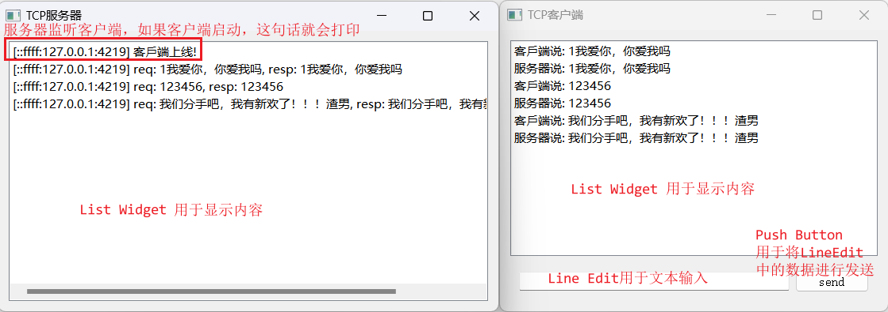

## 二、UDP Socket

### 1、UDP通信概述

<span style=color:red;background:yellow;font-size:20px>UDP（User Datagram Protocol，用户数据报协议）是轻量的、不可靠的、面向数据报、无连接的协议，它可以用于对可靠性要求不高的场合</span>。与TCP通信不同，两个程序之间进行UDP通信无需预先建立持久的socket连接，UDP每次发送数据报都需要指定目标地址与端口。

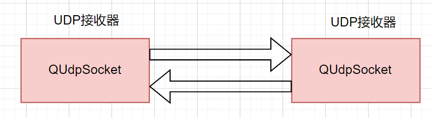

QUdpSocket类用于实现UDP通信，它从QAbstractSocket类继承，因而与QTcpSocket共享大部分的接口函数。主要区别是QUdpSocket以数据报传输数据，而不是以连续的数据流。<span style=color:red;background:yellow>发送数据使用函数QUdpSocket::writeDatagram()，数据报的长度一般少于512字节，每个数据报包含发送者和接受者的IP地址和端口等信息</span>。

要进行UDP数据接收，要用QUdpSocket::bind()函数先绑定一个端口，用于接收传入的数据报。当有数据报传入时会发射readyRead()信号，使用readDatagram()函数来读取接收到的数据报。

QUdpSocket是从QAbstractSocket继承而来，但是又定义了较多新的功能函数用于实现UDP特有的一些功能。QUdpSocket的主要功能函数如下：

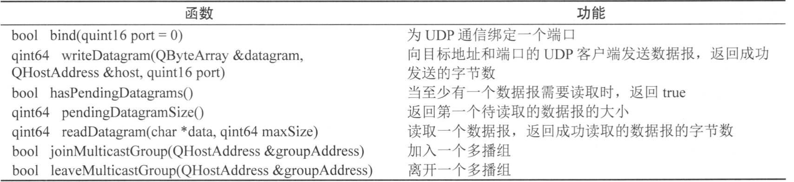


### 2、详细步骤

#### 2.1、创建QUdpSocket对象

 首先，你需要创建一个QUdpSocket对象。这可以通过直接实例化该类来完成。

```C++
//创建QUdpSocket对象
QUdpSocket::QUdpSocket(QObject *parent = nullptr);
//例子：
QUdpSocket *udpSocket = new QUdpSocket(this);
```

#### 2.2、绑定端口

在开始发送或接收数据之前，你需要绑定一个端口到QUdpSocket对象。这可以通过调用bind函数来完成。

```C++
//绑定address与port，绑定指定的端口号，对应原生的bind函数
bool bind(
    const QHostAddress &address
    , quint16 port = 0
    , QAbstractSocket::BindMode mode = DefaultForPlatform);
bool bind(
    quint16 port = 0
    , QAbstractSocket::BindMode mode = DefaultForPlatform);
//参数解析：
//address：QHostAddress类型；QHostAddress(QHostAddress::SpecialAddress address)
//SpecialAddress是个枚举值，如下
//QHostAddress::Null
//QHostAddress::LocalHost
//QHostAddress::LocalHostIPv6
//QHostAddress::Broadcast
//QHostAddress::AnyIPv4
//QHostAddress::AnyIPv6
//QHostAddress::Any

//例子
udpSocket->bind(QHostAddress::LocalHost, 1234);  //1234为端口号 ip为本机ip地址
```

#### 2.3、写入数据

要发送数据，你可以使用writeDatagram函数。这个函数接受要发送的数据和一个目标地址和端口。（注意这里要用QByteArray类型数据发送，如果要发送的数据是QString类型，可以用toLocal8bit()或者toUtf8()转化为QByteArray类型，然后才能发送）

```C++
//函数1：对应原生的sendto
qint64 QUdpSocket::writeDatagram(
    const char *data, qint64 size
    , const QHostAddress &address, quint16 port);
//函数2：
qint64 QUdpSocket::writeDatagram(const QNetworkDatagram &datagram);

QNetworkDatagram::QNetworkDatagram(
    const QByteArray &data
    , const QHostAddress &destinationAddress = QHostAddress()
    , quint16 port = 0);

//函数3：本质与函数2是一样的，就是将QNetworkDatagram拆分了.
qint64 QUdpSocket::writeDatagram(
    const QByteArray &datagram
    , const QHostAddress &host, quint16 port);

//例如1：
QByteArray data;
data.append("Hello, UDP!");
udpSocket->writeDatagram(data, QHostAddress::LocalHost, 1234);

//例如2：或者如下传输
const QString& SERVER_IP = "127.0.0.1";
const quint16 SERVER_PORT = 8888;

QString text = "hello, world";
QNetworkDatagram requestData(text.toUtf8(), QHostAddress(SERVER_IP),SERVER_PORT);
udpSocket->writeDatagram(requestDatagram);
```

#### 2.4、读取数据

要接收数据，你需要使用QUdpSocket的readyRead()信号，这个信号在有数据到达时被触发。然后，你可以调用readDatagram()函数来读取数据 

```C++
//如果至少有一个数据可读，函数返回true，否则返回false。
bool QUdpSocket::hasPendingDatagrams() const;

//获取第一个挂起的UDP数据报的大小(下一个待读取数据报)。如果没有可用的数据报，则此函数返回-1
qint64 QUdpSocket::pendingDatagramSize() const;


//指定可读取的最大值maxSize的数据存放在data中;
//成功，就返回实际读到的数据值，失败返回-1.
qint64 QUdpSocket::readDatagram(
    char *data, qint64 maxSize
    , QHostAddress *address = nullptr
    , quint16 *port = nullptr);

//接收数据，并存放在函数返回结果QNetworkDatagram对象中。maxSize指定可以读取的大小，对应原生的recvfrom
QNetworkDatagram QUdpSocket::receiveDatagram(qint64 maxSize = -1);

//例如1：
connect(socket,&QUdpSocket::readyRead,this,&Widget::readPendingDatagrams);

void Widget::readPendingDatagrams() 
{
    while (udpSocket->hasPendingDatagrams()) 
    {
        QByteArray datagram;
        datagram.resize(udpSocket->pendingDatagramSize());
        QHostAddress sender;  //发送信息者的ip地址
        quint16 senderPort;   //端口号
 
        udpSocket->readDatagram(datagram.data(), datagram.size(), 
                                &sender, &senderPort);
 
        qDebug() << "Received datagram:" << QString::fromLocal8Bit(datagram) 
                 << "from" << sender 
                 << "port" << senderPort;
    }
}

//例如2：
const QNetworkDatagram& requestDatagram = udpSocket->receiveDatagram();
QString request = requestDatagram.data();
QNetworkDatagram responseData(request.toUtf8(),requestDatagram.senderAddress(), 
                              requestDatagram.senderPort());
udpSocket->writeDatagram(responseDatagram);
```

#### 2.5、关闭套接字

 当UDP通信结束时，关闭套接字。

```C++
[override virtual] void QAbstractSocket::close();

//例如：
udpSocket->close();
```

```C++
void Server::initSocket()
{
    udpSocket = new QUdpSocket(this);
    udpSocket->bind(QHostAddress::LocalHost, 7755);
    connect(udpSocket, &QUdpSocket::readyRead,
            this, &Server::readPendingDatagrams);
}

void Server::readPendingDatagrams()
{
    while (udpSocket->hasPendingDatagrams()) 
    {
        QNetworkDatagram datagram = udpSocket->receiveDatagram();
        processTheDatagram(datagram);
    }
}
```

### 3、服务器端的设计

在ui界面，设计一个listWidget控件，用于显示客户端发送过来的数据。

```C++
//widget.h
#ifndef WIDGET_H
#define WIDGET_H

#include <QWidget>
#include <QUdpSocket>

QT_BEGIN_NAMESPACE
namespace Ui { class Widget; }
QT_END_NAMESPACE

class Widget : public QWidget
{
    Q_OBJECT

public:
    Widget(QWidget *parent = nullptr);
    ~Widget();

    void handle();
    QString process(const QString &req);

private:
    Ui::Widget *ui;

    QUdpSocket *_udpSocket;
};
#endif // WIDGET_H

//widget.cpp
#include "widget.h"
#include "ui_widget.h"
#include <QMessageBox>
#include <QNetworkDatagram>

Widget::Widget(QWidget *parent)
    : QWidget(parent)
    , ui(new Ui::Widget)
{
    ui->setupUi(this);

    //设置窗口标题
    setWindowTitle("UDP服务器端");

    //实例化socket
    _udpSocket = new QUdpSocket(this);

    //在收到数据并准备就绪后会触发readyRead信号,然后与handle函数建立连接
    connect(_udpSocket, &QUdpSocket::readyRead, this, &Widget::handle);

    //绑定端口号，如果绑定失败，会调用对话框报错
    bool ret = _udpSocket->bind(QHostAddress::Any, 8888);
    if(!ret)
    {
        QMessageBox::critical(this,  "服务器启动错误", _udpSocket->errorString());
        return;
    }
}

void Widget::handle()
{
    //1、读取请求,读取一个UDP数据报，并且获取数据
    const QNetworkDatagram &requestDatagram = _udpSocket->receiveDatagram();
    QString request = requestDatagram.data();

    //2、根据请求计算响应
    const QString &response = process(request);

    //3、将响应写回到客户端
    //封装数据报,并将其发送给客户端
    QNetworkDatagram responseDatagram(response.toUtf8(),
                                      requestDatagram.senderAddress(),
                                      requestDatagram.senderPort());
    _udpSocket->writeDatagram(responseDatagram);

    //显示打印日志
    QString log = "[" + requestDatagram.senderAddress().toString()
            + ":" + QString::number(requestDatagram.senderPort())
            + "] req: " + request + ", resp: " + response;
    ui->listWidget->addItem(log);
}

QString Widget::process(const QString &req)
{
    return req;
}

Widget::~Widget()
{
    delete ui;
}
```

### 4、客户端的设计

在ui界面，设计一个listWidget空间，用于显示信息；Line Edit用于客户端数据的输入，PushButton用于将Line Edit中的数据发送给服务器。

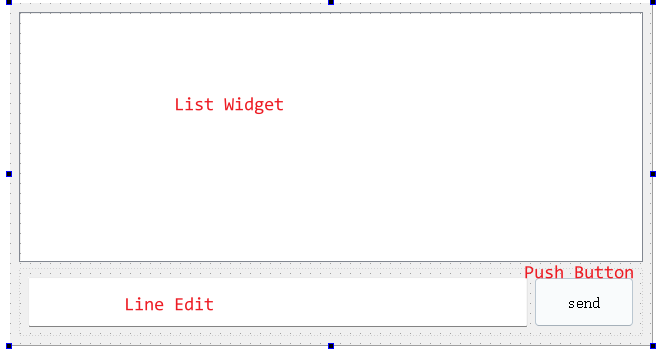

```C++
//widget.h
#ifndef WIDGET_H
#define WIDGET_H

#include <QWidget>
#include <QUdpSocket>

QT_BEGIN_NAMESPACE
namespace Ui { class Widget; }
QT_END_NAMESPACE

class Widget : public QWidget
{
    Q_OBJECT

public:
    Widget(QWidget *parent = nullptr);
    ~Widget();

private slots:
    void on_btnSend_clicked();
    void handle();

private:
    Ui::Widget *ui;
    QUdpSocket *_udpClient;
};
#endif // WIDGET_H


//widget.cpp
#include "widget.h"
#include "ui_widget.h"

#include <QNetworkDatagram>
//提前定义好服务器的 IP 和 端⼝
const QString &SERVER_IP = "127.0.0.1";
const quint16 SERVER_PORT = 8888;

Widget::Widget(QWidget *parent)
    : QWidget(parent)
    , ui(new Ui::Widget)
{
    ui->setupUi(this);

    _udpClient = new QUdpSocket(this);
    setWindowTitle("UDP客户端");

    //在收到数据并准备就绪后会触发readyRead信号,然后与handle函数建立连接
    connect(_udpClient, &QUdpSocket::readyRead, this, &Widget::handle);
}

Widget::~Widget()
{
    delete ui;
}

void Widget::on_btnSend_clicked()
{
    //获取到输⼊框的内容
    const QString &text = ui->lineEdit->text();
    //构造请求数据
    QNetworkDatagram requestData(text.toUtf8(),
                                 QHostAddress(SERVER_IP),
                                 SERVER_PORT);
    //发送请求
    _udpClient->writeDatagram(requestDatagram);
    //消息添加到列表框中
    ui->listWidget->addItem("客户端:" + text);
    //清空输⼊框
    ui->lineEdit->setText("");
}

void Widget::handle()
{
    //读取响应数据
    const QNetworkDatagram &responseDatagram = _udpClient->receiveDatagram();
    QString response = responseDatagram.data();
    //把响应数据显示到界面上
    ui->listWidget->addItem(QString("服务器说: ") + response);
}
```

### 5、测试结果

先启动服务器，然后再启动客户端，在客户端发送数据给服务器。

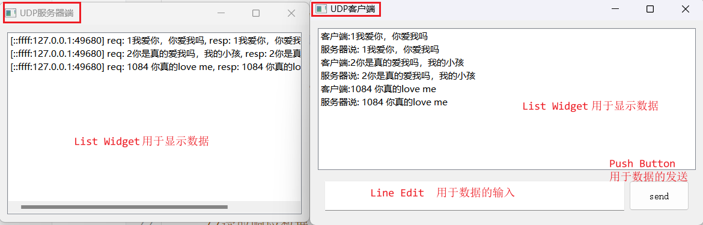

## 三、HTTP Client

### 1、实现高层网络操作的类

Qt网络模块提供一些类实现OSI七层网络模型中高层的网络协议，如HTTP、FTP、SNMP等，这些类主要是QNetworkRequest网络请求、QNetworkReply网络回复和QNetworkAccessManager网络访问管理器。其中，<span style=color:red;background:yellow;>QNetworkRequest类通过一个URL地址发起网络协议请求，也保存网络请求的信息，目前支持HTTP、FTP和局部文件URLs的上传和下载。QNetworkAccessManager类用于协调网络操作。在QNetworkRequest发起一个网络请求后，QNetworkAccessManager类负责发送网络请求，创建网络响应。QNetworkReply类表示网络请求的响应。QNetworkAccessManager在发送一个网络请求后创建一个网络响应。QNetworkReply提供的信号finished、readyRead和downloadProgress可以检测网络响应的执行情况，执行响应操作。QNetworkReply是QIODevice的子类，所以QNetworkReply支持流读写功能，也支持异步或者同步工作模式。</span>

进行Qt开发时，和服务器之间的通信很多时候也会用到HTTP协议。

- 通过HTTP从服务器获取数据；
- 通过HTTP向服务器提交数据

### 2、核心函数

QNetworkAccessManagerr网络访问管理器类提供了HTTP的核心操作.

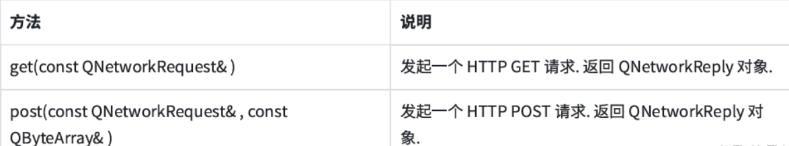

QNetworkRequest网络请求类表示⼀个HTTP请求(不含body)。

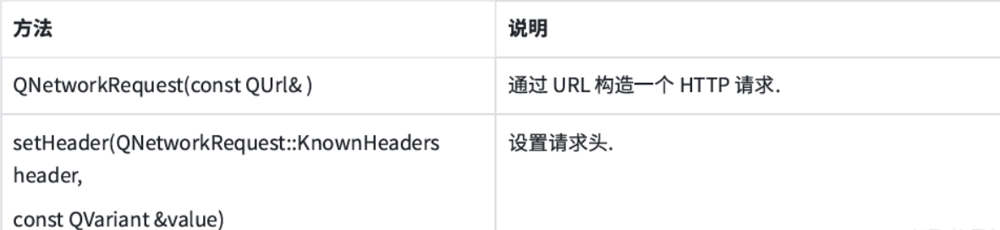

其中的 QNetworkRequest::KnownHeaders是⼀个枚举类型,常用取值: 

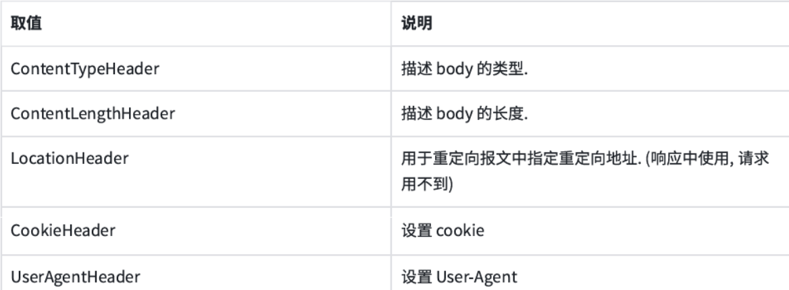

QNetworkReply网络回复类表示⼀个HTTP响应。这个类同时也是 QIODevice 的子类。

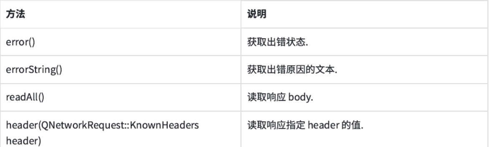

此外, 发QNetworkReply还有⼀个重要的信号finished会在客户端收到完整的响应数据之后触发。

### 3、Http的代码设计

```C++
//widget.h
#ifndef WIDGET_H
#define WIDGET_H

#include <QWidget>
#include <QNetworkAccessManager>

QT_BEGIN_NAMESPACE
namespace Ui { class Widget; }
QT_END_NAMESPACE

class Widget : public QWidget
{
    Q_OBJECT

public:
    Widget(QWidget *parent = nullptr);
    ~Widget();

private slots:
    void on_pushButton_clicked();

private:
    Ui::Widget *ui;
    QNetworkAccessManager *_httpManager;
};
#endif // WIDGET_H

//widget.cpp
#include "widget.h"
#include "ui_widget.h"
#include <QUrl>
#include <QNetworkReply>

Widget::Widget(QWidget *parent)
: QWidget(parent)
, ui(new Ui::Widget)
{
    ui->setupUi(this);

    setWindowTitle("Http客户端");

    _httpManager = new QNetworkAccessManager(this);
}

Widget::~Widget()
{
    delete ui;
}

void Widget::on_pushButton_clicked()
{
    //获取到输⼊框中的URL, 构造QUrl对象
    QUrl url(ui->lineEdit->text());

    //构造HTTP请求对象
    QNetworkRequest request(url);

    //发送GET请求
    QNetworkReply *response = _httpManager->get(request);
    //通过信号槽来处理响应
    connect(response, &QNetworkReply::finished, this, [=]() {
        if(response->error() == QNetworkReply::NoError)
        {
            //响应正确
            QString html(response->readAll());
            ui->plainTextEdit->setPlainText(html);
            //qDebug() << html;
        } else {
            //响应出错
            ui->plainTextEdit->setPlainText(response->errorString());
        }
        response->deleteLater();
    });
}
```

### 4、测试结果

<span style=color:red;background:yellow;font-size:20px>如果使用的是http没有问题，但是如果使用https的时候有问题，可以按照如下操作：</span>

> 将libssl-1_1-x64.dll与libcrypto-1_1-x64.dll文件放在D:\software\qt5\5.14.2\mingw73_64\bin目录下（自己的就找到之前安装Qt软件包的位置），当然如果是32位系统，则是如下两个文件libssl-1_1.dll和libcrypto-1_1.dll（这两个文件我这里有，也可以网络下载）

测试方式 

```C++
qDebug() << QSslSocket::supportsSsl(); //应返回 true
```

此处建议使用QPlainTextEdit而不是QTextEdit。主要因为QTextEdit要进行富文本解析，如果得到的HTTP响应体积很大，就会导致界面渲染缓慢甚至被卡住。

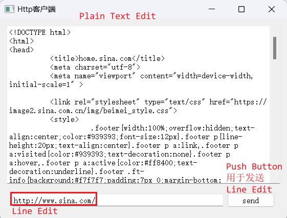

### 5、网络下载MP3文件

另外一个例子，从网络下载mp3文件，并存储在当前用户在的下载文件夹中，比如："C:/Users/lili/Downloads"

```C++
#ifndef MAINWINDOW_H
#define MAINWINDOW_H

#include <QWidget>
#include <QNetworkAccessManager>
#include <QNetworkReply>
#include <QFile>

QT_BEGIN_NAMESPACE
namespace Ui { class Widget; }
QT_END_NAMESPACE

class Widget : public QWidget
{
    Q_OBJECT

public:
    Widget(QWidget *parent = nullptr);
    ~Widget();
private slots:
    void onDownloadButtonClicked();   // 点击下载按钮
    void onDownloadProgress(qint64 bytesReceived, qint64 bytesTotal); // 下载进度更新
    void onDownloadFinished();
private:
    Ui::Widget *ui;

    QNetworkAccessManager *_networkManager;
    QNetworkReply *_currentReply;
    QFile *_outputFile;
    bool _isDownloading;
};
#endif // MAINWINDOW_H

```

```C++
#include "widget.h"
#include "ui_widget.h"
#include <QUrl>
#include <QMessageBox>
#include <QDir>

Widget::Widget(QWidget *parent)
: QWidget(parent)
, ui(new Ui::Widget)
, _networkManager(new QNetworkAccessManager(this))
, _currentReply(nullptr)
, _outputFile(nullptr)
, _isDownloading(false)
{
    ui->setupUi(this);

    // 绑定下载按钮点击事件
    connect(ui->downloadButton, &QPushButton::clicked,
            this, &Widget::onDownloadButtonClicked);

    // 设置进度条初始状态
    ui->progressBar->setRange(0, 100);
    ui->progressBar->setValue(0);
}

Widget::~Widget()
{
    delete ui;
    if (_currentReply)
    {
        _currentReply->deleteLater();
    }

    if (_outputFile)
    {
        _outputFile->deleteLater();
    }
}

void Widget::onDownloadButtonClicked()
{
    if (_isDownloading)
    {
        QMessageBox::warning(this, "警告", "当前已在下载！");
        return;
    }

    QString downloadUrl = ui->urlEdit->text().trimmed();
    if (downloadUrl.isEmpty())
    {
        QMessageBox::warning(this, "错误", "请输入下载链接！");
        return;
    }

    // 设定保存位置（默认存到“下载”文件夹）
    QString savePath = QDir::homePath() + "/Downloads/";
//    qDebug() << "savePath = " << QDir::homePath();//"C:/Users/lili"
    QString fileName = downloadUrl.split("/").last(); // 获取文件名
    if (fileName.isEmpty())
    {
        fileName = "music.mp3"; // 默认文件名
    }

    QString fileFullPath = savePath + fileName;

    // 检查文件是否已存在
    if (QFile::exists(fileFullPath))
    {
        QMessageBox::StandardButton reply;
        reply = QMessageBox::question(this, "文件已存在", "该文件已存在，是否覆盖？",
                                      QMessageBox::Yes | QMessageBox::No);
        if (reply == QMessageBox::No)
            return;
    }

    // 打开文件用于写入
    _outputFile = new QFile(fileFullPath);
    if (!_outputFile->open(QIODevice::WriteOnly))
    {
        QMessageBox::critical(this, "错误", "无法创建文件！");
        delete _outputFile;
        _outputFile = nullptr;
        return;
    }

    // 开始下载
    QNetworkRequest request(downloadUrl);
    _currentReply = _networkManager->get(request);

    // 连接信号
    connect(_currentReply, &QNetworkReply::downloadProgress,
            this, &Widget::onDownloadProgress);
    connect(_currentReply, &QNetworkReply::finished,
            this, &Widget::onDownloadFinished);
    connect(_currentReply, &QNetworkReply::readyRead, [this]() {
        if (_outputFile && _currentReply)
        {
            _outputFile->write(_currentReply->readAll());
        }
    });

    _isDownloading = true;
    ui->downloadButton->setText("正在下载...");
}

void Widget::onDownloadProgress(qint64 bytesReceived, qint64 bytesTotal)
{
    if (bytesTotal > 0)
    {
        int progress = static_cast<int>((bytesReceived * 100) / bytesTotal);
        ui->progressBar->setValue(progress);
        ui->statusLabel->setText(QString("已下载: %1 / %2 KB")
                                 .arg(bytesReceived / 1024).arg(bytesTotal / 1024));
    }
}

void Widget::onDownloadFinished()
{
    if (_outputFile)
    {
        _outputFile->flush();
        _outputFile->close();
        delete _outputFile;
        _outputFile = nullptr;
    }

    if (_currentReply->error() == QNetworkReply::NoError)
    {
        QMessageBox::information(this, "完成", "歌曲下载成功！");
    }
    else
    {
        QMessageBox::critical(this, "错误", "下载失败：" + _currentReply->errorString());
    }

    _currentReply->deleteLater();
    _currentReply = nullptr;
    _isDownloading = false;
    ui->downloadButton->setText("下载");
}

```

UI设计界面如下图：

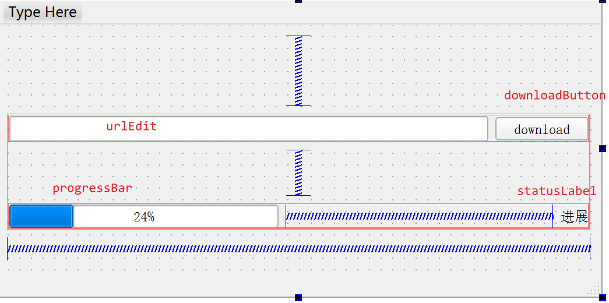

测试结果

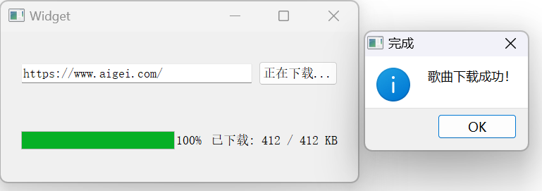

