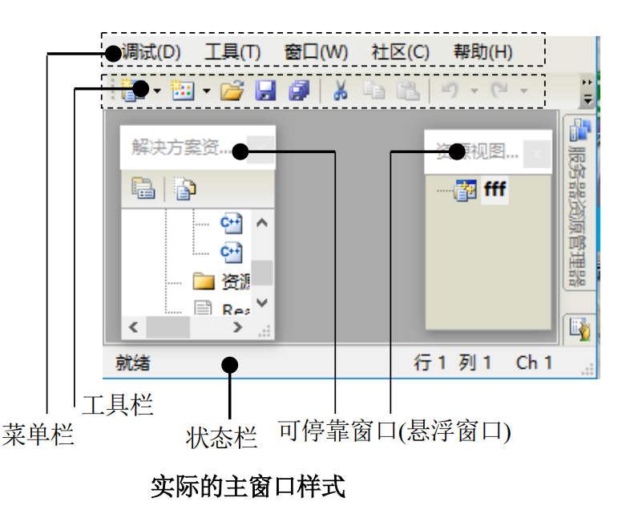
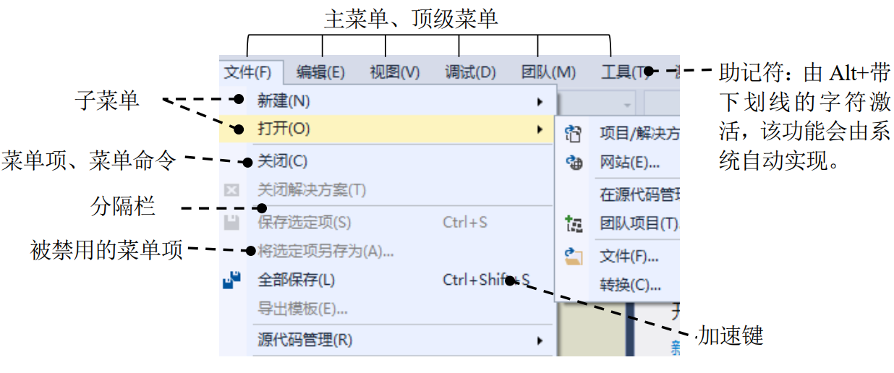
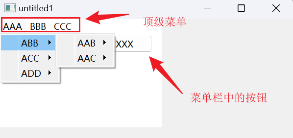
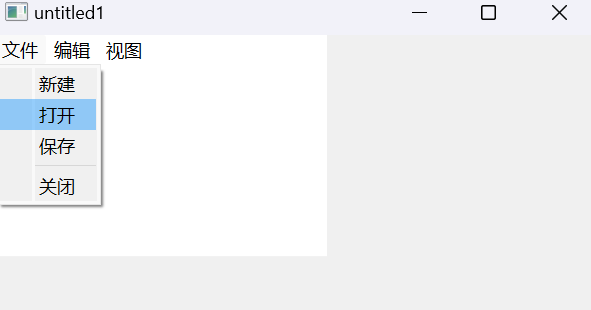
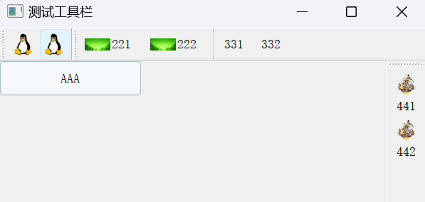
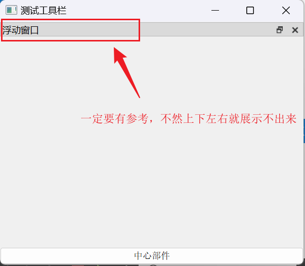
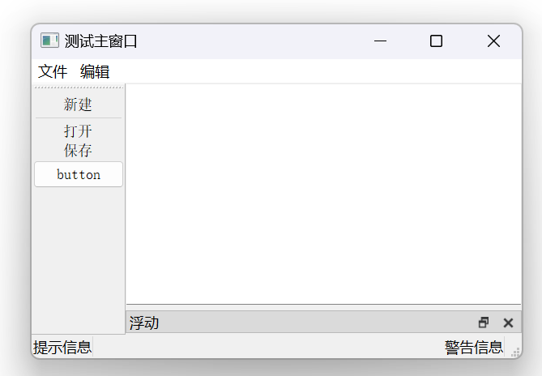

# Qt主窗口

## 一、主窗口介绍

QMainWindow类继承自QWidget类，<span style=color:red;background:yellow;font-size:20px>**因此主窗口就是一个普通的部件，只不过主窗口拥有自已的布局，在主窗口中特定的位置只能添加特定的子部件而已**</span>。 因为主窗口有自已的布局，因此不能在主窗口上设置布局管理器。  

QMainWindow是一个为用户提供主窗口程序的类，包含一个菜单栏、多个工具栏(停靠范围是上下左右)、多个铆接部件(也叫浮动窗口)、一个状态栏、一个中心部件，是一个应用程序的基础。下图为主窗口的布局图：


下面给出一个在实际情况下的案例图，并于主窗口进行一一对应，图形如下：



### 1、菜单与菜单栏

菜单位于菜单栏之中，一个主窗口只能有一个菜单栏，一个菜单栏中可以包含多个菜单。QMainWindow有一个默认的菜单栏，该菜单栏使用menuBar()函数返回，使用setMenuBar()进行添加。

### 2、工具栏

通常是由一系列的类似按钮的部件组成的，使用addToolBar()可以把工具栏添加到主窗口，工具栏是由QToolBar类实现的，一个主窗口可以有多个工具栏，工具栏可以位于主窗口的上、下、左、右四个方向上。

### 3、Dock部件

又称为铆接部件，或者悬浮窗口、可停靠窗口，一个主窗口可以有多个可停靠窗口，使用addDockWidget()可以把可停靠窗口添加到主窗口。

### 4、状态栏

主要用于向用户显示一些程序的状态信息，位于主窗口底部，一个主窗口只能有一个状态栏，使用setStatursBar()函数设置。

### 5、中心部件

主窗口必须有且只能有一个中心部件，它可以是任意类型的部件(比如 QTextEdit、 QLineEdit 等)，使用setCentralWidget()函数设置。

## 二、菜单栏

 QMenuBar类是Qt中用于表示菜单栏的类。‌Qt菜单栏的主要作用是为用户提供直观、可视化的方式来浏览和选择程序的各种功能和操作‌。菜单栏通常位于窗口的顶部或顶部附近，包含多个菜单，每个菜单都有一个标题和一系列相关的命令或选项。用户可以通过点击菜单标题或者在菜单栏上的相应按钮来打开菜单，并从中选择需要的操作‌。

一个主部件最多只能有一个菜单栏，一个菜单栏可以添加多个菜单，一个菜单又可以添加多个菜单项。每个菜单又都是一个QMenu类型，每个菜单项都是一个QAction类型。

### 1、菜单示例图



### 2、各部分介绍

菜单：为便于讲解本文会把单独的一个菜单项和含有其他菜单项的菜单统称为菜单，因此菜单这一概念比较易产生混淆。

主菜单：如上图所示，“文件”、“编辑”、“视图”等都是主菜单。

弹出菜单、下拉菜单：展开后包含其他菜单或菜单项的菜单称为下拉菜单或弹出菜单。通常顶级菜单是弹出菜单。

子菜单：位于弹出菜单中的弹出菜单称为子菜单，因此子菜单也是弹出菜单。通常子菜单在右侧有一个向右的箭头。比如上图中的“新建”、“打开”都是子菜单。

系统菜单： 在标题栏最左边的小图标上左击或右击鼠标，会激活系统菜单。

快捷菜单(上下文菜单)：指的是点击鼠标右键弹出的菜单，这种菜单也是弹出菜单。

标记菜单： 菜单项可以被选中，即在菜单文本左侧显示一个小的选中标记(一般为一个勾形符号)，这种类型的菜单被称为标记菜单。 顶级菜单不能被选中。

助记符：是指使用“AlT+某个字符”形式的快捷键，通常这个字符会加上下划线或被小括号括起来，如上图中的“文件(F)”，其中的 F 就是助记符。

快捷键、加速键、助记符：把 Ctrl+C(复制)这种类型的快捷键称为加速键，其实助记符和加速键都是快捷键，为避免引起概念混淆，本文尽量注意区分

### 3、菜单栏的使用

#### 3.1、菜单栏常用函数

```C++
//添加菜单
QAction *addMenu(QMenu *menu);
QMenu *addMenu(const QString &title);
QMenu *addMenu(const QIcon &icon, const QString &title);
QAction *insertMenu(QAction *before, QMenu *menu);
    
//添加菜单项
QAction *addAction(const QString &text);
QAction *addAction(const QString &text, 
                   const QObject *receiver,
                   const char *member);
QAction *addAction(const QString &text, 
                   const Obj *receiver, 
                   PointerToMemberFunctionOrFunctor method);
QAction *addAction(const QString &text, Functor functor);

//添加分隔符 
QAction *addSeparator();
QAction *insertSeparator(QAction *before);

//设置或者获取是否弹出
void setDefaultUp(bool);
bool isDefaultUp() const;

//设置或者获取当前活动的菜单项。活动菜单项通常用于高亮显示，以便用户可以清楚地知道当前操作的位置
void setActiveAction(QAction *act);
QAction *activeAction() const;

//活动菜单的位置
QAction *actionAt(const QPoint &pt) const
QRect actionGeometry(QAction *act) const;

//设置是否可见
[slot] virtual void setVisible(bool visible) override;

//信号
//当用户将鼠标悬停在菜单项上时触发信号
[signal] void QMenuBar::hovered(QAction *action);

//当用户选择菜单项时触发信号
[signal] void QMenuBar::triggered(QAction *action);
```

#### 3.2、菜单常用函数

```C++
//构造函数
QMenu(const QString &title, QWidget *parent = nullptr);
QMenu(QWidget *parent = nullptr);

//添加菜单
QAction *addMenu(QMenu *menu);
QMenu *addMenu(const QString &title);
QMenu *addMenu(const QIcon &icon, const QString &title);
QAction *insertMenu(QAction *before, QMenu *menu);

//添加菜单项
QAction *addAction(const QString &text);
QAction *addAction(const QIcon &icon, const QString &text);
QAction *addAction(const QString &text, const QObject *receiver, 
                   const char *member, 
                   const QKeySequence &shortcut = 0);
QAction *addAction(const QIcon &icon, const QString &text, 
                   const QObject *receiver, 
                   const char *member, 
                   const QKeySequence &shortcut = 0);
QAction *addAction(const QString &text, Functor functor,
                   const QKeySequence &shortcut = ...);
QAction *addAction(const QString &text, const QObject *context,
                   Functor functor,
                   const QKeySequence &shortcut = 0);
QAction *addAction(const QIcon &icon, const QString &text, 
                   Functor functor, 
                   const QKeySequence &shortcut = ...);
QAction *addAction(const QIcon &icon, const QString &text,
                   const QObject *context, 
                   Functor functor, 
                   const QKeySequence &shortcut = 0);

//返回菜单项
QAction *actionAt(const QPoint &pt) const;
QRect actionGeometry(QAction *act) const;
QAction *activeAction() const;

//用于获取关联的菜单项的 QAction 对象。
QAction *menuAction() const;

//添加分隔符
QAction *addSeparator();
QAction *insertSeparator(QAction *before);
//在菜单中添加一个分隔项
QAction *addSection(const QString &text);
QAction *addSection(const QIcon &icon, const QString &text);
QAction *insertSection(QAction *before, const QString &text);
QAction *insertSection(QAction *before, 
                       const QIcon &icon, 
                       const QString &text);

//设置或者获取标题    
void setTitle(const QString &title)
QString title() const

//信号
//当菜单即将隐藏时触发信号
[signal] void aboutToHide();

//当菜单即将显示时触发信号
[signal] void aboutToShow();

//用户将鼠标悬停在菜单项上时触发信号
[signal] void hovered(QAction *action);

//当用户选择菜单项时触发信号
[signal] void triggered(QAction *action);
```

#### 3.3、菜单项常用函数

```C++
//菜单项构造函数
QAction(const QIcon &icon, const QString &text,
        QObject *parent = nullptr);
QAction(const QString &text, QObject *parent = nullptr);
QAction(QObject *parent = nullptr);

//设置或者获取数据、字体、图标、图标文本、普通文本
void setData(const QVariant &userData);
QVariant data() const;
void setFont(const QFont &font);
QFont font() const;
void setIcon(const QIcon &icon);
QIcon icon() const;
void setIconText(const QString &text)
QString iconText() const;
void setText(const QString &text);
QString text() const;   

//设置或者判断分隔符
void setSeparator(bool b);
bool isSeparator() const;

//设置或者获取菜单项是否支持自动重复，适合需要持续触发的场景
void setAutoRepeat(bool);
bool autoRepeat() const;

//设置或者获取菜单项是否可被选中
void setCheckable(bool);
bool isCheckable() const;

//设置或者获取菜单项的选中状态。
[slot] void setChecked(bool);
bool isChecked() const;

//设置是否禁用
[slot] void setDisabled(bool b);

//设置或者获取是否可用
[slot] void setEnabled(bool);
bool isEnabled() const;

//设置或者获取是否可见
[slot] void setVisible(bool);
bool isVisible() const;
    
//设置或者获取该菜单项的图标在菜单中是否可见
void setIconVisibleInMenu(bool visible)
bool isIconVisibleInMenu() const

//设置或者获取菜单
void setMenu(QMenu *menu)
QMenu *menu() const;

//设置QAction的菜单角色
void setMenuRole(QAction::MenuRole menuRole);
QAction::MenuRole menuRole() const;
//QAction::MenuRole枚举类型
//QAction::NoRole               默认角色
//QAction::Normal               普通菜单项
//QAction::Separator            分隔符
//QAction::Preferences          偏好设置菜单项
//QAction::About                关于菜单项
//QAction::ApplicationSpecific  应用程序特定的菜单项

//设置或者获取优先级
void setPriority(QAction::Priority priority);
QAction::Priority priority() const;

//设置或者获取状态提示、工具提示、"这是什么"提示
void setStatusTip(const QString &statusTip);
QString statusTip() const;
void setToolTip(const QString &tip);
QString toolTip() const;
void setWhatsThis(const QString &what);
QString whatsThis() const;

//获取父部件
QWidget *parentWidget() const;

//信号
//当QAction的状态或属性发生变化时触发信号
[signal] void changed();

//当鼠标悬停在QAction上时触发信号
[signal] void hovered();

//当QAction的选中状态改变时触发信号
[signal] void toggled(bool checked);

//当QAction被触发时触发信号
[signal] void triggered(bool checked = false);
```

#### 3.4、使用示例

```C++
#include "mainwindow.h"

#include <QMenuBar>
#include <QMenu>
#include <QPushButton>

MainWindow::MainWindow(QWidget *parent)
    : QMainWindow(parent)
{
    resize(600, 480);

    //创建一个菜单栏
    QMenuBar *menuBar = new QMenuBar(this);

    //向菜单栏中添加顶级菜单
    QMenu *pm1= menuBar->addMenu("AAA");
    menuBar->addMenu("BBB");
    menuBar->addMenu("CCC");

    //向顶级菜单 AAA中添加菜单项
    QMenu *pm11=pm1->addMenu("ABB");
    pm1->addMenu("ACC");
    pm1->addMenu("ADD");

    //向菜单ABB 中添加菜单项
    pm11->addMenu("AAB");
    pm11->addMenu("AAC");

    QPushButton *pushButton = new QPushButton("XXX", menuBar);
    pushButton->move(200,33);
    //设置菜单栏的大小，并以窗口的形式显示菜单栏
    menuBar->resize(333,222);
}
```

#### 3.5、显示结果



#### 3.6、使用示例

```C++
#include "mainwindow.h"

#include <QMenuBar>
#include <QMenu>
#include <QPushButton>

MainWindow::MainWindow(QWidget *parent)
    : QMainWindow(parent)
{
    resize(600, 480);

    //创建一个菜单栏
    QMenuBar *menuBar = new QMenuBar(this);

    //向菜单栏中添加顶级菜单
    QMenu *pm1= menuBar->addMenu("文件");
    QMenu *pm2= menuBar->addMenu("编辑");
    QMenu *pm3= menuBar->addMenu("视图");

    QAction *newAc = pm1->addAction("新建");
    QAction *openAc =pm1->addAction("打开");
    QAction *saveAc =pm1->addAction("保存");
    pm1->addSeparator();
    QAction *closeAc =pm1->addAction("关闭");

    menuBar->resize(333,222);
        
    //将菜单栏添加到主窗口
    //setMenuBar(menuBar);
}

```

#### 3.7、显示结果



## 三、工具栏

QToolBar类提供了一个可移动的带有一组部件的面板。默认情况下，该部件中没有任何内容，因此要使QToolBar类有意义，需要向其中添加项目。

### 1、常用函数

```C++
//构造函数
QToolBar(QWidget *parent = nullptr);
QToolBar(const QString &title, QWidget *parent = nullptr);

//添加菜单项
QAction *addAction(const QString &text);
QAction *addAction(const QIcon &icon, const QString &text);
QAction *addAction(const QString &text, 
                   const QObject *receiver, 
                   const char *member);
QAction *addAction(const QIcon &icon, 
                   const QString &text, 
                   const QObject *receiver, 
                   const char *member);
QAction *addAction(const QString &text, Functor functor);
QAction *addAction(const QString &text, 
                   const QObject *context,
                   Functor functor);
QAction *addAction(const QIcon &icon, 
                   const QString &text, 
                   Functor functor);
QAction *addAction(const QIcon &icon, 
                   const QString &text, 
                   const QObject *context,
                   Functor functor);

//获取菜单项的位置
QAction *actionAt(const QPoint &p) const;
QAction *actionAt(int x, int y) const;

//添加分隔符
QAction *addSeparator();
QAction *insertSeparator(QAction *before);

//添加部件
QAction *addWidget(QWidget *widget);
QAction *insertWidget(QAction *before, QWidget *widget);
//获取与指定QAction关联的QWidget
QWidget *widgetForAction(QAction *action) const;

//设置或者获取停靠位置
void setAllowedAreas(Qt::ToolBarAreas areas);
Qt::ToolBarAreas allowedAreas() const;
bool isAreaAllowed(Qt::ToolBarArea area) const;
//Qt::ToolBarAreas枚举类型
//Qt::LeftToolBarArea    工具栏位于窗口的左侧区域  
//Qt::RightToolBarArea   工具栏位于窗口的右侧区域
//Qt::TopToolBarArea     工具栏位于窗口的顶部区域
//Qt::BottomToolBarArea  工具栏位于窗口的底部区域
//Qt::AllToolBarAreas    工具栏可以放置在所有可用的区域。
//Qt::NoToolBarArea      工具栏不位于任何区域，通常用于禁用工具栏的可见性或位置

//设置或者获取工具栏是否可以浮动
void setFloatable(bool floatable);
bool isFloatable() const;
//获取当前工具栏是否处于浮动状态
bool isFloating() const;

//设置或者获取工具栏是否可移动
void setMovable(bool movable);
bool isMovable() const;

//设置或者获取图标大小
[slot] void setIconSize(const QSize &iconSize);
QSize iconSize() const;

//设置或者获取工具栏中工具按钮的样式
[slot] void setToolButtonStyle(Qt::ToolButtonStyle toolButtonStyle);
Qt::ToolButtonStyle toolButtonStyle() const;
//Qt::ToolButtonStyle枚举类型
//Qt::ToolButtonIconOnly          仅显示图标
//Qt::ToolButtonTextOnly          仅显示文本
//Qt::ToolButtonTextBesideIcon    文本与图标并排显示
//Qt::ToolButtonTextUnderIcon     文本在图标下方显示

//设置或者获取工具栏的方向
void setOrientation(Qt::Orientation orientation);
Qt::Orientation orientation() const;
//Qt::Orientation枚举类型
//Qt::Horizontal   水平工具栏。
//Qt::Vertical     垂直工具栏。

//清空工具栏，常用于重置工具栏
void clear();

//信号
//当工具栏中的某个QAction被触发（点击）时触发信号
[signal] void actionTriggered(QAction *action);

//当工具栏可停靠区域发生变化时触发信号
[signal] void allowedAreasChanged(Qt::ToolBarAreas allowedAreas);

//当图标大小发生变化时触发信号
[signal] void iconSizeChanged(const QSize &iconSize);

//当工具栏是否可移动的状态改变时触发信号
[signal] void movableChanged(bool movable);

//当工具栏的方向改变时触发信号
[signal] void orientationChanged(Qt::Orientation orientation);

//当工具按钮的样式发生变化时触发信号
[signal] void toolButtonStyleChanged(Qt::ToolButtonStyle toolButtonStyle);

//当工具栏从停靠状态变为浮动状态（或反之）时触发信号
[signal] void topLevelChanged(bool topLevel);

//当工具栏的可见性发生变化时触发信号
[signal] void visibilityChanged(bool visible);
```

### 2、添加资源文件

在Qt项目中经常会使用资源文件，所以就需要添加资源文件，以图片为例，**<span style=color:red;background:yellow;font-size:30px>添加的步骤如下：</span>**

- 右键项目-> Add New(添加新文件)->Qt->Qt Resource File(Qt资源文件)，然后给资源文件取名，如果文件名叫res，就会生成res.qrc；
- 点击项目下的任何一个文件，右键，然后选择"Show in Explorer"打开项目路径，将事先图片文件夹拷贝到项目路径下；
- 点击Resources下的res.qrc，右键"Open in Edit"，点击"Add Prefix"添加前缀（可以修改默认前缀），点击"Add Files"添加资源文件到项目，点击"Build"(左下角的锤子图标)，这样就可以在项目"Resources"资源文件夹下看到新添加的所有图片，资源文件添加成功；
- 后续代码中使用资源文件就可以使用 “冒号 + 前缀名 + 文件名”形式即可。

### 3、使用示例

```C++
#include "mainwindow.h"

#include <QToolBar>
#include <QMenu>
#include <QPushButton>

MainWindow::MainWindow(QWidget *parent)
    : QMainWindow(parent)
{
    setWindowTitle("测试工具栏");
    resize(600, 480);

    //初始化工具栏
    //标题TTT不会显示为工具栏中的工具按钮文本
    QToolBar *toolBar1 = new QToolBar("TTT");
    QToolBar *toolBar2 = new QToolBar("TTT");
    QToolBar *toolBar3 = new QToolBar("TTT");
    QToolBar *toolBar4 = new QToolBar("TTT");

    //把工具栏添加到主窗口中
    addToolBar(toolBar1);
    addToolBar(toolBar2);
    addToolBar(toolBar3);
    //把工具栏toolBar4添加到右侧的工具栏区域
    addToolBar(Qt::RightToolBarArea, toolBar4);

    //向各工具栏中添加动作
    toolBar1->addAction(QIcon(":/Image/linux.png"), "111");
    toolBar1->addAction(QIcon(":/Image/linux.png"), "112");
    toolBar2->addAction(QIcon(":/Image/Frame.jpg"), "221");
    toolBar2->addAction(QIcon(":/Image/Frame.jpg"), "222");
    toolBar3->addAction(QIcon(":/Image/pig.jpg"), "331");
    toolBar3->addAction(QIcon(":/Image/pig.jpg"), "332");
    toolBar4->addAction(QIcon(":/Image/sunny.png"), "441");
    toolBar4->addAction(QIcon(":/Image/sunny.png"), "442");
        
    //设置各工具栏的属性
    //把文字显示在图标的侧面
    toolBar2->setToolButtonStyle(Qt::ToolButtonTextBesideIcon);
    //仅显示文字
    toolBar3->setToolButtonStyle(Qt::ToolButtonTextOnly);
    //文字显示在图标的下面
    toolBar4->setToolButtonStyle(Qt::ToolButtonTextUnderIcon);

    //toolBar2不能成为独立窗口
    toolBar2->setFloatable(0);
    //toolBar3不可移动
    toolBar3->setMovable(0);
    //toolBar4只可在上、左、右三个区域放置，但不能放置在底部
    toolBar4->setAllowedAreas(Qt::TopToolBarArea
                              |Qt::LeftToolBarArea
                              |Qt::RightToolBarArea);

    //创建按钮对象
    QPushButton *pushButton =new QPushButton("AAA");
    pushButton->setFixedSize(200, 50);
    setCentralWidget(pushButton); //设置主窗口的中心部件

    //点击按钮pushButton可把工具栏放置在右侧
    connect(pushButton, &QPushButton::clicked, [=]{
        addToolBar(Qt::RightToolBarArea, toolBar1);
    });
}
```

### 4、显示结果

  

## 四、铆接部件

又称为浮动窗口，在Qt中QDockWidget类提供了一个有标题栏的框架窗口样式。默认情况下，该部件中没有任何内容，因此要使QDockWidget类有意义，需要向其中添加部件，使用QDockWidget::setWidget()。

### 1、常用函数

```C++
//构造函数
QDockWidget(QWidget *parent = nullptr, 
            Qt::WindowFlags flags = Qt::WindowFlags());
QDockWidget(const QString &title, 
            QWidget *parent = nullptr, 
            Qt::WindowFlags flags = Qt::WindowFlags());
//Qt::WindowFlags枚举类型，表示窗口类型:
//Qt::Widget         表示一个普通的窗口部件
//Qt::Window         创建一个顶级窗口
//Qt::Dialog         创建一个对话框窗口，通常用于交互
//Qt::Sheet          在macOS上，表示一个样式对话框，通常附属于某个窗口
//Qt::Drawer         在macOS上，表示一个抽屉式窗口，通常用于显示附加内容
//Qt::Popup          创建一个弹出窗口，通常用于上下文菜单或提示框
//Qt::Tool           创建一个工具窗口，通常在主窗口之上，通常没有任务栏图标
//Qt::ToolTip        创建一个工具提示窗口，通常用于显示简短信息
//Qt::SplashScreen   创建一个启动画面窗口，通常在应用程序启动时显示
//Qt::Desktop        表示桌面窗口，通常用于全屏显示
//Qt::SubWindow      创建一个子窗口，通常在主窗口内显示
//Qt::ForeignWindow  表示一个外部窗口，通常用于与其他窗口系统集成
//Qt::CoverWindow    创建覆盖窗口，通常用于遮盖其他窗口

//设置或者获取可停靠区域
void setAllowedAreas(Qt::DockWidgetAreas areas);
Qt::DockWidgetAreas allowedAreas() const;
bool isAreaAllowed(Qt::DockWidgetArea area) const;
//Qt::DockWidgetAreas枚举类型
//Qt::LeftDockWidgetArea      表示停靠窗口可以停靠在主窗口的左侧区域
//Qt::RightDockWidgetArea     表示停靠窗口可以停靠在主窗口的右侧区域
//Qt::TopDockWidgetArea       表示停靠窗口可以停靠在主窗口的顶部区域
//Qt::BottomDockWidgetArea    表示停靠窗口可以停靠在主窗口的底部区域
//Qt::AllDockWidgetAreas      表示停靠窗口可以停靠在主窗口的所有区域，包括左、右、顶部和底部。
//Qt::NoDockWidgetArea        表示停靠窗口不允许停靠在任何区域。


//设置或者获取是否可浮动
void setFloating(bool floating);
bool isFloating() const;

//设置或者获取停靠窗口的功能特性
void setFeatures(QDockWidget::DockWidgetFeatures features);
QDockWidget::DockWidgetFeatures features() const;
//QDockWidget::DockWidgetFeatures枚举类型
//QDockWidget::DockWidgetClosable         允许用户关闭停靠窗口。关闭后，窗口将从主窗口中移除
//QDockWidget::DockWidgetMovable          允许用户将停靠窗口移动到主窗口的不同区域
//QDockWidget::DockWidgetFloatable        允许用户将停靠窗口从主窗口中拖出，使其成为浮动窗口
//QDockWidget::DockWidgetVerticalTitleBar 将停靠窗口的标题栏设置为垂直方向。通常用于将多个停靠窗口垂直排列
//QDockWidget::AllDockWidgetFeatures      含所有可用的停靠窗口特性。使用此特性将启用所有功能
//QDockWidget::NoDockWidgetFeatures       不启用任何停靠窗口特性。停靠窗口将没有关闭、移动或浮动的功能

//设置或者获取停靠窗口的标题栏部件
void setTitleBarWidget(QWidget *widget);
QWidget *titleBarWidget() const;

//设置或者获取停靠窗口中显示的部件
void setWidget(QWidget *widget);
QWidget *widget() const;

//获取用于切换停靠窗口可见性的动作
QAction *toggleViewAction() const;

//信号
//当停靠窗口的允许停靠区域发生改变时触发信号
[signal] void allowedAreasChanged(Qt::DockWidgetAreas allowedAreas);

//当停靠窗口的停靠位置发生改变时触发信号
[signal] void dockLocationChanged(Qt::DockWidgetArea area);

//当停靠窗口的特性发生改变时触发信号
[signal] void featuresChanged(QDockWidget::DockWidgetFeatures features);

//当停靠窗口的顶级状态发生改变时触发信号
[signal] void topLevelChanged(bool topLevel);

//当停靠窗口的可见性发生改变时触发信号
[signal] void visibilityChanged(bool visible);
```

### 2、使用示例

```C++
#include "mainwindow.h"

#include <QDockWidget>
#include <QPushButton>
#include <QDebug>

MainWindow::MainWindow(QWidget *parent)
    : QMainWindow(parent)
{
    setWindowTitle("测试工具栏");
    resize(600, 480);

    //创建浮动窗口对象
    QDockWidget *dockWidget = new QDockWidget("浮动窗口");

    //设置可浮动状态
    dockWidget->setFloating(1);

    //设置铆接部件的停靠位置
    dockWidget->setAllowedAreas(Qt::AllDockWidgetAreas);

    //将铆接部件添加到窗口中，同时指定添加到下面
    addDockWidget(Qt::TopDockWidgetArea, dockWidget);

    QPushButton *pushButton = new QPushButton("中心部件");
    setCentralWidget(pushButton);

    //点击按钮，将铆接部件添加到窗口右边
    connect(pushButton, &QPushButton::clicked, [=]{
        addDockWidget(Qt::RightDockWidgetArea, dockWidget);
    });
}
```

### 3、显示结果



## 五、状态栏

QStatusBar类用于向用户显示一些程序的状态信息，状态栏通常位于窗口底部。默认情况下，状态栏什么也不会显示，因此需要自行编写代码处理状态栏上显示的信息。主窗口只能有一个状态栏，使用QMainWindow::setStatursBar()函数可设置状态栏。状态栏可以显示3种类型的信息。

> 临时信息：通常用于显示部件的状态信息(即使用 setStatusTip()函数设置的信息)，临时信息的显示方式通常是，当鼠标进入该部件时显示该信息，离开该部件时清除该信息。临时信息使用 QStatusBar::showMessage()函数进行设置；
>
> 正常信息：正常信息会一直显示在状态栏，但是当需要显示临时信息时，临时信息可能会隐藏正常信息。正常信息通过一个 QWidget 部件来进行显示(比如 QLabel、QProgressBar 等)，可使用 QStatusBar::addWiget()函数向状态栏添加这些部件；
>
> 永久信息：永久信息显示在状态栏的最右侧，永久信息不会被临时信息隐藏。永久信息也通过一个 QWidget 部件来进行显示(比如 QLabel、 QProgressBar 等)，可使用QStatusBar::addPermanentWidget()函数向状态栏添加这些部件。

### 1、常用函数

```C++
//构造函数
QStatusBar(QWidget *parent = nullptr);

//添加部件
void addWidget(QWidget *widget, int stretch = 0);
int insertWidget(int index, QWidget *widget, int stretch = 0);
void removeWidget(QWidget *widget);

//将部件永久的添加到状态栏
void addPermanentWidget(QWidget *widget, int stretch = 0);
int insertPermanentWidget(int index, QWidget *widget, int stretch = 0);

//清除当前显示在状态栏上的消息
[slot] void clearMessage();
//获取当前显示在状态栏上的消息
QString currentMessage() const;
//显示在状态栏上的消息
[slot] void showMessage(const QString &message, int timeout = 0);

//设置或者获取是否启用状态栏的大小控制手柄
void setSizeGripEnabled(bool);
bool isSizeGripEnabled() const;

//当临时状态消息发生变化时触发信号
[signal] void messageChanged(const QString &message);
```

### 2、使用示例

```C++
#include "mainwindow.h"

#include <QStatusBar>
#include <QPushButton>
#include <QDebug>

MainWindow::MainWindow(QWidget *parent)
    : QMainWindow(parent)
{
    setWindowTitle("测试状态栏");
    resize(600, 480);

    //创建状态栏对象
    QStatusBar *statusBar= new QStatusBar;

    //设置中心部件
    QPushButton *pushButton1 =new QPushButton("remove btn4", this);
    pushButton1->move(100, 100);
    pushButton1->resize(200, 40);

    QPushButton *pushButton2 =new QPushButton("add btn4", this);
    pushButton2->move(350, 100);
    pushButton2->resize(200, 40);

    //以下部件会添加到状态栏
    QPushButton *pushButton3 =new QPushButton("btn3");
    QPushButton *pushButton4 =new QPushButton("btn4");
    QPushButton *pushButton5 =new QPushButton("btn5");

    //向主窗口中添加状态栏和中心部件
    setStatusBar(statusBar);

    //设置状态栏的正常信息
    statusBar->addWidget(pushButton3);

    //设置状态栏的永久信息(使用 QWidget 部件显示)
    statusBar->addPermanentWidget(pushButton4);
    statusBar->addPermanentWidget(pushButton5);

    //设置各部件的状态信息提示
    pushButton1->setStatusTip("hide button btn4");
    pushButton2->setStatusTip("add permanent button btn4");

    //点击按钮会移除按钮4，显示不了
    connect(pushButton1, &QPushButton::clicked, [=]{
        statusBar->removeWidget(pushButton4);
    });

    //点击按钮2会将按钮4重新设置为永久按钮，并显示出来
    connect(pushButton2, &QPushButton::clicked, [=]{
        statusBar->addPermanentWidget(pushButton4);
        pushButton4->show();
    });
}
```

### 3、显示结果


## 六、主窗口程序设计

### 1、主窗口设计

```C++
#include "mainwindow.h"

#include <QMenuBar>
#include <QMenu>
#include <QToolBar>
#include <QStatusBar>
#include <QDockWidget>
#include <QPushButton>
#include <QLabel>
#include <QTextEdit>

MainWindow::MainWindow(QWidget *parent)
    : QMainWindow(parent)
{
    setWindowTitle("测试主窗口");

    //重置窗口的大小，不然窗口很小
    resize(500, 300);

    //---------------------菜单栏-------------------
    //菜单栏创建（菜单栏，最多只能有一个,所以是setXXX）
    //注意：menuBar()使用懒加载机制，只有在首次调用时才会创建菜单栏对象;
    //QMainWindow会自动将菜单栏添加到窗口的顶部布局中，菜单栏的位置和大小
    //由QMainWindow的布局管理器控制;
    QMenuBar *mBar = menuBar();

    //将菜单栏放在窗口中
    setMenuBar(mBar);

    //创建菜单
    QMenu *fileMenu = mBar->addMenu("文件");
    QMenu *editMenu = mBar->addMenu("编辑");

    //创建菜单项
    QAction *newAc = fileMenu->addAction("新建");
    //添加分隔符
    fileMenu->addSeparator();
    QAction *openAc = fileMenu->addAction("打开");
    QAction *saveAc = fileMenu->addAction("保存");

    QAction *copyAc = editMenu->addAction("复制");
    QAction *pasteAc = editMenu->addAction("粘贴");
    //添加分隔符
    editMenu->addSeparator();
    QAction *cutAc = editMenu->addAction("剪切");

    /////////////////////工具栏/////////////////////////
    //创建工具栏，可以有多个，所以是addXXX
    QToolBar *toolBar = new QToolBar;
    //将工具栏添加到窗口中
    addToolBar(Qt::LeftToolBarArea, toolBar);//Qt中所有的枚举值都是Qt::开头的

    //设置只能停靠的位置
    toolBar->setAllowedAreas(Qt::LeftToolBarArea|Qt::RightToolBarArea);
    //设置可以浮动
    toolBar->setFloatable(true);
    //设置是否可以移动
    toolBar->setMovable(true);

    //工具栏中可以设置内容
    toolBar->addAction(newAc);
    toolBar->addSeparator();
    toolBar->addAction(openAc);
    toolBar->addAction(saveAc);

    //工具栏中添加控件
    QPushButton *pbtn = new QPushButton("button");
    toolBar->addWidget(pbtn);

    //--------------状态栏-------------
    //statusBar() 函数，用于获取或创建主窗口的状态栏（QStatusBar）。状态栏
    //通常用于显示应用程序的临时消息、进度、提示信息等内容
    //懒加载机制，只有在首次调用时才会创建状态栏对象,QMainWindow会自动将状态栏
    //添加到窗口的底部布局中；状态栏的位置和大小由QMainWindow的布局管理器控制。
    //状态栏只能有一个，所以说是setXXX
    //创建状态栏
    QStatusBar *stBar = statusBar();
    //将状态栏放在窗口中(这个可以不写)
    setStatusBar(stBar);

    //创建标签，并将其放在状态栏中
    QLabel *lab = new QLabel("提示信息");
    QLabel *lab2 = new QLabel("警告信息");

    //左侧显示
    stBar->addWidget(lab);
    //右侧显示
    stBar->addPermanentWidget(lab2);

    //-------------铆接部件-----------
    //铆接部件可以有多个，所以是addXXX
    QDockWidget *dockWidget = new QDockWidget("浮动");
    //将铆接部件添加到窗口中，同时指定添加到下面
    addDockWidget(Qt::BottomDockWidgetArea, dockWidget);
    //设置铆接部件的停靠位置
    dockWidget->setAllowedAreas(Qt::TopDockWidgetArea|Qt::BottomDockWidgetArea);

    //-------------中心部件---------------
    //中心部件只能有一个,所以是setXXXX
    QTextEdit *textEdit = new QTextEdit;
    //将中心部件添加到窗口中
    setCentralWidget(textEdit);
}
```

### 2、显示结果




