# Qt数据库

## 一、数据库

### 1、什么是数据库

我们之前写过很多程序，在程序中我们可以使用数据结构将数据进行存储，但是往往这些数据都是<span style=color:red;background:yellow>存储在内存中（短暂的存储，不能永久保存）或者以文件的形式存储在磁盘中（可以持久保存，但是数据的组织与管理不方便，比如想查找文件内容不方便）</span>，那么如果想对数据持久的保存，更好的管理数据，往往使用数据库进行。<span style=color:red;background:yellow;font-size:20px>数据库是"按照数据结构来组织、存储和管理数据的仓库"，是一个长期存储在计算机内的、有组织的、可共享的、统一管理的大量数据的集合。</span> 

### 2、数据库的相关概念

#### 2.1、DB

<span style=color:red;background:yellow;font-size:20px>DB（英文全称data base，数据库）是依照某种数据模型组织起来并存放二级存储器中的数据集合</span>。这种数据集合具有如下特点：尽可能不重复，以最优方式为某个特定组织的多种应用服务，其数据结构独立于使用它的应用程序，对数据的增、删、改和检索由统一软件进行管理和控制。从发展的历史看， 数据库是数据管理的高级阶段，它是由文件管理系统发展起来的。

#### 2.2、DBMS

<span style=color:red;background:yellow;font-size:20px>数据库管理系统(Database Management System)是一种操纵和管理数据库的大型软件，用于建立、使用和维护数据库，简称 DBMS</span>。它对数据库进行统一的管理和控制， 以保证数据库的安全性和完整性。 用户通过DBMS访问数据库中的数据，数据库管理员也通过DBMS进行数据库的维护工作。它可以支持多个应用程序和用户用不同的方法在同时或不同时刻去建立，修改和询问数据库。大部分DBMS提供数据定义语言 DDL（ Data Definition Language）和数据操作语言DML（ Data ManipulationLanguage），供用户定义数据库的模式结构与权限约束， 实现对数据的追加、删除等操作。

### 3、结构化查询语言

<span style=color:red;background:yellow;font-size:20px>结构化查询语言(Structured Query Language)简称SQL，是一种特殊目的的编程语言，是一种数据库查询和程序设计语言，用于存取数据以及查询、更新和管理关系数据库系统</span>。SQL是一种ANSI（美国国家标准协会）的标准， 但也有许多不同版本的SQL语言。SQL 是关系数据库系统的标准语言。所有关系型数据库管理系统， 如MySQL、SQL Server、Oracle、Sybase、postgreSQL和MS Access使用 SQL 作为标准数据库语言。

#### 3.1、SQL使用

- 允许用户访问在关系数据库管理系统的数据；
- 让用户来描述数据；
- 允许用户定义数据库中的数据和处理数据；
- 允许使用SQL模块、库和预编译器的其它语言中嵌入；
- 允许用户创建和删除数据库和表；
- 允许用户创建视图， 存储过程， 函数在数据库中；
- 允许用户设置表， 过程和视图的权限。

#### 3.2、SQL命令

SQL的命令可以分为如下几类：

##### 3.2.1、数据查询语言

DQL(Data Query Language)，也就是数据库查询语言，常用命令是SELECT。
SELECT命令用于从一个或多个表中检索特定的记录。

##### 3.2.2、数据操作语言

DML(Data Manipulate Language)，也就是数据操作语言，常用命令是INSERT、UPDATE、DELETE。

- INSERT命令用于创建记录；
- UPDATE命令用于修改记录；
- DELETE命令用于删除记录。

##### 3.2.3、数据定义语言

DDL(Data Define Languge)也就是数据定义语言。常用命令是CREATE、ALTER、DROP 。

- CREATE命令用于创建一个新的表，表的视图，或者在数据库中的对象；
- ALTER命令用于修改现有的数据库对象， 例如一个表；
- DROP命令用于删除整个表，数据库中的表或其他对象或视图。

##### 3.2.4、数据控制语言

DCL(Data Control Language)也就是数据控制语言。常用命令是GRANT与REVOKE。

- GRANT命令用于授予用户权限；
- REVOKE命令用于收回用户授予的权限。

##### 3.2.5、事务控制语言

TCL(Transaction Control Language)也就是事务控制语言。常用命令是COMMIT 与ROLLBACK。

- COMMIT命令用于事务提交；
- ROLLBACK命令用于事务回滚。

### 4、数据库种类

数据库可以分为两种：即关系型数据库和非关系型数据库。

##### 4.1、关系型数据库

<span style=color:red;background:yellow;font-size:20px>关系型数据库，是指采用了关系模型来组织数据的数据库。</span>

- 关系模型指的就是二维表格模型， 而一个关系型数据库就是由二维表及其之间的联系所组成的一个数据组织；
- 通过SQL结构化查询语句存储数据；
- 强调 ACID 规则, 保持数据一致性。ACID 规则即原子性（Atomicity）、一致性（Consistency） 、隔离性（Isolation）、持久性（Durability） 。

##### 4.2、非关系型数据库

NoSQL最常见的解释是non-relational、Not Only SQL也被很多人接受。 NoSQL仅仅是一个概念，泛指非关系型的数据库，区别于关系数据库，它们不保证关系数据的 ACID 特性。<span style=color:red;background:yellow;font-size:20px>NoSQL 的产生并不是要彻底地否定关系型数据库，而是作为传统关系型数据库的一个有效补充</span>。NOSQL数据库在特定的场景下可以发挥出难以想象的高效率和高性能。

- NOSQL不是否定关系数据库， 而是作为关系数据库的一个重要补充；
- NOSQL为了高性能、高并发而生，忽略影响高性能，高并发的功能；
- NOSQL典型产品 memcached(纯内存)， redis(持久化缓存)， mongodb(文档的数据库)。

##### 4.3、优缺点

<span style=color:red;background:yellow;font-size:20px>关系型数据库优缺点</span>
优点：

- 易于维护：都是使用表结构，格式一致；
- 使用方便：SQL 语言通用，可用于复杂查询；
- 复杂操作：支持 SQL，可用于一个表以及多个表之间非常复杂的查询。

缺点：

- 读写性能比较差，尤其是海量数据的高效率读写；
- 固定的表结构，灵活度稍欠；
- 高并发读写需求， 传统关系型数据库来说， 硬盘 I/O 是一个很大的瓶颈。

<span style=color:red;background:yellow;font-size:20px>非关系型数据库优缺点</span>

优点：

- 格式灵活：存储数据的格式可以是key-value形式、文档形式、图片形式等等，文档形式、图片形式等等， 使用灵活， 应用场景广泛， 而关系型数据库则只支持基础类型；
- 速度快：nosql 可以使用硬盘或者随机存储器作为载体， 而关系型数据库只能使用硬盘；
- 高扩展性；
- 成本低： nosql 数据库部署简单， 基本都是开源软件。

缺点：

- 不提供sql支持， 学习和使用成本较高；
- 无事务处理；
- 数据结构相对复杂， 复杂查询方面稍欠。


## 二、SQLite数据库

### 1、基本概念

<span style=color:red;background:yellow;font-size:20px>SQLite是一个C语言编写的、开源的、轻量级、嵌入式、跨平台的关系型数据库，是一个进程内的库，实现了自给自足的、无服务器的、零配置的、事务性的SQL数据库引擎</span>。SQLite几乎可以在所有的手机和计算机上运行，它被嵌入到无数人每天都在使用的众多应用程序中，非常适合小型项目、嵌入式数据库或者测试环境中。此外，SQLite 还具有稳定的文件格式、跨平台能力和向后兼容性等特点。SQLite的开发者承诺，至少在 2050 年之前保持该文件格式不变。服务器端的SQL数据库引擎旨在实现企业级数据的共享存储，它们强调的是可扩展性、并发性、集中化和控制性。相比之下，SQLite 通常用于为个人应用程序和设备提供本地数据存储，它强调的是经济、高效、可靠、独立和简单。

SQLite与其他数据库（如 MySQL 或 PostgreSQL）的主要区别如下：

- <span style=color:red;background:yellow;font-size:20px>**轻量级：**</span>SQLite是一个非常小的库，其完全配置下的二进制文件大小在1MB 左右，这使得它在资源受限的环境中非常有用。

- <span style=color:red;background:yellow;font-size:20px>**嵌入式：** </span>SQLite是一个嵌入式数据库，这意味着它是一个库，不是一个独立的服务。在使用SQLite时，你的应用程序会直接与数据库文件进行交互，而不是通过网络与运行在另一个进程或机器上的数据库服务器进行交互。这使得 SQLite在需要轻量级本地存储的场景中非常有用，例如在移动应用、桌面应用或物联网设备中。

- <span style=color:red;background:yellow;font-size:20px>**无服务器：**</span>与其他数据库不同，SQLite不需要运行数据库服务器。SQLite数据库只是一个文件，你可以直接在你的文件系统中创建和操作它。这使得 SQLite 在设置和维护方面非常简单。

- <span style=color:red;background:yellow;font-size:20px>**事务性：**</span>像其他的SQL数据库一样，SQLite支持事务，这意味着你可以组合多个操作作为一个单一的、原子的操作。

- <span style=color:red;background:yellow;font-size:20px>**零配置：**</span>SQLite不需要任何配置，这使得它在需要快速简单存储解决方案的场景中非常有用。

使用场景

- 嵌入式设备和物联网；
- 低流量网站；
- 可以作为应用程序的缓存，减轻对中心数据库的压力;
- 内存或者临时数据库得益于 SQLite 的简单快速，非常使用程序演示或者日常测试;

<span style=color:red;background:yellow;font-size:20px>SQLite数据库功能特性</span>：

- ACID事务；
- 支持数据库大小至2TB；
- 足够小、大致13w行C代码、4MB左右；
- 存储在单一磁盘文件当中的一个完整的数据库；
- 独立（没有额外依赖）；
- 源代码完全开源；
- 支持多种编程语言：C/C++、PHP、Java、Python等等。

SQLite数据库中的主表保存数据库表的关键数据信息，命名为sqlite_master。

### 2、安装

#### 第一步：在 Windows上安装SQLite

到SQLite官网`https://www.sqlite.org/download.html`下载，从Windows区下载预编译的二进制文件，你需要下载sqlite-dll-win-x64-3490200.zip和sqlite-tools-win-x64-34290200.zip压缩文件（注意：服务器上都有，我都下载好了）。

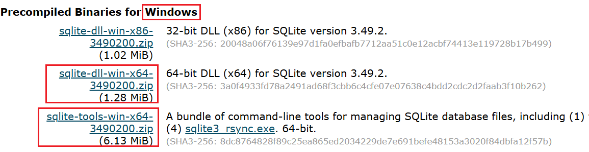

#### 第二步：新建与解压

 新建文件夹D:\software\sqlite（安装软件的位置），并在此文件夹中解压上面两个压缩文件，将得到以下文件

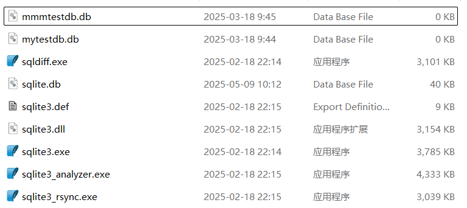

#### 第三步：修改环境变量

添加D:\software\sqlite到PATH环境变量。

在win11系统下，直接点击window建即可（也就是键盘左下角带微软图标那个键）

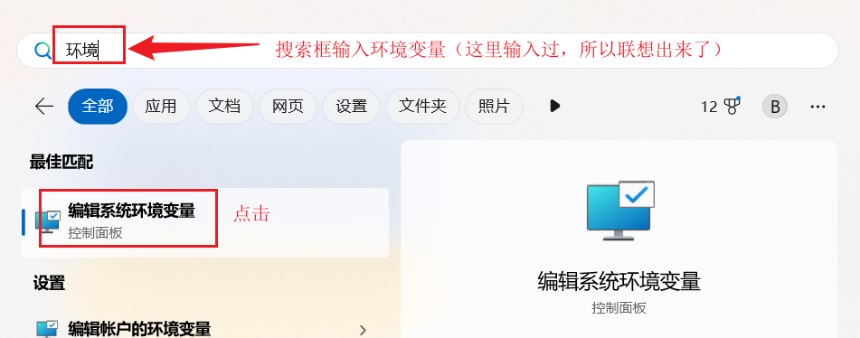

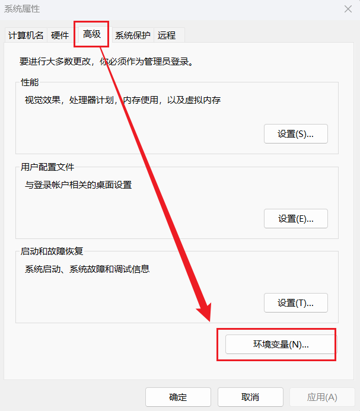

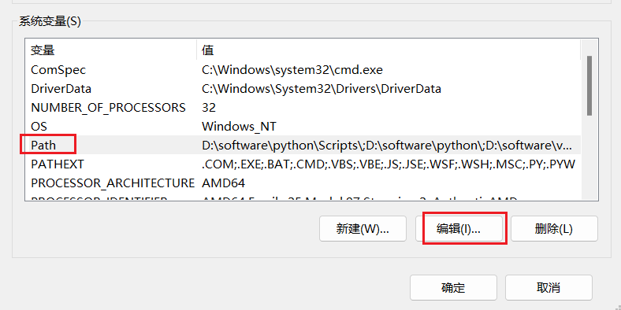

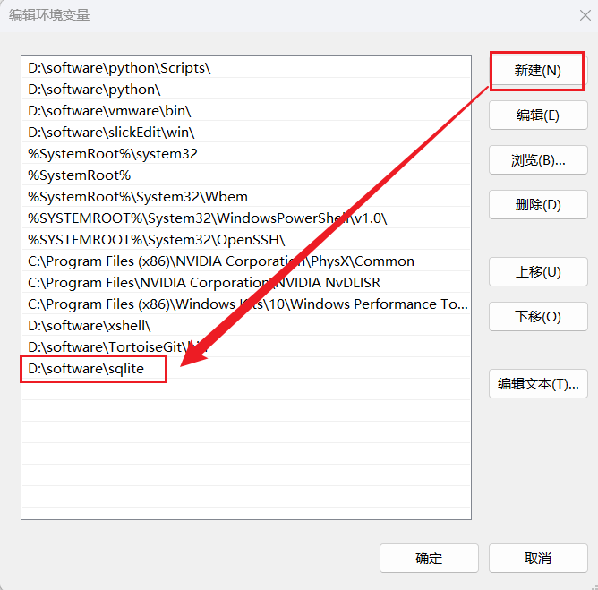

#### 第四步：测试安装结果

命令提示符下（使用window + r，然后cmd，就可以了），使用 sqlite3 命令，将显示如下结果

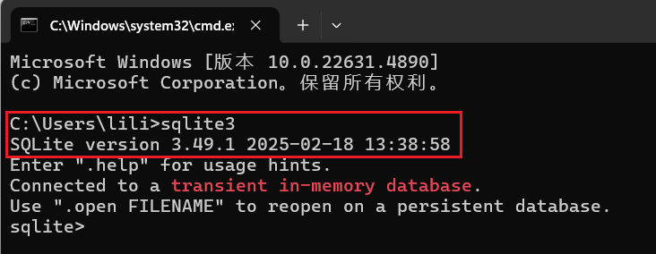


### 3、Navicat安装与破解

Navicat是一种可视化工具，比上面的命令行更加方便、直观，接受起来更方便。

<span style=color:red;background:yellow;font-size:30px>注意，其它版本的安装方式类似，这里只是以版本15为例。</span>

#### 第一步、激活前的准备

##### 1、软件安装包和激活工具

这个在服务器上都有，不需要大家下载。

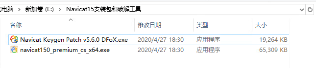

##### 2、环境准备

先断网、然后关闭“病毒和威胁防护”设置中的“实时保护”，它会自动删除注册机

#### 第二步、安装navicat premium

安装过程按照步骤一步步向下执行即可。

注意：安装成功后，不要打开软件。在后面步骤才能打开。（一不小心打开了，就关掉，重试，再不行就卸载重来）

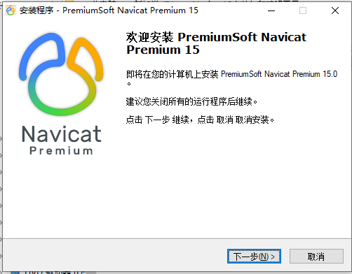

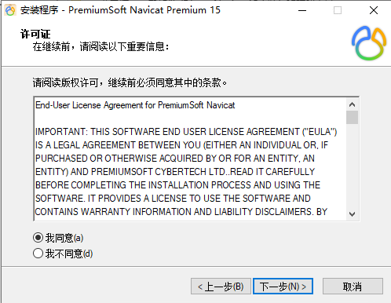

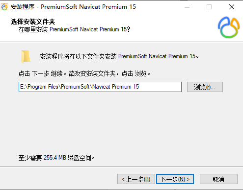

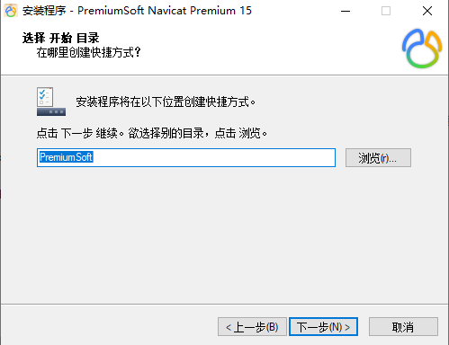

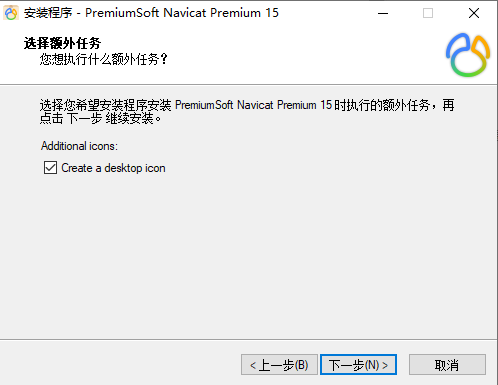

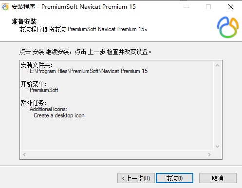


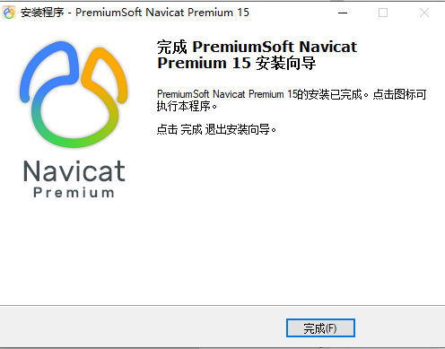

#### 第三步、注册

1、打开注册机，点击Patch，找得navicat的安装路径，点击确定，弹出如下页面表示加载成功，否则后面会无法生成激活码

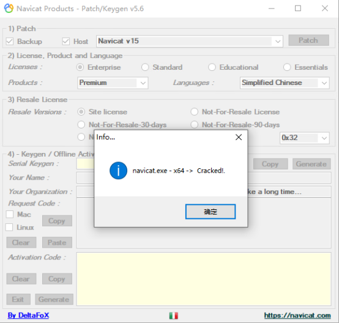

2、注册页面1)、2)步骤中内容如下，校对即可。点击Generate生成按钮，生成激活码密钥，点击Copy，拷贝密钥

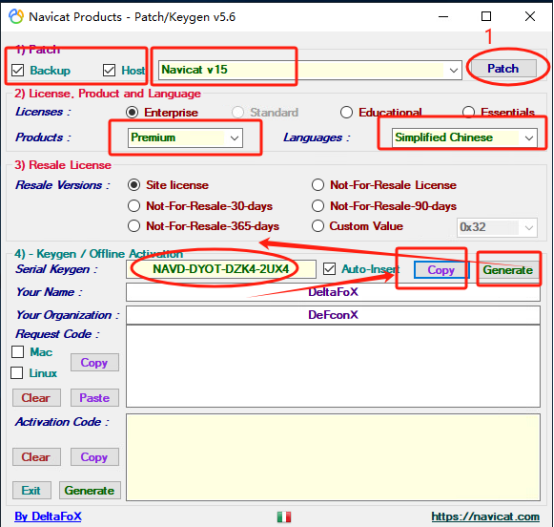

 3、打开软件navicat软件，点击注册，弹出注册页面

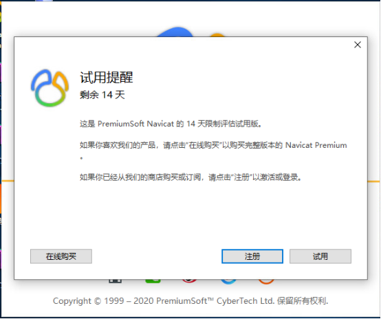

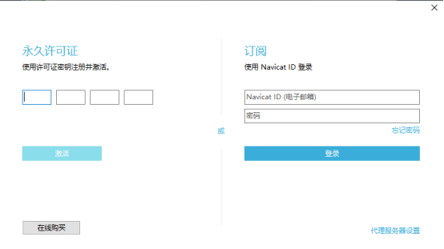

 4、粘贴密钥，右侧出现绿色对钩，点击激活，弹出新的提示页面，点击手动激活

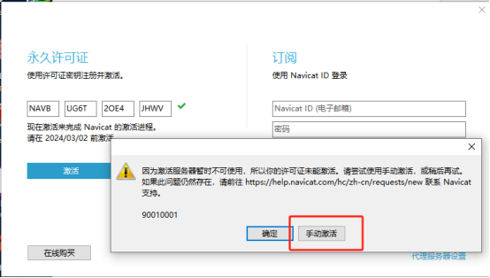

 5、复制手动激活页面中的请求码，粘贴到注册机页面的请求码框中，点击Generate生成按钮，生成激活码，再点击激活码框旁边的Copy按钮，复制激活码

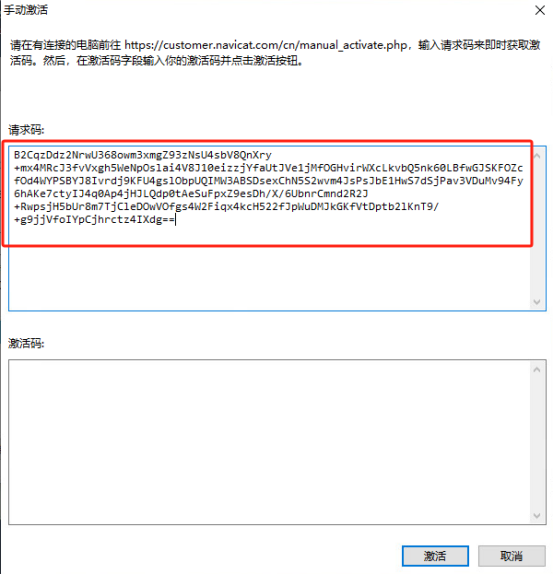

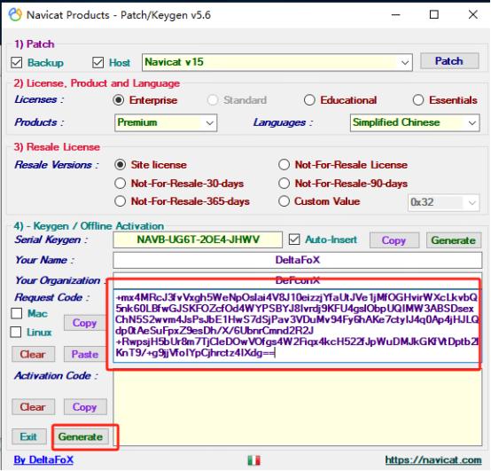

 6、粘贴激活码到navicat手动激活页面的激活码框中，点击下面的激活按钮，弹出激活成功页面，代表激活成功了。

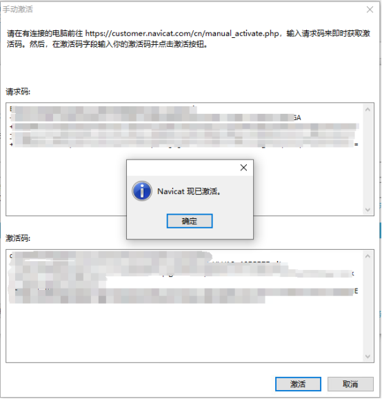

#### 第四步、连接测试

首先，进入Navicat时，页面如下


其次，连接数据库

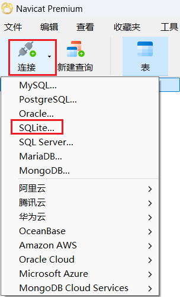

最后，进行如下选择与测试

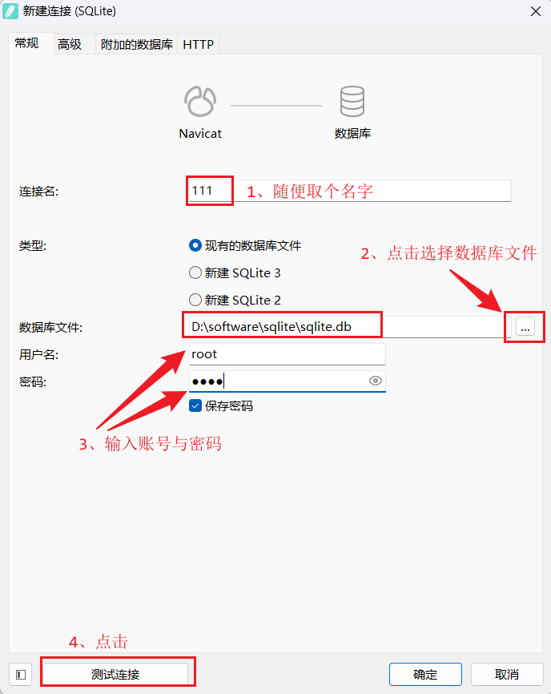


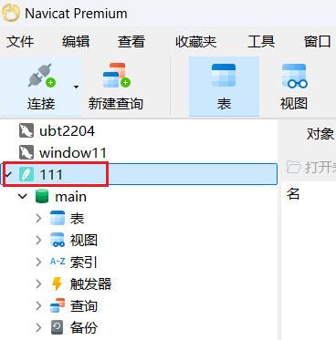

### 4、SQLite的使用

安装了SQLite后，就可以在终端（命令行）中输入 sqlite3来启动SQLite的命令行界面，然后进行基本的数据操作，比如：创建一个数据库、在数据库中创建表、在表中添加数据、删除数据、更新数据以及查询数据，当然也可以在上述安装的软件Navicat中进行命令的操作，但是不管怎么样，都需要会基本的命令操作，也就是使用SQL，下面就进行SQL语法介绍与学习。


## <span style=color:red;background:yellow;font-size:50px>三、SQLite下的SQL语句（非常重要）</span>

上面介绍SQL时候说到过，SQL是一种特殊目的的编程语言，是一种数据库查询和程序设计语言，用于存取数据以及查询、更新和管理关系数据库系统，同样SQL在SQLite中也是非常重要的，SQLite数据库中的操作需要SQL的支撑，包括：表的创建、删除、修改；数据的增、删、改、查等等，下面来看看SQL在SQLite下的具体使用。

### 1、创建表  

```mysql
CREATE TABLE table_name (column_name column_type,...);

#示例
CREATE TABLE IF NOT EXISTS course_table (
    id INT UNSIGNED AUTO_INCREMENT,
    course VARCHAR(100) NOT NULL,
    teacher VARCHAR(40) NOT NULL,
    price DECIMAL(8,2) NOT NULL,
    PRIMARY KEY (id)
);
```

### 2、删除表

```mysql
DROP TABLE table_name;

#示例
DROP TABLE course_table;
```

### 3、修改表

#### 3.1、删除列

```mysql
ALTER TABLE table_name DROP COLUMN column_name;

#示例
ALTER TABLE course_table DROP COLUMN teacher;
```

####  3.2、增加列

```mysql
ALTER TABLE table_name ADD COLUMN column_name property constraint;

#示例
ALTER TABLE course_table ADD COLUMN email VARCHAR(100) NOT NULL DEFAULT 'example@163.com';
```

#### 3.3、重命名列

```mysql
ALTER TABLE table_name RENAME COLUMN old_column TO new_column;
#示例
ALTER TABLE course_table RENAME COLUMN teacher TO Teacher;
```

#### 3.4、重命名表

```mysql
ALTER TABLE old_table_name RENAME TO new_table_name;
#示例
ALTER TABLE course_table RENAME TO new_table_course;
```

### 4、添加数据

```mysql
INSERT INTO table_name (field1, field2,...fieldN) VALUES (value1, value2,...valueN);

#示例
INSERT INTO course_table (course, teacher, price) VALUES ('嵌入式物联网', 'lili', 10000);
```

### 5、删除数据

```mysql
DELETE FROM table_name [WHERE Clause];

#示例
DELETE FROM course_table WHERE id = 3;
```

### 6、修改数据

```mysql
UPDATE table_name SET field1=new_value1, field2=new_value2 [WHERE Clause];
#示例
UPDATE course_table SET teacher = 'yuanzhi' WHERE id = 1;
```

### 7、查找数据

```mysql
SELECT field1, field2,...fieldN FROM table_name
[WHERE Clause]
[OFFSET M ][LIMIT N];

#示例
SELECT course,price FROM course_table;

SELECT course,price FROM course_table WHERE id = 1;
```

### <span style=color:red;background:yellow;font-size:40px>8、高级数据查询(重要)</span>

#### 8.1、单表查询

##### 8.1.1、创建表与数据

```mysql
CREATE TABLE IF NOT EXISTS student(
    id INT UNSIGNED AUTO_INCREMENT,
    name VARCHAR(100) NOT NULL ,
    age TINYINT NOT NULL,
    sex TINYINT NOT NULL ,
    score SMALLINT NOT NULL,
    address VARCHAR(512) NOT NULL,
    PRIMARY KEY (id)
);
```

```mysql
INSERT INTO student (name, age, sex, score, address) 
VALUES ('zhangsan', 21, 1, 101, '信阳市');

INSERT INTO student (name, age, sex, score, address) 
VALUES ('lisi', 22, 1, 102, '周口市');

INSERT INTO student(name, age, sex, score, address) 
VALUES ('wangwu', 23, 1, 103, '武汉市');

INSERT INTO student(name, age, sex, score, address) 
VALUES ('zhaoliu', 24, 1, 104, '上海市');
```

##### 8.1.2、基础查询

一般查询， 查看表中的所有记录以及所有字段（属性） 

```mysql
SELECT * FROM student;
```

只查看某些字段  

```mysql
SELECT name, age FROM student;
```

把查询出来的结果的字段名显示为其它名字  

```mysql
SELECT name AS '姓名' , age AS '年龄' FROM student;
```

在查询结果中添加一列， 这一列的值为一个常量  

```mysql
SELECT name,sex,'广州', address FROM student;
```

把某些字段合并后显示出来。 注意， 合并的字段的数据类型必须一致  

```mysql
SELECT name, (age+score) AS '年龄加得分' FROM student;
```

把查询出来的结果的重复记录去掉  

```mysql
SELECT distinct score FROM student;
```

##### 8.1.3、条件查询

查询姓名为zhangsan的学生信息  

```mysql
SELECT * FROM student WHERE name = 'zhangsan';
```

查询性别为1，并且年龄为22岁的学生信息  

```mysql
SELECT * FROM student WHERE sex=1 AND age=22;
```

##### 8.1.4、范围查询

查询年龄在21到23岁的学生的信息 

```mysql
SELECT * FROM student WHERE age BETWEEN 21 AND 23;
```

##### 8.1.5、判空查询

判断是否为 null  

```mysql
SELECT * FROM student WHERE score IS NOT NULL; #判断不为空
SELECT * FROM student WHERE score IS NULL;     #判断为空
```

判断是否为空字符串 

```mysql
SELECT * FROM student WHERE sex <> ''; #判断不为空字符串
SELECT * FROM student WHERE sex = ''; #判断为空字符串
```

##### 8.1.6、模糊查询

使用 like 关键字，"%"代表任意数量的字符， "_" 代表占位符。

查询名字为z开头的学生的信息  

```mysql
SELECT * FROM student WHERE name LIKE 'z%';
```

查询姓名里第二个字母为h的学生的信息  

```mysql
SELECT * FROM student WHERE name LIKE '_h%';
```

##### 8.1.7、分页查询

分页查询主要用于查看第N条到第M条的信息，通常和排序查询一起使用。

使用limit关键字，第一个参数表示从条记录开始显示，第二个参数表示要显示的数目。表中默认第一条记录的参数为0

查询学生表中第二到第三条的信息

```mysql
SELECT * FROM student LIMIT 1,2;
```

##### 8.1.8、查询后排序

查询后的结果按照某个字段来排序。关键字：order by，asc：升序, desc：降序。

按照年龄的升序排序  

```mysql
SELECT * FROM student ORDER BY age ASC;
```

按照多个字段排序：  

```mysql
SELECT * FROM student ORDER BY age DESC, score DESC;
```

##### 8.1.9、聚合查询

聚合函数对一组数据执行计算， 集中生成汇总值。如果需要对查询出来的结果进行求和、求平均值、求最大最小值、统计显示的数目等运算，就要用到聚合查询。

| 聚合函数 | 描述             |
| -------- | ---------------- |
| sum()    | 计算某列的总和   |
| avg()    | 计算某列的平均值 |
| max()    | 计算某列的最大值 |
| min()    | 计算某列的最小值 |
| count()  | 计算某列的行数   |

查询所有学生年龄的和

```mysql
SELECT sum(age) FROM student;
```

查询所有学生年龄的平均值  

```mysql
SELECT avg(age) FROM student;
```

查询年龄最大的学生的年龄  

```mysql
SELECT max(age) FROM student;
```

查询年龄最小的学生的年龄  

```mysql
SELECT min(age) FROM student;
```

统计表中学生的数目  

```mysql
SELECT count(age) FROM student;
```

##### 8.1.10、分组查询

可以把查询出来的结果根据某个条件来分组显示。关键字：group by

根据性别把学生分组

```mysql
SELECT * FROM student GROUP BY sex;
```

分组筛选查询
需求： 查询哪些地区的人数大于等于1个

- 查询每个地区的情况;
- 添加条件

预期结果： 武汉市  1


注意：如果使用了group by，在分组基础上进行筛选要使用having关键字

```mysql
SELECT address,count(*) FROM student GROUP BY address HAVING count(*)>=1;
```

##### 8.1.11、联合查询

查询年龄大于23岁， 并且sex是1的学生  

```mysql
SELECT * FROM student WHERE sex = 1
UNION
SELECT * FROM student WHERE age > 23;
```

#### 8.2、多表查询

##### 8.2.1、创建表与数据

```mysql
CREATE TABLE IF NOT EXISTS dept(
    id INT UNSIGNED AUTO_INCREMENT,
    name VARCHAR(32) NULL ,
    PRIMARY KEY (id)
);

INSERT INTO dept (id, name) VALUES (1, '讲师');
INSERT INTO dept (id, name) VALUES (2, '助教');
INSERT INTO dept (id, name) VALUES (3, '推广');


CREATE TABLE IF NOT EXISTS employee(
    id INT UNSIGNED AUTO_INCREMENT,
    name VARCHAR(32) NULL,
    sex TINYINT NOT NULL DEFAULT 1,
    age TINYINT NULL,
    dept_id INT NOT NULL,
    PRIMARY KEY (id)
);

INSERT INTO employee (id, name, sex, age, dept_id) VALUES (1,'changfeng',1,20,1);
INSERT INTO employee (id, name, sex, age, dept_id) VALUES (2, 'tianming',1,21,1);
INSERT INTO employee (id, name, sex, age, dept_id) VALUES (3, 'yuanzhi',1,22,1);
INSERT INTO employee (id, name, sex, age, dept_id) VALUES (4, 'lili',1,23,1);
INSERT INTO employee (id, name, sex, age, dept_id) VALUES (5, 'xingkong',1,24,1);

INSERT INTO employee (id, name, sex, age, dept_id) VALUES (6, 'momo',0,18,2);
INSERT INTO employee (id, name, sex, age, dept_id) VALUES (7, 'panpan',0,18,2);
INSERT INTO employee (id, name, sex, age, dept_id) VALUES (8, 'zhuzhu',0,19,2);
INSERT INTO employee (id, name, sex, age, dept_id) VALUES (9, 'anni',0,21,3);
```

##### 8.2.2、内连接

内连接（inner join）：只取两张表有对应关系的记录  

```mysql
SELECT * FROM employee INNER JOIN dept ON employee.dept_id = dept.id;
```

##### 8.2.3、左连接

左连接（left join）: 在内连接的基础上保留右表没有对应关系的记录  

```mysql
SELECT * FROM employee LEFT JOIN dept ON employee.dept_id = dept.id;
```

#### 8.3、子查询/合并查询

修改表

```mysql
ALTER TABLE employee 
ADD COLUMN salary DECIMAL(8,2) NULL DEFAULT 1000 

ALTER TABLE employee
ADD COLUMN level VARCHAR(32) NULL DEFAULT 'NORMAL';


UPDATE employee SET salary = 1300.00, level = 'BOSS' WHERE id = 3;
UPDATE employee SET salary = 1400.00, level = 'MANAGER' WHERE id = 4;
UPDATE employee SET salary = 1600.00, level = 'MANAGER' WHERE id = 6;
UPDATE employee SET salary = 1100.00 WHERE id = 1;
UPDATE employee SET salary = 1200.00 WHERE id = 2;
UPDATE employee SET salary = 1500.00 WHERE id = 5;
UPDATE employee SET salary = 1700.00 WHERE id = 7;
UPDATE employee SET salary = 1800.00 WHERE id = 8;
UPDATE employee SET salary = 1900.00 WHERE id = 9;
```

##### 8.3.1、子查询

子查询是指嵌入在其它sql语句中的select语句， 也叫嵌套查询；

###### 8.3.1.1、单行子查询

显示与lili同一部门的员工

```mysql
SELECT * FROM employee WHERE dept_id = (SELECT dept_id FROM employee WHERE name='lili');
```

###### 8.3.1.2、多行子查询

多行子查询即返回多行记录的子查询。

in关键字：运算符可以检测结果集中是否存在某个特定的值，如果检测成功就执行外部的查询。

查询和3号部门的工作相同的雇员的名字、岗位、工资、 部门号，但是不包含3号部门的

```mysql
SELECT id,name,level,salary FROM employee WHERE level IN (SELECT DISTINCT level FROM employee WHERE dept_id=3) AND dept_id<>3;
```

exists 关键字：内层查询语句不返回查询的记录。而是返回一个真假值。 如果内层查询语句查询到满足条件的记录，就返回一个真值（true），否则，将返回一个假值（false）。当返回的值为true时，外层查询语句将进行查询；当返回的为false时，外层查询语句不进行查询或者查询不出任何记录  

```mysql
SELECT * FROM employee WHERE EXISTS(SELECT id FROM dept WHERE id = 9);
```

###### 8.3.1.3、在from子句中使用子查询

子查询出现在from子句中，这种情况下将子查询当做一个临时表使用。

例如：查找每个部门工资最高的人的姓名、工资、部门、最高工资

```mysql
SELECT employee.name, employee.salary, employee.dept_id, max_salary 
FROM employee, (SELECT max(salary) max_salary, dept_id FROM employee 
                group by dept_id) tmp
                WHERE employee.dept_id=tmp.dept_id 
                AND employee.salary=tmp.max_salary;
```

##### 8.3.2、合并查询

在实际应用中，为了合并多个select的执行结果，可以使用集合操作符union、union all。

union：该操作符用于取得两个结果集的并集。当使用该操作符时，会自动去掉结果集中的重复行。

例如：将工资大于1200或职位是MANAGER的人找出来

```mysql
SELECT name,salary,level FROM employee WHERE salary > 1200 
UNION
SELECT name,salary,level FROM employee WHERE level = 'MANAGER';
```

union all：该操作符用于取得两个结果集的并集。当使用该操作符时，不会去掉结果集中的重复行。

例如：将工资大于1200或职位是MANAGER的人找出来

```mysql
SELECT name,salary,level FROM employee WHERE salary > 1200 
UNION ALL
SELECT name,salary,level FROM employee WHERE level = 'MANAGER';
```

#### 8.4、正则表达式查询

##### 8.4.0、正则表达式的模式字符

| 选项        | 说明（自动加匹配二字）            | 例子                                       | 匹配值示例                |
| ----------- | --------------------------------- | ------------------------------------------ | ------------------------- |
| ^           | 文本开始字符                      | '^b'匹配以字母 b 开头的字符串              | book, big, banana,bike    |
| $           | 文本结束字符                      | 'st$'匹配以 st 结尾的字符串                | test, resist, persist     |
| .           | 任何单个字符                      | 'b.t'匹配任何 b 和 t 之间有一个字符        | bit, bat, but, bite       |
| *           | 0 个或多个在它前面的字符          | 'f*n'匹配字符 n 前面有任意 n 个字符 f      | fn, fan, faan, abcn       |
| +           | 前面的字符一次或多次              | 'ba+'匹配以 b 开头后面紧跟至少一个 a       | ba, bay, bare, battle     |
| <字符串>    | 包含指定字符串的文本              | 'fa'                                       | fan, afa, faad            |
| [字符集合]  | 字符集合中的任一个字符            | '[xz]'匹配 x 或者 z                        | dizzy, zebra, x-ray,extra |
| [^]         | 不在括号中的任何字符              | '[^abc]'匹配任何不包含 a、 b 或 c 的字符串 | desk, fox, f8ke           |
| 字符串{n}   | 前面的字符串至少 n 次             | b{2}匹配 2 个或更多的 b                    | bbb, bbbb, bbbbbb         |
| 字符串{n,m} | 前面的字符串至少 n 次， 至多 m 次 | b{2,4}匹配最少 2 个，最多 4 个 b           | bb, bbb, bbbb             |


##### 8.4.1、^匹配字符开始的部分

从employee表name字段中查询以k开头的记录

```mysql
SELECT * FROM employee WHERE name REGEXP '^k';
```

从employee表name字段中查询以aaa开头的记录  

```mysql
SELECT * FROM employee WHERE name REGEXP '^aaa';
```

##### 8.4.2、$匹配字符结束的部分

从employee表name字段中查询以c结尾的记录

```mysql
SELECT * FROM employee WHERE name REGEXP 'c$';
```

从employee表name字段中查询以aaa结尾的记录  

```mysql
SELECT * FROM employee WHERE name REGEXP 'aaa$';
```

##### 8.4.3、`.`匹配字符串中的任意一个字符， 包括回车和换行

从employee表name字段中查询以L开头y结尾中间有两个任意字符的记录

```mysql
SELECT * FROM employee WHERE name REGEXP '^L..y$';
```

##### 8.4.4、[字符集合] 匹配字符集合中的任意字符

从employee表name字段中查询包含 c、e、o 三个字母中任意一个的记录

```mysql
SELECT * FROM employee WHERE name REGEXP '[ceo]';
```

从employee表name字段中查询包含数字的记录  

```mysql
SELECT * FROM employee WHERE name REGEXP '[0-9]';
```

从employee表name字段中查询包含数字或 a、b、c 三个字母中任意一个的记录  

```mysql
SELECT * FROM employee WHERE name REGEXP '[0-9a-c]';
```

##### 8.4.5、`[^字符集合]`匹配除了字符集合外的任意字符

从employee表name字段中查询包含a-w字母和数字以外字符的记录

```mysql
SELECT * FROM employee WHERE name REGEXP '[^a-w0-9]';
```

##### 8.4.6、s1|s2|s3 匹配 s1s2s3中的任意一个

从employee表name字段中查询包含'ic'的记录

```mysql
SELECT * FROM employee WHERE name REGEXP 'ic';
```

从employee表name字段中查询包含 ic、uc、ab 三个字符串中任意一个的记录  

```mysql
SELECT * FROM employee WHERE name REGEXP 'ic|uc|ab';
```

##### 8.4.7、`*`代表多个该字符前的字符，包括0个或1个

从employee表name字段中查询c之前出现过a的记录

```mysql
SELECT * FROM employee WHERE name REGEXP 'a*c';
```

##### 8.4.8、+代表多个该字符前的字符，包括1个

从employee表name字段中查询c之前出现过a的记录

```mysql
SELECT * FROM employee WHERE name REGEXP 'a+c'; #(注意比较结果！ )
```

##### 8.4.9、字符串{N} 字符串出现N次

从employee表name字段中查询出现过a3次的记录

```mysql
SELECT * FROM employee WHERE name REGEXP 'a{3}';
```

##### 8.4.10、字符串{M， N}字符串最少出现M次，最多出现N次

从employee表name字段中查询ab出现最少1次最多3次的记录

```mysql
SELECT * FROM employee WHERE name REGEXP 'ab{1,3}';
```


## 四、Qt数据库

在Qt中使用数据库，需要在项目文件pro中添加对sql的支持，使用形式如下：

```C++
Qt += sql
```

### 1、QSqlDatabase类

<span style=color:red;background:yellow;font-size:20px>是Qt数据库模块中用于管理数据库连接的类</span>。提供了连接到各种数据库系统的能力，比如SQLite、MySQL等。<span style=color:red;background:yellow;font-size:20px>功能包括创建连接、打开和关闭连接、设置连接参数以及管理连接池。</span>

#### 1.1、添加数据库连接

你可以使用addDatabase函数来添加一个数据库连接。

```C++
[static] QSqlDatabase QSqlDatabase::addDatabase(
    const QString &type
    , const QString &connectionName
    = QLatin1String(defaultConnection));
//type:指定数据库类型，例如 “QSQLITE”、“QMYSQL”等;
//connectionName:参数指定连接的名称，默认为defaultConnection.

[static] QSqlDatabase QSqlDatabase::addDatabase(
    QSqlDriver *driver
    , const QString &connectionName 
    = QLatin1String(defaultConnection))
//driver:给定的驱动程序对象;
//connectionName:参数指定连接的名称，默认为defaultConnection.
```

#### 1.2、设置连接参数

一旦添加了数据库连接，可以使用一系列函数来设置连接的参数，如下：

```C++
void QSqlDatabase::setDatabaseName(const QString &name);
//设置数据库的名称（对于SQLite数据库是文件路径，对于其他数据库是数据库名）

//例如
void test()
{
    db = QSqlDatabase::addDatabase("QODBC");
    db.setDatabaseName("DRIVER={Microsoft Access Driver (*.mdb, *.accdb)};"
                       "FIL={MS Access};DBQ=myaccessfile.mdb");
    if (db.open()) 
    {
        // success!
    }
}
 
void QSqlDatabase::setHostName(const QString &host);
//设置数据库服务器的主机名。

void QSqlDatabase::setUserName(const QString &name)
//设置数据库用户名。

void QSqlDatabase::setPassword(const QString &password)；
//设置数据库密码                       
```

#### 1.3、打开和关闭连接

一旦设置了连接参数，可以使用open函数打开数据库连接或者使用close函数关闭数据库连接。此外，你可以使用 isOpen 函数检查连接是否已打开。

```C++
//打开数据库连接
bool QSqlDatabase::open();
bool QSqlDatabase::open(const QString &user, const QString &password);

//检查连接是不是打开了
bool QSqlDatabase::isOpen() const;

//关闭数据库连接
void QSqlDatabase::close();
```

#### 1.4、连接状态和有效性

你可以使用isValid函数检查数据库连接是否有效。一个有效的连接是指已经成功添加到连接池中的连接，并且未被移除。

```C++
//检查数据库是不是有效
bool QSqlDatabase::isValid() const;
```

#### 1.5、连接池管理

Qt的数据库模块还提供了连接池的功能，可以通过removeDatabase函数从连接池中移除指定的数据库连接。这在需要释放不再需要的连接时非常有用，避免资源浪费。

```C++
//移除指定链接的数据库
[static] void QSqlDatabase::removeDatabase(const QString &connectionName);
```

### 2、QSqlQuery类

<span style=color:red;background:yellow;font-size:20px>该类提供执行和操作SQL语句的各种方法</span>，比如：select/insert/delete/update/create/drop/alter.

<span style=color:red;background:yellow;font-size:20px>该类是Qt数据库模块中用于执行SQL查询和命令的主要类之一。它允许你向数据库发送SQL查询语句，并处理返回的结果。</span>

#### 2.1、创建 QSqlQuery对象

可以使用QSqlQuery创建一个查询对象，然后使用该对象执行SQL查询和命令。

```C++
//创建查询对象
QSqlQuery(const QSqlQuery &other);
QSqlQuery(QSqlDatabase db);
QSqlQuery(const QString &query = QString(), QSqlDatabase db = QSqlDatabase());
QSqlQuery(QSqlResult *result);

//例如
SqlQuery query;
```

#### 2.2、执行SQL查询和命令

```C++
bool QSqlQuery::exec(const QString &query);

bool QSqlQuery::exec();
//执行前面的prepared的SQL查询，如果查询成功返回true，否则返回false

void test()
{
    QSqlQuery query;
    query.exec("INSERT INTO employee (id, name, salary) "
                 "VALUES (1001, 'Thad Beaumont', 65000)");
    
    //执行SELECT查询，并将查询结果存储在QSqlQuery对象中
    bool success = query.exec("SELECT * FROM students");
}
```

#### 2.3、检索查询结果

你可以使用next函数遍历查询结果的每一行，并使用value函数获取每一列的值。

```C++
bool QSqlQuery::next();

//例如:
while (query.next()) 
{
    QString name = query.value(0).toString(); //获取第一列的值并转换为字符串
    int age = query.value(1).toInt(); // 获取第二列的值并转换为整数
    // 处理结果...
}
```

#### 2.4、绑定参数

你可以使用 bindValue函数将值绑定到SQL查询中的占位符。这是防止SQL注入攻击的一种重要方法。

```C++
bool QSqlQuery::prepare(const QString &query);

void QSqlQuery::bindValue(const QString &placeholder, 
                          const QVariant &val, 
                          QSql::ParamType paramType = QSql::In)

void QSqlQuery::bindValue(int pos, 
                          const QVariant &val,
                          QSql::ParamType paramType = QSql::In);

void test()
{
    QSqlQuery query;
    query.prepare("INSERT INTO person (id, forename, surname) "
                  "VALUES (:id, :forename, :surname)");
    query.bindValue(":id", 1001);
    query.bindValue(":forename", "Bart");
    query.bindValue(":surname", "Simpson");
    query.exec();
}
```

这里 :id是一个占位符，bindValue 函数将值1001绑定到该占位符上,其它几个类似。

#### 2.5、错误处理

你可以使用 lastError函数来获取最后一个执行错误的详细信息。这对于调试数据库操作非常有用。

```C++
QSqlError QSqlQuery::lastError() const;
```

### 3、测试代码

```C++
#include "widget.h"
#include "ui_widget.h"

#include <QSqlDatabase> 
#include <QSqlQuery>
#include <QDebug>

Widget::Widget(QWidget *parent)
: QWidget(parent)
, ui(new Ui::Widget)
{
    ui->setupUi(this);

    // 建立与SQLite数据库的连接
    QSqlDatabase sqldb = QSqlDatabase::addDatabase("QSQLITE");
    //设置数据库的名字
    sqldb.setDatabaseName("wangdao.db"); 
    //打开数据库
    if (!sqldb.open())
    {
        qDebug() << "SQLite连接到数据库连接失败";
        return;
    }
    else
    {
        qDebug() << "SQLite连接到数据库连接成功";
    }

    //执行SQL查询来创建数据库表
    QSqlQuery query;
    bool ret = query.exec("CREATE TABLE IF NOT EXISTS people ("
                              "id INTEGER PRIMARY KEY AUTOINCREMENT,"
                              "name TEXT,"
                              "age INTEGER)");
    if (!ret)
    {
        qDebug() << "创建people表失败";
    }
    else
    {
        qDebug() << "创建people表成功";
    }

    //执行SQL查询将数据插入表中
    QSqlQuery query1;
    query1.prepare("INSERT INTO people (name, age) VALUES (:name, :age)");
    query1.bindValue(":name", "Li hua");
    query1.bindValue(":age", 20);

    if (!query1.exec())
    {
        qDebug() << "数据插入people表失败";
    }
    else
    {
        qDebug() << "数据插入people表成功";
    }

    QSqlQuery query2("SELECT * FROM people");
    while (query2.next())
    {
        qDebug() << "id:" << query2.value(0).toInt() 
                 << ", name:" << query2.value(1).toString() 
                 << ", age:" << query2.value(2).toInt();
    }

    // 更新数据update、删除数据delete
    // 关闭数据库连接
    if (sqldb.isOpen())
    {
        sqldb.close();
    }
}
```
